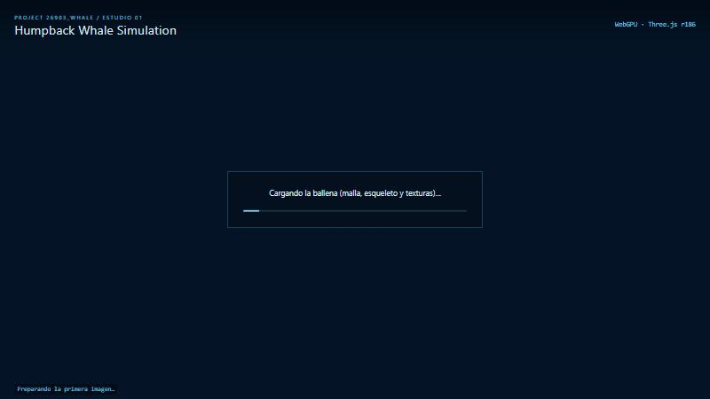
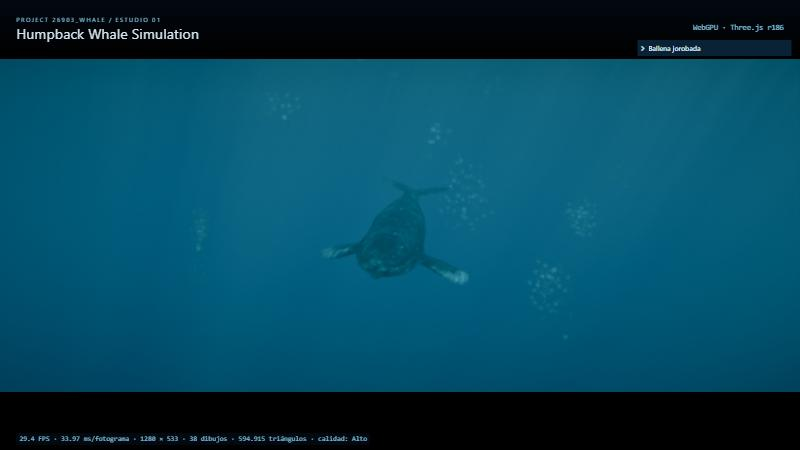
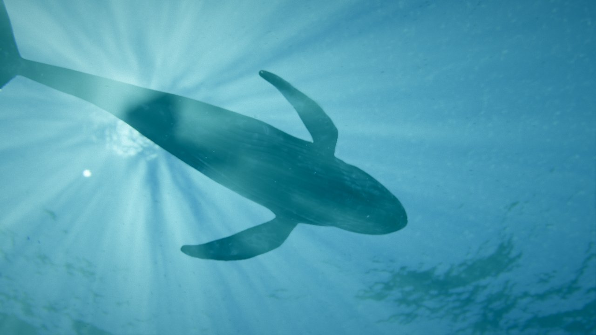
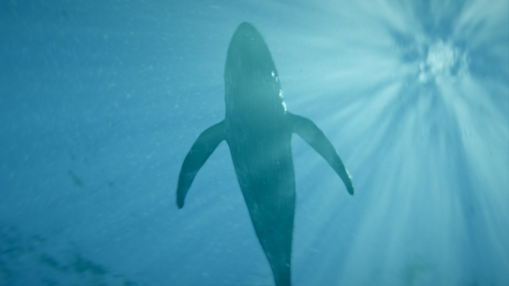
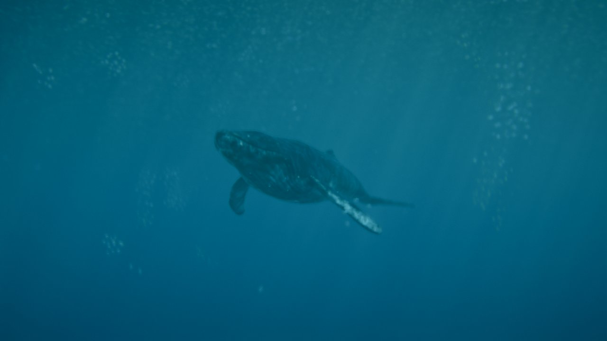
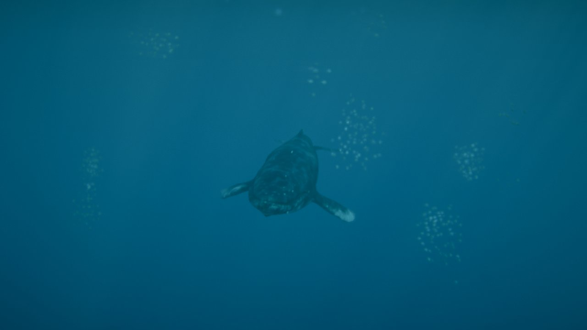

# Ampliación · Arranque, formato de cine e interfaz

29/09/2026 · Petición de Roberto. El arranque se inspira en el diseño del visor *Blade Runner / Estudio 01*:
- **Carga:** parte de azul oscuro, con los mensajes de la inicialización.
- **Fundido:** cuando la imagen se estabiliza, se funde a la animación.
- **Cámara:** empieza en el encuadre de referencia, desde abajo y a contraluz, y viaja a su posición de seguimiento.
- **Formato:** bandas negras de cine.
- **Pie:** métricas con los FPS.
- **Textos:** proyecto y título, con una paleta azul.

| Carga | Seguimiento, con bandas de cine |
|---|---|
|  |  |

**Viaje de la cámara** (de izquierda a derecha y de arriba abajo):

| | |
|---|---|
|  |  |
|  |  |

(Las capturas del viaje salen en 16:9: con el panel del navegador oculto no hay tamaño de ventana y el visor dibuja a 1280×720. En la página se ven en la franja 2,4:1.)

## Qué hay

- **Interfaz (`src/core/ui.js`):**
  - **Cabecera:** a la izquierda, «PROJECT 26903_WHALE / ESTUDIO 01» y el título «Humpback Whale Simulation»; a la derecha, el backend («WebGPU · Three.js r186», con la versión real de three).
  - **Recuadro de estado:** muestra el mensaje y la barra de progreso de la inicialización.
  - **Pie:** métricas actualizadas dos veces por segundo: FPS, ms por fotograma, resolución, dibujos, triángulos y calidad activa.
- **Mensajes de la inicialización:** cada uno aparece antes del paso que describe:
  1. iniciando el renderizador WebGPU;
  2. cargando la ballena;
  3. generando las nubes volumétricas;
  4. calculando el cielo y la luz;
  5. generando el océano (FFT);
  6. preparando salpicaduras, burbujas y espuma;
  7. soltando el cardumen;
  8. compilando shaders;
  9. estabilizando la imagen.
- **Pestaña en segundo plano:** entre pasos se espera a que el navegador pinte, con un máximo de 60 ms. Así la carga no se queda parada si no hay `requestAnimationFrame`.
- **Error de carga:** si falta el modelo, el aviso queda en el recuadro.
- **Fundido:**
  - **Cuándo:** la animación ya se dibuja bajo la cortina azul (`--whale-cover`). Se funde (2,2 s) cuando la imagen es estable: al menos 1,5 s y 45 fotogramas, y los últimos 15 sin tirones (ningún fotograma más de 2,5 veces la media, típicamente los de la compilación de shaders). Como mucho, a los 12 s.
  - **Encuadre inicial:** la cámara está bajo la ballena, 13 m por debajo y del lado contrario al sol, mirando hacia arriba. Se ven la silueta, los rayos de sol y el cardumen, como en el pantallazo de referencia. Se engancha a la ballena desde su primer fotograma.
  - **Viaje:** 3,2 s después empieza el viaje (7 s, *smootherstep*) hasta la posición de seguimiento de siempre (16; 4,3; 10,8 m respecto a la ballena). Va en arco alrededor de ella (dirección y distancia por separado); en línea recta pasaba casi a través del cuerpo. Todo es relativo a la ballena, que sigue nadando.
  - **Nado tranquilo:** mientras dura el arranque, la ballena no empieza su ciclo automático (respirar o saltar). La primera acción llega con la cámara ya en su sitio.
  - **Interrupción:** si el usuario cambia de modo de cámara, el arranque se interrumpe.
- **Bandas de cine (`viewer.js`):**
  - **Franja 2,4:1:** el renderer dibuja solo una franja centrada de 2,4:1 (el tamaño del canvas y el aspecto de la cámara salen de ella). El fondo de la página es negro, así que quedan bandas arriba y abajo, o a los lados si la ventana es más ancha.
  - **Desactivar:** `viewer.frame.letterbox = false` y `viewer.applyFrame()` vuelve a pantalla completa.
  - **Etiquetas:** las de los huesos van en la misma franja.
- **Paleta azul:** variables CSS (`--whale-text`, `--whale-accent`, `--whale-border`…). El panel de control (lil-gui) usa la misma paleta y queda bajo la cabecera. Las estadísticas (tecla B) y la línea de tiempo se han movido para no chocar con la cabecera y el pie.
- **Capturas de prueba:** `whaleViewer.capture` conserva ahora la proporción del canvas (antes lo escalaba a 16:9).
