# Fase 1.1 · Auditoría del modelo descargado

28/09/2026 · Blender 5.1.1 · solo lectura (el original no se ha modificado ni guardado)

## Resumen

- El modelo sirve como base: ballena jorobada con esqueleto de 47 huesos, 7 animaciones horneadas (nado, reposo, 3 saltos, boca abierta), texturas PBR a 1K/2K/4K con dos variantes de piel y un esculpido de alta de 857 k triángulos para hornear.
- Malla de juego muy ligera: **9 746 triángulos** (subdivisión nivel 1 → ≈ 39 k, justo el objetivo de 20-40 k).
- Problemas a resolver en 1.2-1.7:
  - Texturas enlazadas con rutas absolutas del autor.
  - Escala de 19,1 m (el plan pide ≈ 14 m).
  - Hasta 10 influencias por vértice.
  - Archivo con mucho material sobrante.
  - Saltos que empiezan en superficie y con poco giro.
  - Faltan `swim_fast`, `dive`, `pec_slap` y los eventos.
- **Licencia sin confirmar.** No hay archivo de licencia; el readme solo dice "Thank you for purchasing this model!". El repo de GitHub es **público**: no se debe subir el .blend, las texturas ni el GLB hasta confirmar la licencia.

## 1. Archivos descargados

Carpeta: `_Downloads\humpback-whale-animated\` (más el zip original de 494 MB en `_Downloads\`).

| Archivo | Tamaño | Contenido |
|---|---:|---|
| `Whale.blend` | 133 MB | Escena principal (guardada con Blender 3.2) |
| `whale.spp` | 398 MB | Proyecto de Substance Painter (permite retexturizar) |
| `WhaleFBX.fbx` | 4,9 MB | Exportación FBX |
| `WhaleOBJ.obj` / `.mtl` | 0,7 MB | Malla baja estática (5 105 vértices), exportada con Blender 2.93 |
| `WhaleSTL.stl` | 0,5 MB | Malla estática para impresión |
| `Textures.rar` | 163 MB | Mismo contenido que `Textures\Textures\` |
| `Read me.txt` | 600 B | Notas del autor sobre las variantes de piel y las texturas de las "barbs" |

Texturas (`Textures\Textures\`):

| Carpeta | Mapas | Resoluciones |
|---|---|---|
| `WithJawBarnacles` | Diffuse, Normal, Height, Ambient (AO) | 1K, 2K, 4K |
| `NoJawBarnacles` | Diffuse, Normal, Height, AOMap | 1K, 2K, 4K |
| `Wed,Dry Roughness` | DryRoughness, WetRoughness (sirven para las dos variantes) | 2K, 4K |
| `BarbsTexture` | fiber_albedo, alpha, ambient, specular, translucency, fiver (normal) | ~512 px |

**Autor, fuente y licencia:**

- No hay archivo de licencia ni URL de la tienda.
- Indicios:
  - El readme dice "Thank you for purchasing this model!", así que es un modelo comprado.
  - Las rutas internas del .blend apuntan a `C:\Users\Diego\...` y a `D:\Models3dSell\Humpback\WhalESELLING\`, de modo que el autor es probablemente "Diego" y lo vende en alguna tienda.
  - El zip se llama `humpback-whale-animated-<uuid>.zip`.
- **Pendiente:** Roberto debe confirmar la tienda y el tipo de licencia (uso en tiempo real y en web, y si permite distribuir el GLB en un repo o web pública).

## 2. Escena y unidades

| Dato | Valor |
|---|---|
| Unidades | Métrico, metros, `scale_length` = 1,0 |
| FPS | 24 |
| Rango de la escena | 0-89 |
| Eje "arriba" | +Z (Blender); el exportador glTF lo convierte a +Y |
| Orientación | Cuerpo a lo largo de Y, **morro hacia −Y**, cola hacia +Y (en glTF/Three.js el morro queda hacia +Z) |
| Origen | En (0, 0, 0), cerca del centro del cuerpo; transformaciones ya aplicadas (escala 1, rotación 0) |
| Plano de agua de la escena | `Water` en z = −0,41 m: la ballena en reposo está **a flor de agua** |

## 3. Objetos

| Objeto | Tipo | Visible | Uso |
|---|---|---|---|
| **`HumpbackWhale`** | Malla | Sí | **Malla de juego** con piel, ojos, córnea y "barbs" unidos; deformada por `HumpbackRig` |
| **`HumpbackRig(bakeanimationshere)`** | Armature | Sí | **Esqueleto con las animaciones horneadas** (sin restricciones) |
| `ControlRig` | Armature | No | Rig de control del autor (restricciones Copy Transforms/Rotation) |
| `Whale`, `Eyes`, `Cornea`, `Barbs` | Malla | No | Copia de la ballena por piezas, ligada a `ControlRig` |
| `HIghPoluMOdel` | Malla | No (no render) | Esculpido: **856 932 triángulos**, sin UVs, con color por vértice |
| `TongueHighPoly`, `eyeshp` | Malla | No | Lengua (59 k tris) y ojos (17 k tris) en alta |
| `Water` | Malla | No | Plano de agua de 192 m con subdivisión |
| `Empty` … `Empty.008` (9) | Empty | No | Imágenes de referencia del autor |
| `Light`, `Light.001`, `Light.002`, `Camera` | — | Sí | Iluminación y cámara de la escena del autor |

## 4. Malla de juego `HumpbackWhale`

| Dato | Valor |
|---|---|
| Vértices / caras | 4 975 / 4 926 (4 770 quads, 20 n-gons, 136 triángulos) |
| **Triángulos** | **9 746** |
| Modificadores | Armature → `HumpbackRig`; Subdivision (viewport off, render nivel 2 ≈ 156 k tris) |
| UVs | 1 mapa (`UVMap`) |
| Atributos | `Col` (color por vértice), `material_index` |
| Materiales | `Humpback` (piel), `Cornea`, `Barbs` |
| Grupos de vértices | 48 (47 huesos + `shrinkwrap`, que no es un hueso) |
| **Influencias por vértice** | Máx. **10**; **1 942 de 4 975** vértices tienen más de 4 (glTF/Three.js usan 4) |
| Vértices sin pesos | 0 |
| Shape keys | Ninguna |

Histograma de influencias: 1→419 · 2→722 · 3→1 118 · 4→774 · 5→564 · 6→707 · 7→316 · 8→251 · 9→90 · 10→14.

## 5. Medidas en reposo (metros) y comparación con el plan

| Medida | Modelo | Plan / real | Con escala a 14 m (×0,731) |
|---|---:|---:|---:|
| Longitud total | **19,15** | ≈ 14 (adultos 12-16) | 14,0 |
| Envergadura con pectorales | 9,40 | — | 6,87 |
| Altura (con pectorales bajadas) | 4,53 | — | 3,31 |
| Pectoral (longitud de la aleta) | ≈ 4,8 (cadena de huesos 4,56) | 4-5 (≈ 1/3 del cuerpo) | ≈ 3,5 |
| Pectoral / longitud | **0,25** | ≈ 0,30-0,33 | — |
| Envergadura de la caudal | 5,76 | ≈ 5 | 4,21 |
| Caudal / longitud | 0,30 | ≈ 0,30-0,35 | — |

Conclusión:

- Tamaño: el modelo es grande pero está bien proporcionado. Al escalarlo a 14 m, la caudal queda correcta y las **pectorales quedan algo cortas** (3,5 m frente a 4-5 m).
- Pectorales: alargarlas un 15-25 % acercaría el modelo a las referencias. Es un cambio opcional para 1.3 o 1.9.

## 6. Materiales y texturas

| Material | Nodos | Estado |
|---|---|---|
| `Humpback` (piel) | Principled + Diffuse, Normal, AO (mezclado con el color) y una imagen de rugosidad | Imágenes **no encontradas** |
| `Barbs` | Principled + albedo, alpha, specular, translucency y normal; transparencia *dithered* | Imágenes **no encontradas** |
| `Cornea` | Principled sin texturas | OK |
| `Material.001`, `Material.002`, `Dots Stroke` | Del esculpido, del agua y de un trazo | Sobrantes |

- **Imágenes:** las 25 del archivo (sin contar `Render Result`) usan rutas absolutas del autor (`C:\Users\Diego\...`, `D:\Models3dSell\...`) o relativas a carpetas que no existen. **Ninguna carga, ni hay ninguna empaquetada.** Por eso los renders sin reasignar salen en magenta.
- **Remapeo:** en la auditoría las reasigné en memoria a `Textures\Textures\`:
  - Piel: `WithJawBarnacles\2kText`.
  - Rugosidad: `Wed,Dry Roughness\2kText\DryRoughness.png`, en lugar de la `image (3).png` perdida.
  - "Barbs": `BarbsTexture`.

  Con eso el modelo se ve completo (capturas del apartado 9).
- **Sobran** 16 imágenes (referencias del autor, agua y texturas antiguas de los ojos en alta) (`a.jpg`, `XD.jpg`, `NORMALOOCEAN.png`, `jijijiji.jpg`, `Screenshot (82).png`…).
- **Máscara de mojado:** que haya `WetRoughness` y `DryRoughness` permite hacerla casi directamente en la Fase 1.5.

## 7. Esqueleto `HumpbackRig`

47 huesos, todos deformantes, sin restricciones (listo para glTF). Jerarquía (longitudes en m):

```
MasterBone 1.72
├─ Spine.003 1.15 → Spine.004 1.29 → Spine.005 1.48
│   ├─ Head 1.26
│   │   ├─ UpperJaw 3.08 · LowerJaw 3.33
│   │   ├─ Tongue → Tongue.002 … Tongue.007 (8 huesos)
│   │   └─ Eye.L · Eye.R
│   ├─ Fin.L → Fin.L.001 … Fin.L.005 (6 huesos, 4.56 m)
│   └─ Fin.R → Fin.R.001 … Fin.R.005 (6 huesos)
├─ UpperFin 0.35 → UpperFin.001 0.41          (aleta dorsal)
└─ MasterBone.006 1.24 → Spine 1.01 → Spine.001 1.19 → Spine.002 1.09 → Spine.008 0.93 → Spine.007 0.96
    ├─ Tail.L → Tail.L.001 … Tail.L.004 (5 huesos)
    └─ Tail.R → Tail.R.001 … Tail.R.004 (5 huesos)
```

Comparación con la Fase 1.6:

| Requisito | Modelo | Valoración |
|---|---|---|
| Columna de 12-16 huesos | 11 (MasterBone, 3 delanteros, Head, MasterBone.006 y 6 traseros) | Suficiente para ondular; no hace falta reconstruir |
| Cabeza y mandíbula | `Head`, `UpperJaw`, `LowerJaw` | ✔ |
| Pectorales | 6 huesos por lado | ✔ (más que "hombro-codo-muñeca") |
| Caudal (pedúnculo y lóbulos) | Lóbulos izquierdo y derecho con 5 huesos cada uno | ✔ |
| Máx. 4 influencias | Hasta 10 | ✘ Limitar a 4 y normalizar |
| Extra | Lengua (8 huesos) y ojos (2) | Se pueden quitar si no se usa `MouthOpen` |

## 8. Animaciones

- **Acciones:** hay 16. Por cada clip hay una versión para `ControlRig` (`Swim1`, `JumpLeft`…) y otra horneada para `HumpbackRig` (`Swim1_Anim`, `JumpLeft_Anim`…), cada una en su propia pista NLA.
- **Curvas:** todas tienen 470 curvas (location, rotation_quaternion y scale de los 47 huesos) con **una clave por fotograma**.
- **Eventos:** no hay marcadores (ni de pose ni de timeline).

Clips horneados (24 fps):

| Clip | Fotogramas | Duración | Movimiento de raíz | Bucle | Notas |
|---|---:|---:|---|---|---|
| `Idle_Anim` | 0-59 | 2,5 s | No (in-place) | Cerrado | Ondulación suave |
| `Swim1_Anim` | 0-89 | 3,7 s | No | Cerrado | Nado con aleteo amplio de la caudal |
| `Swim2_Anim` | 0-89 | 3,7 s | No | Cerrado | Nado con cabeceo 0-9° |
| `MouthOpen_Anim` | 0-89 | 3,7 s | No | Cerrado | Mismo cuerpo que `Swim1_Anim` y la boca se abre |
| `JumpStraight_Anim` | 0-139 | 5,8 s | No | Vuelve a la pose inicial | Salto recto: cabeceo máx. 48°, sin giro; 60 % fuera del agua en el ápice |
| `JumpLeft_Anim` | 0-143 | 6,0 s | Sube `MasterBone` hasta +4,4 m | Vuelve | Giro de hasta −36°; 82 % fuera del agua |
| `JumpRight_Anim` | 0-143 | 6,0 s | Sube `MasterBone` hasta +4,4 m | Vuelve | Giro de hasta +25°; 82 % fuera del agua |
| `RestPosee` | 0 | — | — | — | Pose de reposo |

**Eventos estimados en los saltos** (a partir de la altura de la cabeza respecto al agua, z = −0,41):

| Clip | Salida (cabeza > 2 m) | Ápice | Impacto (cabeza vuelve al agua) | Tiempo en el aire |
|---|---:|---:|---:|---:|
| `JumpStraight_Anim` | f ≈ 66 | f 90 (cabeza a 6,4 m) | f ≈ 120-125 | ≈ 2,3 s |
| `JumpLeft_Anim` | f ≈ 63 | f 87 (9,7 m) | f ≈ 120-125 | ≈ 2,5 s |
| `JumpRight_Anim` | f ≈ 63 | f 87 (10,7 m) | f ≈ 120-125 | ≈ 2,5 s |

Comparación con la Fase 1.7 y las referencias:

- `swim_idle`: **sirve**, con `Swim1_Anim`, `Swim2_Anim` o `Idle_Anim` (in-place y con bucle cerrado).
- `swim_fast`: **falta**. Se puede derivar de `Swim2_Anim` acelerado y con más amplitud.
- `breach`: **sirve como base, pero no es el salto de las fotos.**
  - Empieza a flor de agua (no hay ascenso desde profundidad).
  - El cuerpo solo llega a 48° de inclinación (en las fotos, 60-80°).
  - Gira 25-36° como máximo (el plan pide 90-180°).
  - Cae hacia delante, no de espalda.
  - El tiempo en el aire (≈ 2,5 s) y la fracción fuera del agua (82 %) sí encajan.
- `dive` y `pec_slap`: **faltan**.
- Eventos `surface_exit`, `apex` e `impact`: **faltan**. Las estimaciones de arriba sirven para crearlos. glTF no exporta marcadores, así que irán en `extras` o en un JSON aparte.
- Tamaño: el horneado denso (clave en todos los fotogramas y en escala y posición constantes) hará el GLB pesado. Hay que quitar los canales constantes y comprimir.

## 9. Capturas (render Eevee en reposo con texturas reasignadas)

| Lateral | Tres cuartos |
|---|---|
| 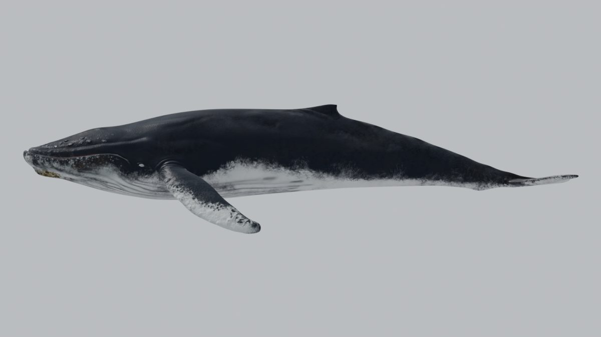 | 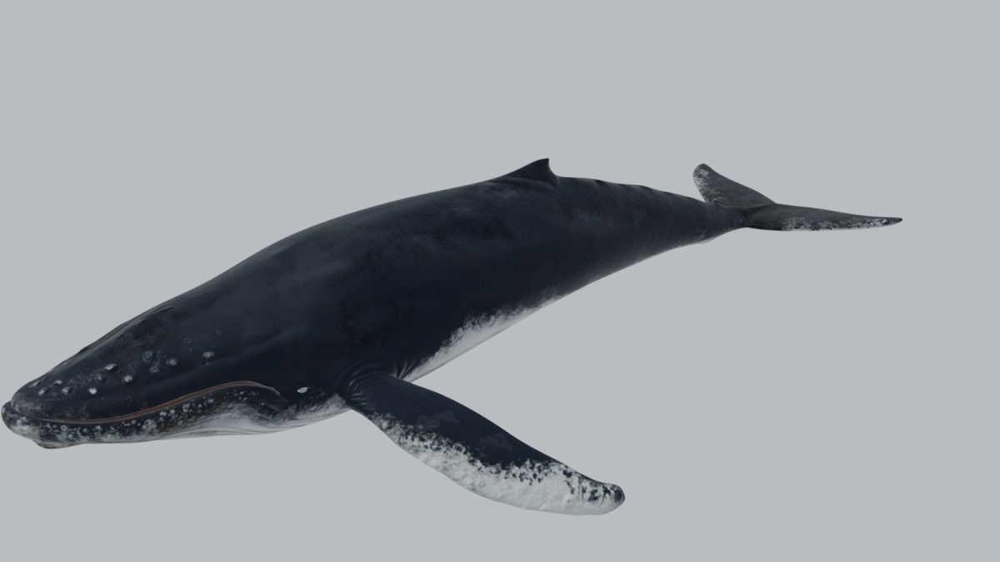 |

| Superior | Inferior |
|---|---|
| 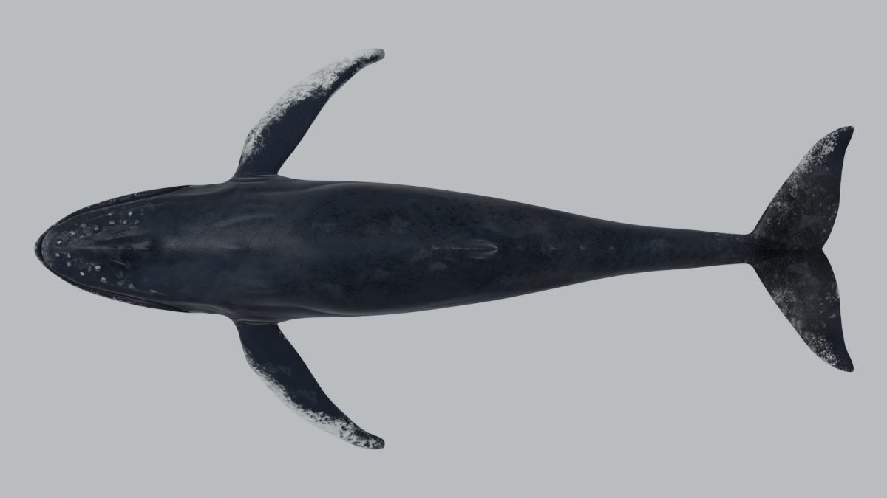 | 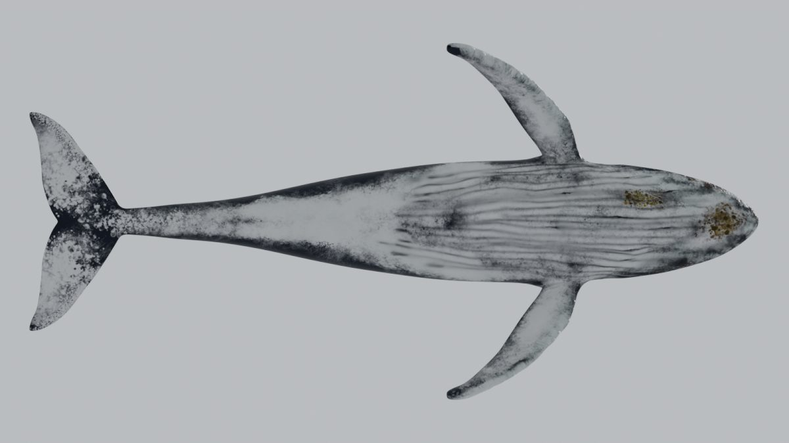 |

| Frontal | Nado (`Swim1_Anim`, f 0) |
|---|---|
| 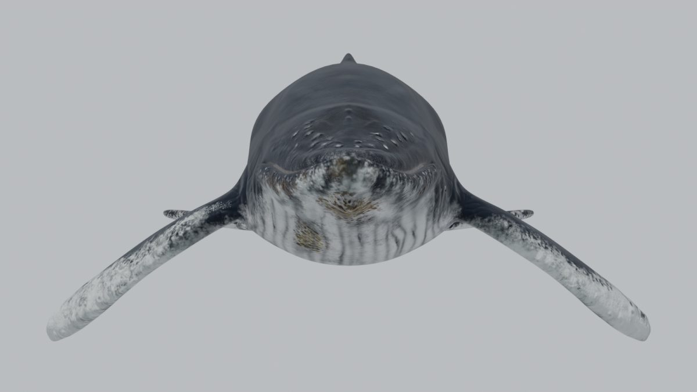 | 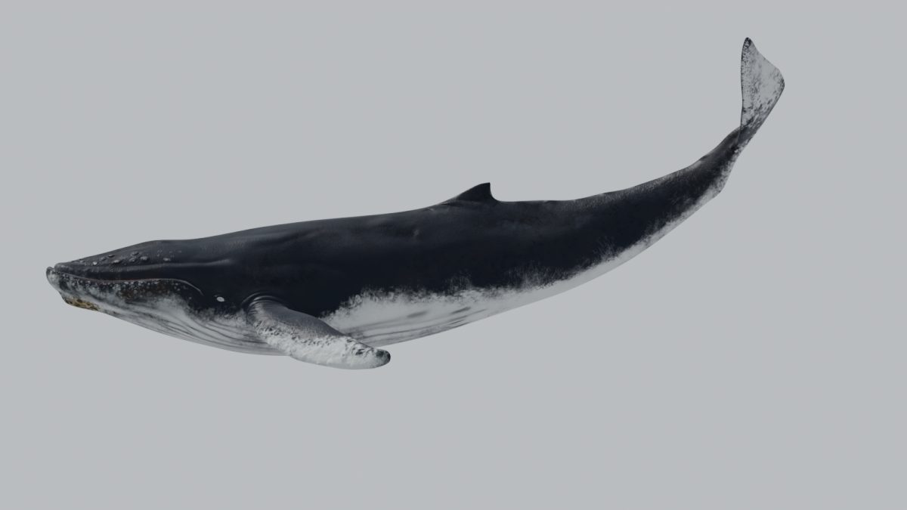 |

`JumpStraight_Anim` (vista lateral fija, fotogramas 0, 28, 56, 83, 111 y 139):

| f 0 | f 28 | f 56 |
|---|---|---|
| 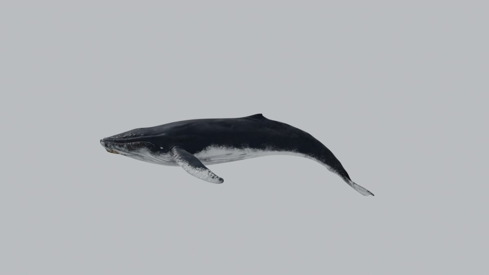 | 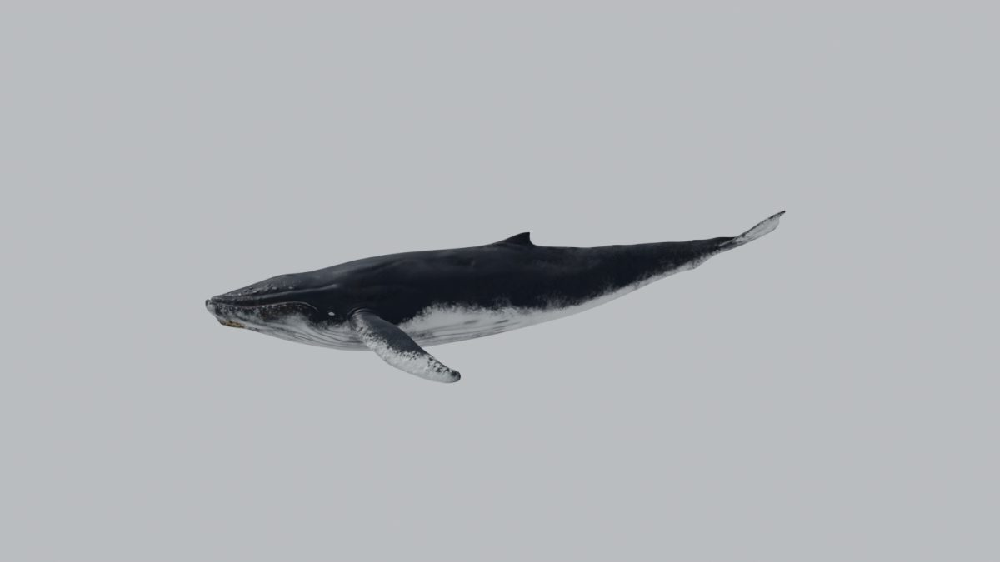 | 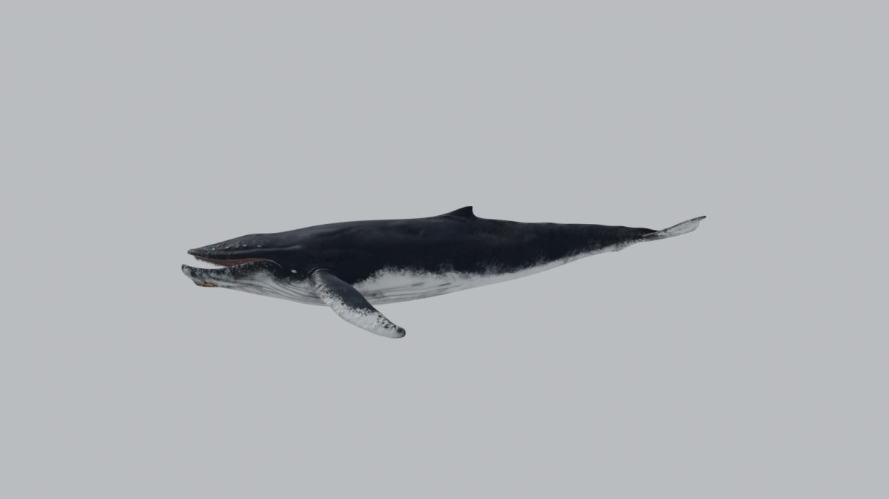 |

| f 83 | f 111 | f 139 |
|---|---|---|
| 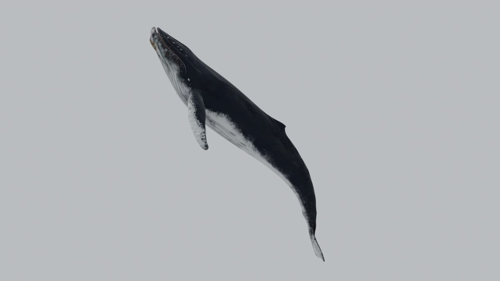 | 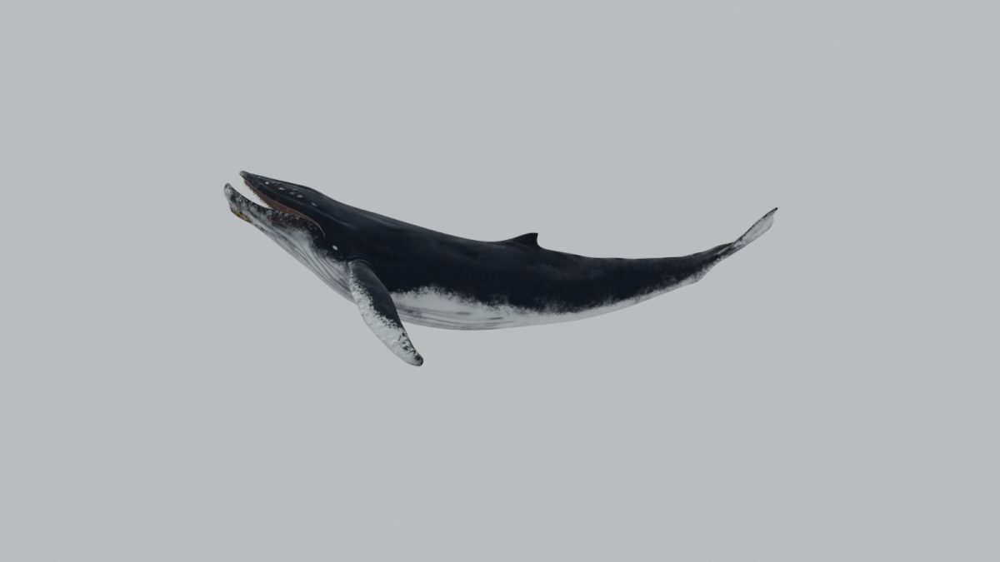 | 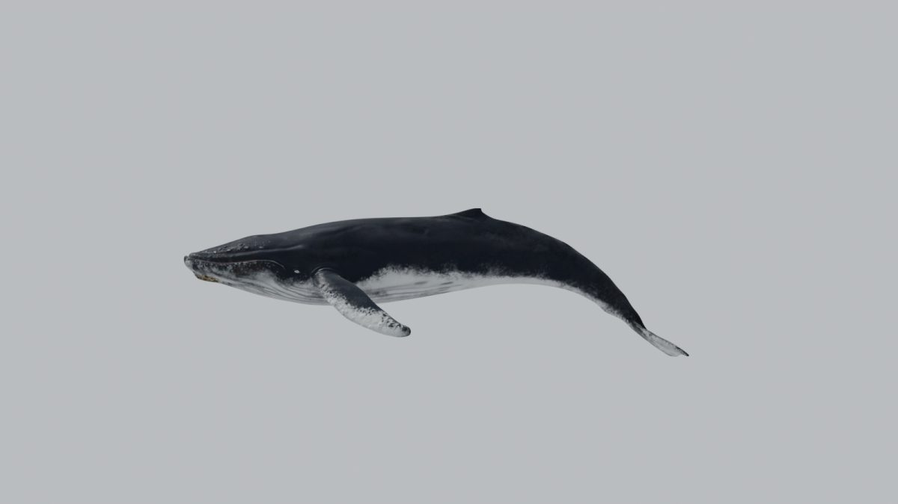 |

**Frente a las referencias** (`.PLAN/referencias`):

- Coincide:
  - Dorso negro y vientre y surcos ventrales blancos.
  - Pectorales blancas por debajo y con manchas.
  - Tubérculos en la cabeza.
  - Percebes en la mandíbula (variante `WithJawBarnacles`).
  - Pequeña aleta dorsal sobre joroba.
- Falta o se queda corto:
  - El **borde festoneado** de las pectorales (el borde es liso).
  - El borde dentado de la caudal.
  - La longitud relativa de las pectorales.
  - Las cicatrices.

  Son candidatos para el refinado de la Fase 1.9.

## 10. Recomendación para las fases 1.2-1.7

1. **Licencia primero.**
   - Confirmar la tienda y la licencia.
   - Mientras tanto, los binarios (.blend, texturas, GLB) se quedan fuera del repo público. En `.gitignore` o con Git LFS en un repo privado; también cabe un GLB servido desde otro sitio.
   - La Fase 1.8 ("copia a `public/models`") depende de esto.
2. **1.2 Copia de trabajo.**
   - Copiar a `_Blender\Claude modelo\Whale_opt.blend` solo `HumpbackWhale` y `HumpbackRig` con sus acciones `*_Anim`.
   - Copiar las texturas `WithJawBarnacles\2kText`, `Wed,Dry Roughness\2kText` y `BarbsTexture` junto al .blend, con rutas relativas.
   - El esculpido `HIghPoluMOdel` va a un `.blend` aparte, solo para hornear.
3. **1.3 Limpieza.**
   - Borrar `ControlRig` y sus mallas, las acciones sin `_Anim`, los empties, las luces, la cámara, el agua y las imágenes sobrantes.
   - Quitar el grupo `shrinkwrap` y el atributo `Col` si no se usa.
   - Triangular los 20 n-gons.
   - **Escala a 14 m (×0,7313)**: hay que escalar también las claves de posición de los huesos. La alternativa sin riesgo es escalar en Three.js.
   - Orientación correcta para glTF: no requiere cambios.
4. **1.4 Geometría.**
   - LOD0 = subdivisión nivel 1 aplicada (≈ 39 k tris).
   - LOD1 = malla base (9,7 k).
   - LOD2 = *decimate* a ≈ 5 k.
   - Antes de hornear, comprobar si el normal map entregado basta en LOD0. Si no, hornear desde `HIghPoluMOdel`, que no necesita UVs.
5. **1.5 Texturas.**
   - baseColor desde Diffuse 2K.
   - Normal 2K (verificar convención OpenGL frente a DirectX).
   - ORM = AO + DryRoughness + metal 0.
   - Máscara de mojado a partir de Wet/Dry roughness.
   - Ajuste leve de color a las fotos.
   - "Barbs" con `alphaMode: MASK` (u omitirlas en LOD1-2).
6. **1.6 Rig.**
   - Se mantiene: no hace falta reconstruir.
   - Limitar a 4 influencias y normalizar.
   - Opcional: quitar lengua y ojos (−10 huesos).
7. **1.7 Animaciones.**
   - `swim_idle` = `Swim1_Anim` (y `Swim2_Anim` o `Idle_Anim` como variantes).
   - `breach` a partir de `JumpLeft_Anim` o `JumpRight_Anim`. La trayectoria global (ascenso desde profundidad, arco, giro de 90-180° y caída de espalda) se añade como *root motion* en Blender o por código en Three.js. Recomiendo Three.js: es parametrizable y no rompe el horneado.
   - Crear `swim_fast`, `dive` y `pec_slap`.
   - Marcar los eventos con los fotogramas estimados.
   - Al exportar, quitar los canales constantes (scale y location de casi todos los huesos).

## 11. Cómo reproducir

Scripts en `_Blender\scripts\`; copia de la versión usada en [`scripts/fase_1_1/`](scripts/fase_1_1/). Ninguno guarda el .blend.

```
"C:\Program Files\Blender Foundation\Blender 5.1\blender.exe" --background "<_Downloads>\humpback-whale-animated\Whale.blend" --python audit_model.py -- "<_Blender>\Claude modelo\auditoria"
"C:\Program Files\Blender Foundation\Blender 5.1\blender.exe" --background "<...>\Whale.blend" --python audit_render.py -- "<...>\auditoria" "<_Downloads>\humpback-whale-animated\Textures\Textures"
"C:\Program Files\Blender Foundation\Blender 5.1\blender.exe" --background "<...>\Whale.blend" --python audit_jumps.py -- "<...>\auditoria"
```

Salidas completas (fuera del repo), en `_Blender\Claude modelo\auditoria\`:

- `audit.json` (volcado completo).
- `anim.json` (medidas, texturas reasignadas, clips).
- `jumps.json` (inclinación, giro y eventos).
- Renders PNG a 1600×900.

Nota técnica de Blender 5: al asignar una acción por script hay que asignar también `animation_data.action_slot`. Si no, la pose no cambia.
