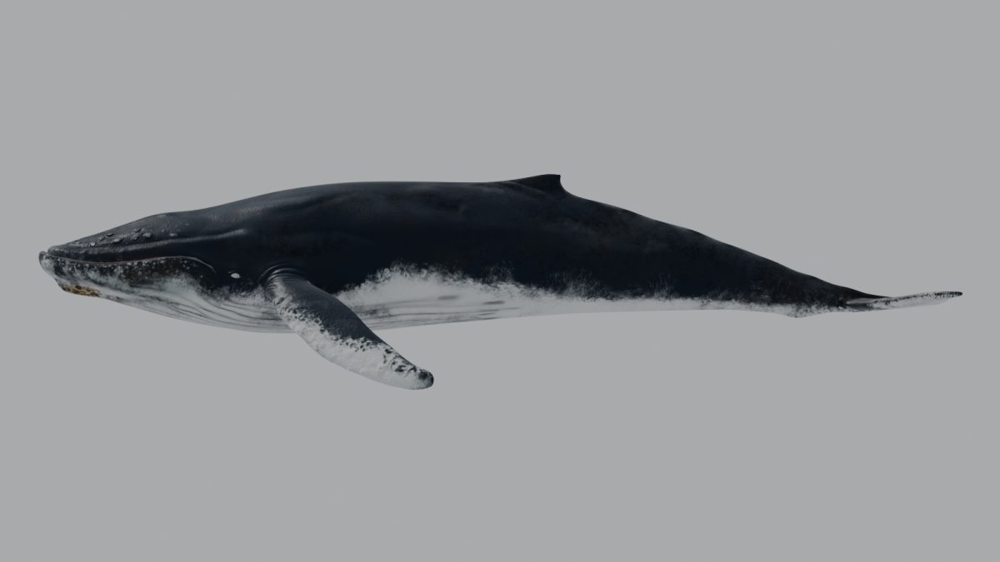
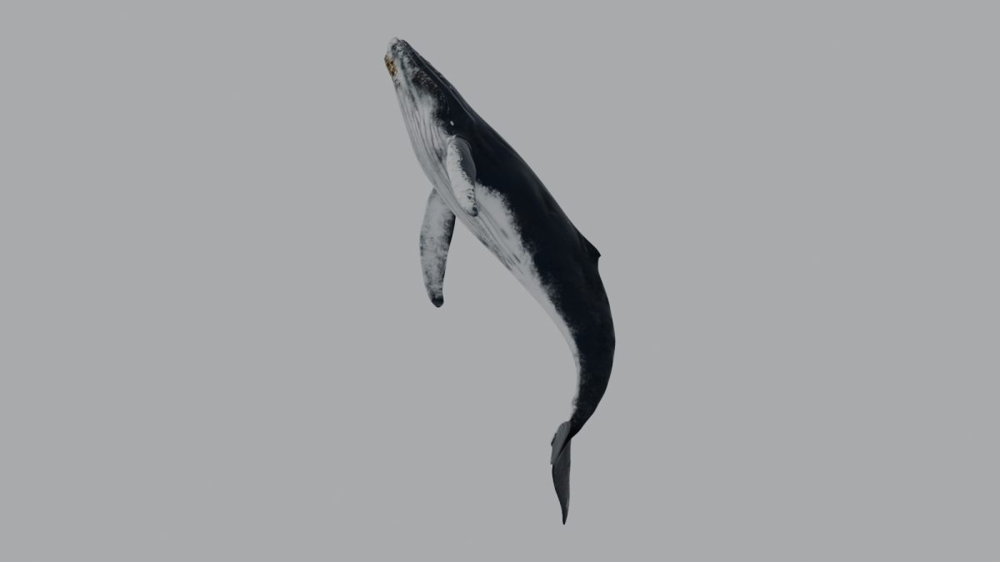

# Fase 1.2 · Copia de trabajo

28/09/2026 · Blender 5.1.1 · script `fase_1_2_copia_trabajo.py`

## Resumen

- He creado `_Blender\Claude modelo\Whale_opt.blend` (3,6 MB, frente a los 133 MB del original). Contiene solo lo que se va a exportar: la malla de juego `Whale`, el esqueleto `WhaleRig` y sus 8 acciones horneadas.
- Las texturas están copiadas en `_Blender\Claude modelo\textures\` con nombres claros y **rutas relativas**. Las 9 que usa el modelo cargan correctamente.
- El esculpido de alta va aparte, en `Whale_bake_src.blend` (29 MB), para hornear en la Fase 1.4.
- **Verificación:** en 35 poses (reposo y varios fotogramas de cada clip), los vértices deformados de la copia coinciden con los del original con **0 m de diferencia**.
- El original `_Downloads\...\Whale.blend` no se ha modificado: conserva la fecha de las 13:40:48.

## Qué se ha copiado y cómo

El script no abre ni guarda el original. Parte de un Blender vacío (`--factory-startup`) y **añade** (*append*) desde `Whale.blend` solo los objetos necesarios. Así el archivo de trabajo nace limpio, sin el `ControlRig`, las mallas duplicadas, los empties, las luces, la cámara, el agua ni las imágenes perdidas.

### `Whale_opt.blend`

| Elemento | Nombre en el original | Nombre nuevo | Notas |
|---|---|---|---|
| Malla de juego | `HumpbackWhale` | `Whale` | 4 975 vértices, 9 746 triángulos, 1 UV, materiales `Humpback`, `Cornea` y `Barbs`, modificadores Armature y Subdivision |
| Esqueleto | `HumpbackRig(bakeanimationshere)` | `WhaleRig` | 47 huesos, sin acción activa; los clips están en 8 pistas NLA |
| Acciones | `*_Anim` y `RestPosee` | Sin cambios | `Idle_Anim` 0-59, `Swim1_Anim` y `Swim2_Anim` 0-89, `MouthOpen_Anim` 0-89, `JumpStraight_Anim` 0-139, `JumpLeft_Anim` y `JumpRight_Anim` 0-143, `RestPosee` 0 |
| Escena | — | — | Métrico, metros, 24 fps, fotogramas 0-143 |

**Sin cambios todavía**, porque son tareas de la Fase 1.3:

- La escala (19,1 m).
- El grupo `shrinkwrap` y el atributo `Col`.
- Los 20 n-gons.
- Las influencias por vértice (hasta 10).
- Los nombres de los clips.

### `Whale_bake_src.blend` (fuente para hornear)

| Objeto | Nombre en el original | Triángulos |
|---|---|---:|
| `Whale_HighPoly` | `HIghPoluMOdel` | 856 932 |
| `Tongue_HighPoly` | `TongueHighPoly` | 58 962 |
| `Eyes_HighPoly` | `eyeshp` (con modificador Mirror) | 16 670 (×2) |

Sin materiales ni imágenes: solo se necesita la geometría.

### Texturas (`_Blender\Claude modelo\textures\`, 77 MB)

Variante de piel elegida: **`WithJawBarnacles`**, con percebes en la mandíbula, como en las referencias.

| Archivo | Origen (`Textures\Textures\`) | Uso |
|---|---|---|
| `skin_diffuse_2k.png` | `WithJawBarnacles\2kText\Diffuse.png` | Enlazada: color de la piel |
| `skin_normal_2k.png` | `WithJawBarnacles\2kText\Normal.png` | Enlazada: normal |
| `skin_ao_2k.png` | `WithJawBarnacles\2kText\Ambient.png` | Enlazada: AO, mezclado con el color en el material original |
| `skin_roughness_dry_2k.png` | `Wed,Dry Roughness\2kText\DryRoughness.png` | Enlazada: rugosidad (sustituye a la `image (3).png` perdida) |
| `skin_roughness_wet_2k.png` | `Wed,Dry Roughness\2kText\WetRoughness.png` | Para la máscara de "mojado" (1.5) |
| `skin_height_2k.png` | `WithJawBarnacles\2kText\Height.png` | Reserva (horneado o *parallax*) |
| `skin_*_4k.png` (5) | Carpetas `4kText` | Reserva para horneados y reescalados de calidad (1.4-1.5) |
| `barbs_albedo`, `alpha`, `specular`, `translucency`, `normal`, `ao` (.png) | `BarbsTexture\` | Enlazadas (salvo `ao`): material `Barbs` |

Todas las imágenes del .blend usan rutas `//textures\...`, relativas al .blend. La carpeta `Claude modelo` se puede mover entera sin romper nada.

## Verificación

Script `verify_model.py`, ejecutado sobre el original y sobre la copia. Compara:

- Estadísticas de la malla y el número de huesos.
- Acciones y pistas NLA.
- Imágenes: que existan y carguen.
- Posiciones deformadas: bounding box, centroide y una muestra de 25 vértices, en reposo y en 4-5 fotogramas de cada clip `*_Anim` (35 poses en total).

| Comprobación | Original | Copia |
|---|---|---|
| Vértices / caras / triángulos | 4 975 / 4 926 / 9 746 | 4 975 / 4 926 / 9 746 |
| Grupos de vértices, máx. influencias, vértices con más de 4 | 48 · 10 · 1 942 | 48 · 10 · 1 942 |
| Huesos | 47 | 47 |
| Acciones de la ballena | 8 (+ 8 del `ControlRig`) | 8 |
| Imágenes que cargan | 0 de 25 | 9 de 9 |
| Diferencia máxima de vértices deformados (35 poses) | — | **0 m** |

| Reposo (copia) | `JumpRight_Anim` f 87 (copia) |
|---|---|
|  |  |

Datos completos en `_Blender\Claude modelo\verificacion\`: `original.json`, `whale_opt.json` y los PNG.

## Cómo reproducir

```
"C:\Program Files\Blender Foundation\Blender 5.1\blender.exe" --background --factory-startup ^
  --python "_Blender\scripts\fase_1_2_copia_trabajo.py" -- ^
  "_Downloads\humpback-whale-animated\Whale.blend" "_Downloads\humpback-whale-animated\Textures\Textures" "_Blender\Claude modelo"

"C:\Program Files\Blender Foundation\Blender 5.1\blender.exe" --background "_Blender\Claude modelo\Whale_opt.blend" ^
  --python "_Blender\scripts\verify_model.py" -- "<salida>.json" Whale WhaleRig --render "<carpeta>"
```

Copia de los scripts en [`scripts/fase_1_2/`](scripts/fase_1_2/). Los .blend y las texturas **no se versionan** por la licencia (ver la Fase 1.1).

## Notas para la Fase 1.3

- `verify_model.py` queda como prueba de regresión. Después de escalar a 14 m, las poses deben coincidir con las del original multiplicadas por 0,7313.
- Las rutas relativas se guardaron con separador `\` (Windows). Si el .blend se abre en otro sistema, puede necesitar `bpy.ops.file.make_paths_relative()`.
