# Fase 1.4 · Optimización de geometría y LODs

28/09/2026 · Blender 5.1.1 · scripts `fase_1_4_lods.py` y `fase_1_4_render.py`

## Resumen

| LOD | Cómo se obtiene | Triángulos | Piel / córnea / "barbs" | Distancia a LOD0 (media / p95 / máx.) |
|---|---|---:|---|---|
| **LOD0** | Malla base + subdivisión nivel 1 aplicada | **39 196** | 35 036 / 1 088 / 3 072 | — |
| **LOD1** | LOD0 simplificado (decimate collapse, simetría X) | **14 997** | 13 894 / 406 / 697 | 0,5 / 1,3 / 3,5 mm |
| **LOD2** | LOD0 simplificado | **4 998** | 4 520 / 110 / 368 | 2,1 / 5,3 / 9,6 mm |

- Los tres LODs **comparten las UVs, los materiales y las texturas**, y están enlazados al mismo esqueleto `WhaleRig`.
- **Pesos:** máximo **4 influencias** por vértice, normalizadas a 1, en los tres LODs (antes había hasta 9). El cambio de deformación en LOD0 es de 2,2 mm de media y 42 mm en el percentil 99, con un máximo de 131 mm en la punta de los lóbulos de la caudal. En los renders no se aprecia.
- **Normal map: no hace falta hornear.** El normal map entregado (`skin_normal_2k`) ya reproduce el detalle del esculpido sobre el LOD0 (tubérculos, pliegues de la pectoral, textura de piel). El esculpido de alta además difiere del modelo final (boca entreabierta, tubérculos más grandes), así que hornearlo empeoraría el resultado.
- Ya no hay n-gons: la subdivisión los convierte en quads y la simplificación, en triángulos.
- La malla base (9,7 k) deja de estar en `Whale_opt.blend`; se conserva en `versiones\Whale_opt_f1_3.blend`.

## Decisiones

1. **LOD1 y LOD2 salen del LOD0, no de la malla base.** La base es la "jaula" de la subdivisión y es algo más grande que la superficie subdividida. Si el LOD1 fuera la base, al cambiar de LOD se notaría un salto de volumen. Simplificando el LOD0, los tres LODs mantienen la misma forma (LOD1 a menos de 3,5 mm del LOD0 y LOD2 a menos de 1 cm), además de las mismas UVs y texturas.
2. **Subdivisión nivel 1 y no 2.** El autor renderizaba con nivel 2 (≈ 156 k triángulos). El nivel 1 da 39 k, dentro del objetivo de 20-40 k, y el normal map cubre la diferencia de detalle.
3. **Sin horneado desde el esculpido.** Ver la comparación en arcilla. La distancia media de la piel del LOD0 al esculpido es de 32 mm, pero las mayores diferencias (hasta 28 cm) están en la boca (morro, y ≈ −6,5 m): en el esculpido está entreabierta. Es otra versión del modelo; el normal map entregado corresponde a la malla final.
4. **Límite de 4 influencias hecho a mano.** `vertex_group_limit_total` no hacía nada ejecutado desde el script (solo normalizaba), así que se implementó en Python: conservar los 4 pesos mayores (≥ 0,001) y normalizar. Es lo mismo que haría el exportador glTF, pero así queda controlado y medido.

## Pesos: efecto de limitar a 4 influencias (LOD0)

Error = desplazamiento de cada vértice deformado respecto a la versión sin límite, en 9 poses repartidas entre los 7 clips:

| Pose | Máx. | p99 |
|---|---:|---:|
| `Swim1_Anim` f 0 / f 44 | 56 / 103 mm | 36 / 63 mm |
| `Swim2_Anim` f 45 | 131 mm | 106 mm |
| `Idle_Anim` f 29 | 48 mm | 31 mm |
| `JumpRight_Anim` f 70 / f 87 | 74 / 50 mm | 33 / 25 mm |
| `JumpLeft_Anim` f 107 | 115 mm | 45 mm |
| `JumpStraight_Anim` f 90 | 45 mm | 24 mm |
| `MouthOpen_Anim` f 40 | 99 mm | 58 mm |
| **Total** | **131 mm** | **42 mm** (media 2,2 mm) |

Los 300 vértices con más error dependen sobre todo de `Tail.R.001` (132) y `Tail.L.001` (116): son los lóbulos de la caudal, donde se solapan muchos huesos pequeños. En una ballena de 14 m y con el movimiento más amplio (`Swim2`, f 45) la diferencia no se ve:

| Pesos originales (hasta 9) | LOD0 con 4 influencias |
|---|---|
|  | 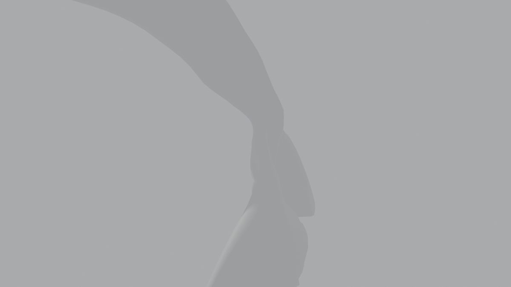 |

Si en la Fase 1.6 se viera algún artefacto en la caudal, se puede corregir allí suavizando los pesos de los lóbulos.

## Normal map: esculpido frente a LOD0

Material gris y misma luz y cámara:

| Esculpido (857 k) | LOD0 sin normal map | LOD0 con `skin_normal_2k` |
|---|---|---|
| 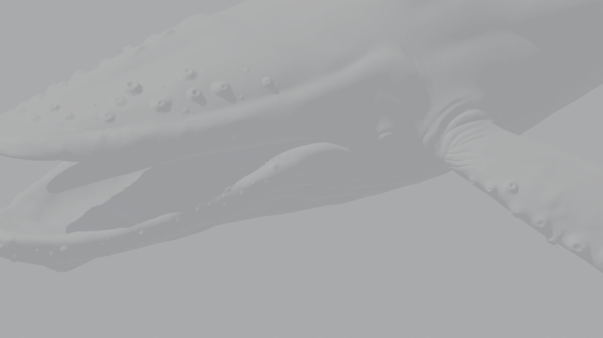 | 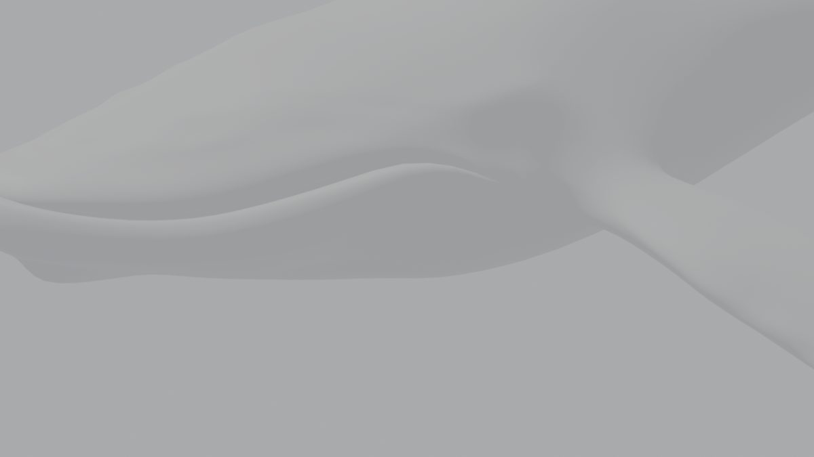 | 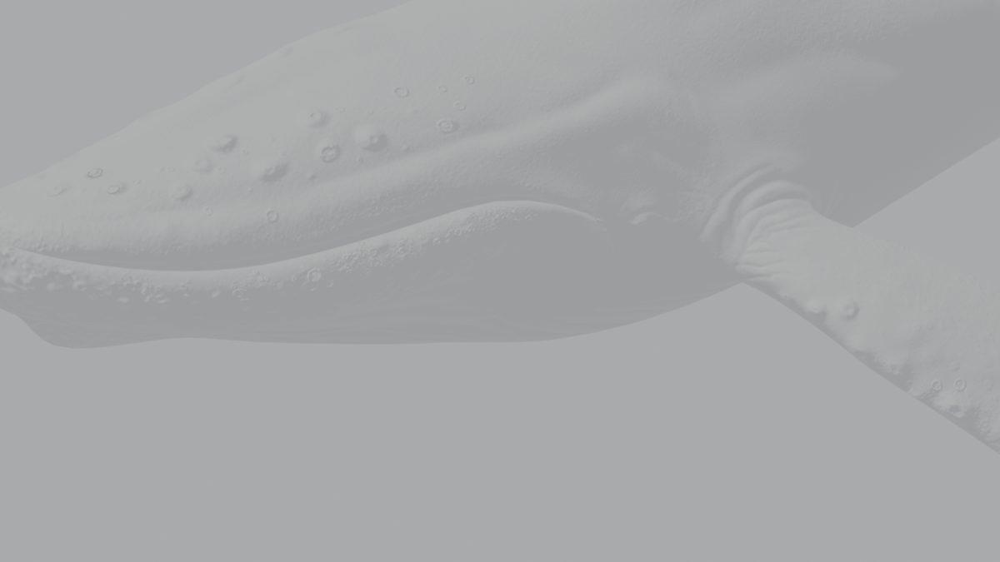 |
| 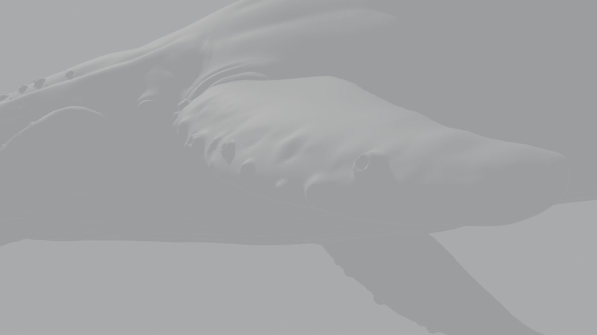 | 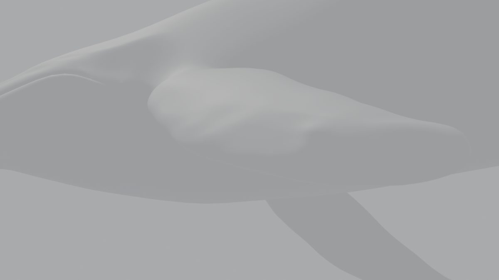 | 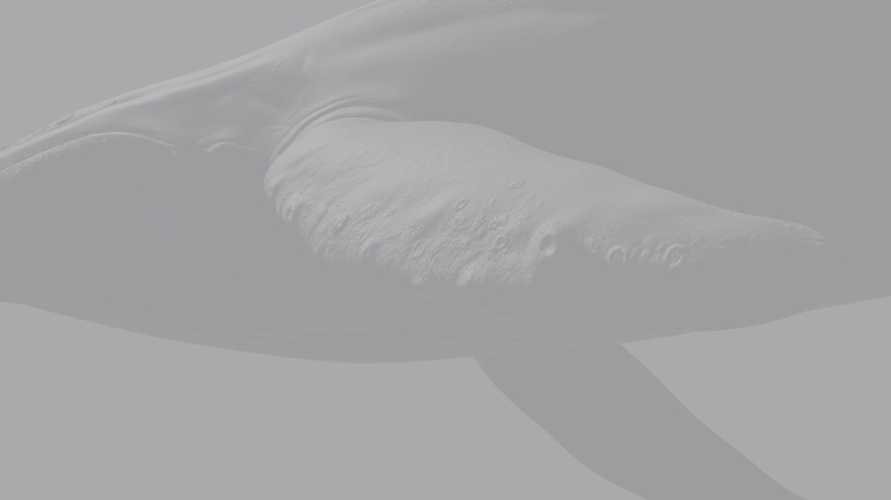 |

Con el normal map, el LOD0 recupera los tubérculos, los pliegues en la base de la pectoral, las protuberancias del borde de la pectoral y la microtextura de la piel. El esculpido tiene la boca entreabierta y los tubérculos más marcados en relieve; como silueta, esos relieves solo se notarían en primerísimos planos.

## LODs

| LOD0 (39 k) | LOD1 (15 k) | LOD2 (5 k) |
|---|---|---|
|  | 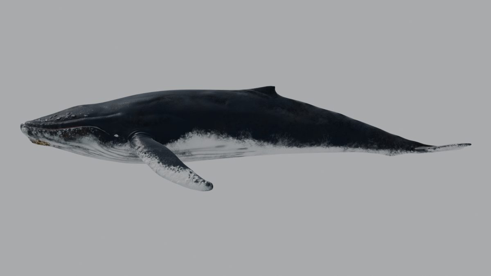 |  |
| 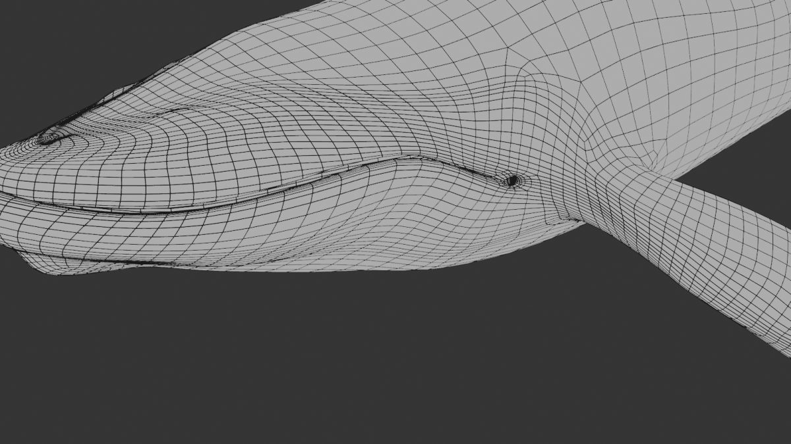 | 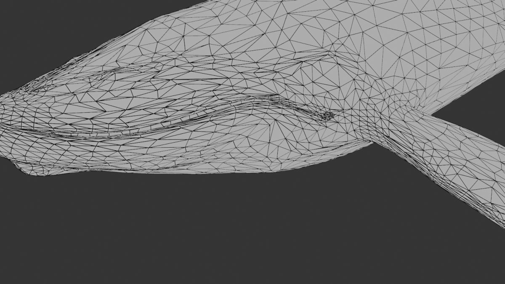 | 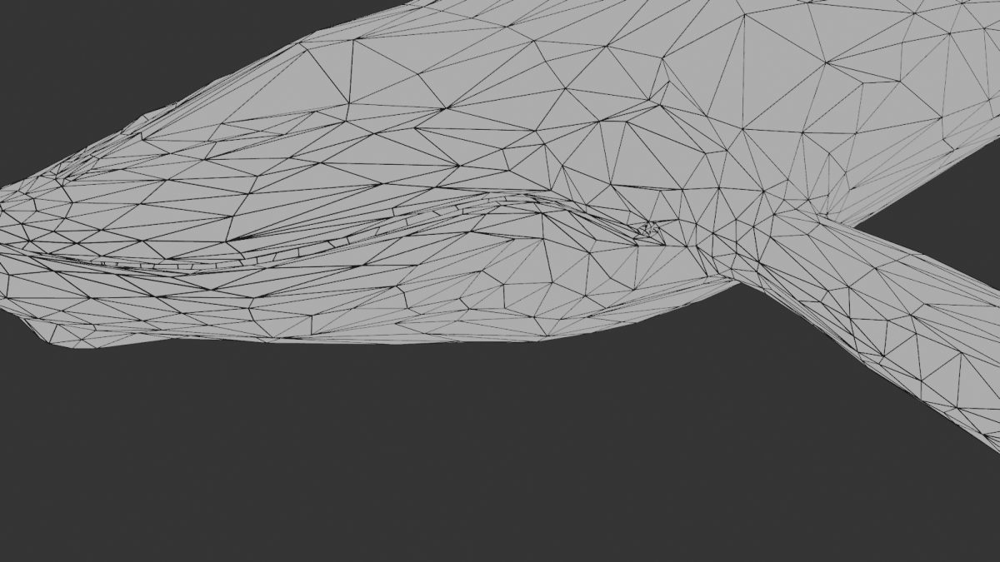 |

- A distancia de vista completa, los tres son prácticamente iguales porque la silueta se conserva y el detalle lo pone el normal map.
- La simplificación concentra los triángulos en la boca, los ojos y la pectoral, y los reduce en las zonas planas del lomo.
- Distancias de uso orientativas para Three.js (`THREE.LOD`), a ajustar en la Fase 8.2: LOD0 hasta unos 40 m, LOD1 hasta unos 120 m y LOD2 a partir de ahí.

## Verificación

`verify_model.py` sobre cada LOD de `Whale_opt.blend`:

| LOD | Triángulos | Máx. influencias | Imágenes | Poses deformadas | Diferencia de bounding box frente al original escalado |
|---|---:|---:|---|---:|---:|
| LOD0 | 39 196 | 4 | 9 de 9 cargan | 35 | ≤ 3,5 cm |
| LOD1 | 14 997 | 4 | 9 de 9 | 35 | ≤ 3,5 cm |
| LOD2 | 4 998 | 4 | 9 de 9 | 35 | ≤ 3,5 cm |

Los 3,5 cm de diferencia con el original son esperables: el original se midió sobre la jaula (la subdivisión estaba desactivada en el viewport) y la superficie subdividida queda ligeramente por dentro.

## Archivos

En `_Blender\Claude modelo\`, sin versionar por la licencia.

| Archivo | Contenido |
|---|---|
| `Whale_opt.blend` (5,4 MB) | `WhaleRig` + `Whale_LOD0`, `Whale_LOD1` y `Whale_LOD2` |
| `versiones\Whale_opt_f1_3.blend`, `versiones\Whale_bake_src_f1_3.blend` | Entrada de la fase (resultado de la 1.3) |
| `verificacion\lods_f1_4.json` | Informe: triángulos, influencias, distancias y error de pesos |
| `verificacion\whale_opt_f1_4_lod{0,1,2}.json`, `verificacion\f1_4\*.png` | Verificación y renders |

## Cómo reproducir

```
set BL="C:\Program Files\Blender Foundation\Blender 5.1\blender.exe"
set M=D:\Trabajo\Proyectos_LEGION\26_903_Whale\_Blender\Claude modelo
%BL% --background "%M%\versiones\Whale_opt_f1_3.blend" --python _Blender\scripts\fase_1_4_lods.py -- "%M%\Whale_opt.blend" "%M%\versiones\Whale_bake_src_f1_3.blend" "%M%\verificacion\lods_f1_4.json"
%BL% --background "%M%\Whale_opt.blend" --python _Blender\scripts\fase_1_4_render.py -- "%M%\verificacion\f1_4" "%M%\Whale_bake_src.blend" "%M%\versiones\Whale_opt_f1_3.blend"
```

Copia de los scripts en [`scripts/fase_1_4/`](scripts/fase_1_4/).

## Pendiente para las fases siguientes

- **1.5:** texturas glTF (baseColor, normal y ORM a 2K) y máscara de mojado. Los tres LODs las comparten.
- **1.6:** el rig ya cumple el máximo de 4 influencias. Queda revisar la caudal y, opcionalmente, quitar la lengua y los ojos.
- **1.8:** exportar los tres LODs como mallas con piel sobre el mismo esqueleto y montar `THREE.LOD` en el visor.
