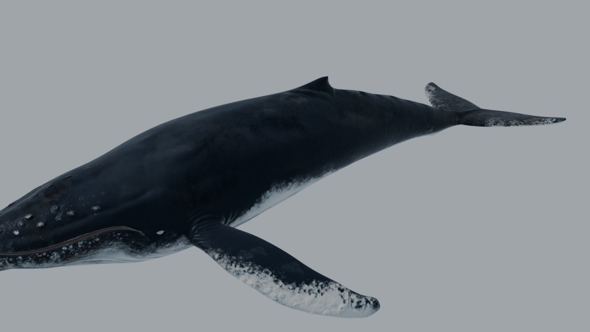
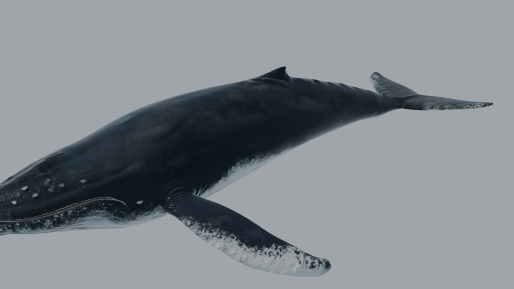
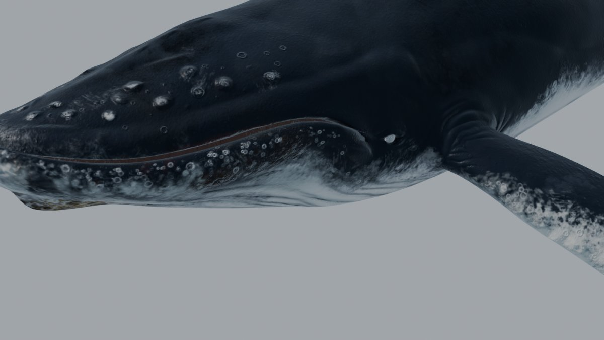
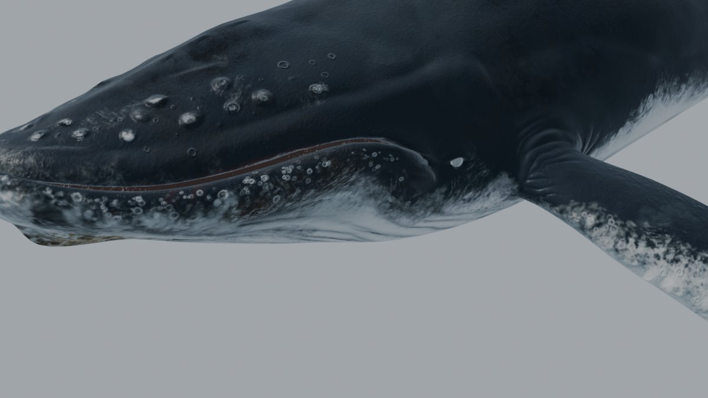
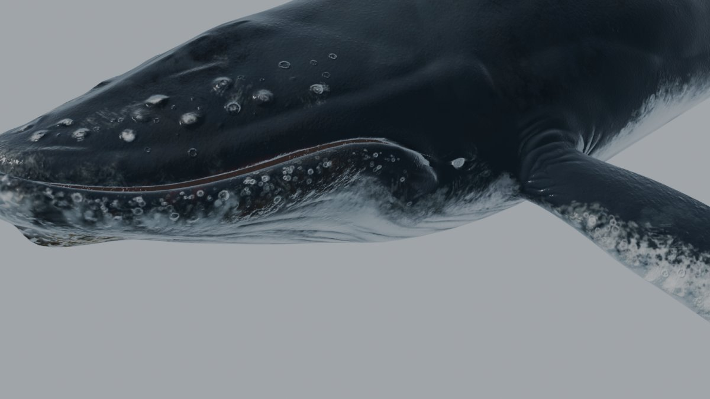
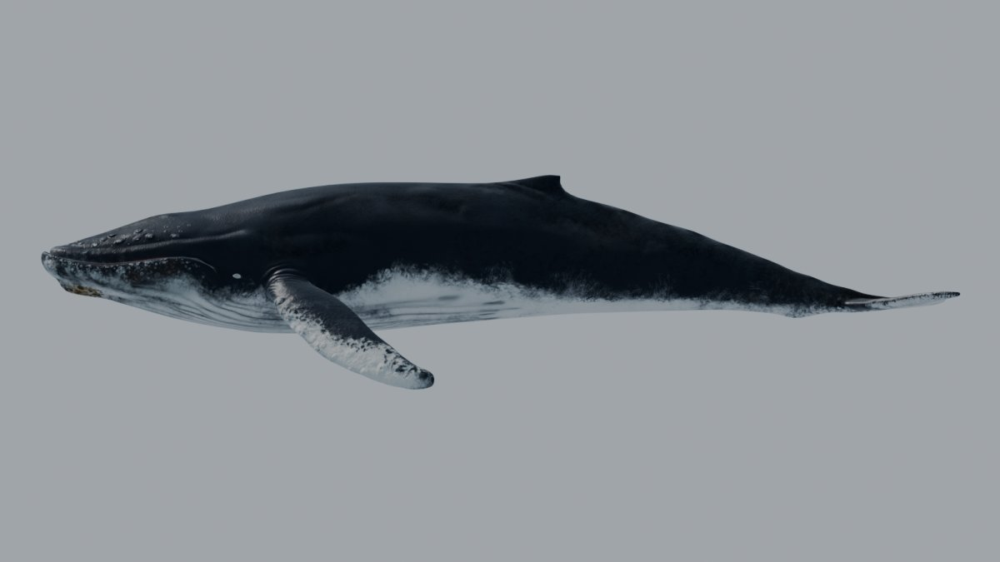
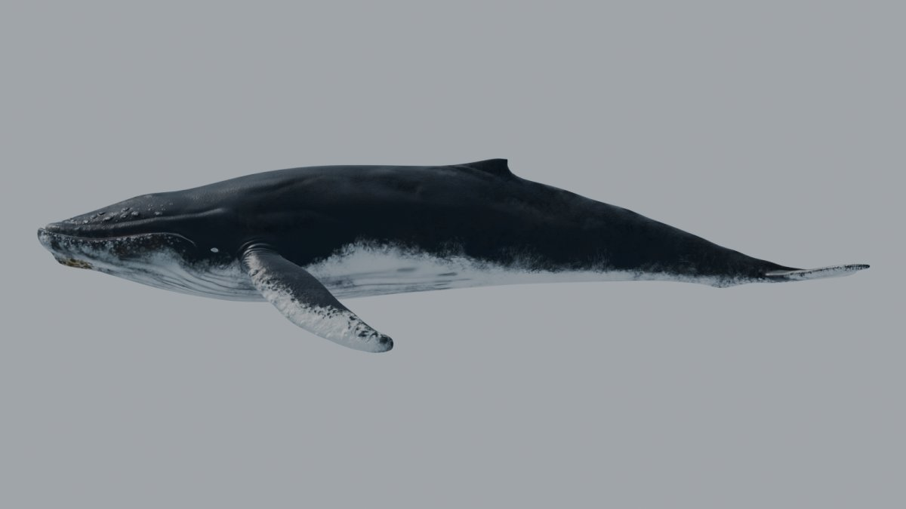

# Fase 1.5 · Texturas PBR glTF

28/09/2026 · Blender 5.1.1 · scripts `fase_1_5_analisis.py`, `fase_1_5_texturas.py` y `fase_1_5_render.py`

## Resumen

- He generado el juego de texturas glTF a 2K en `_Blender\Claude modelo\textures\gltf\`: baseColor, ORM y normal de la piel, un **mapa de mojado** para Three.js y las texturas de las "barbs" con alfa.
- He reconstruido los materiales `Humpback` y `Barbs` con nodos que el exportador glTF entiende. En `Humpback`, la AO sale por el grupo `glTF Material Output`.
- **Ajuste de color, leve y medido:**
  - Negros un poco levantados y menos azules (el dorso pasa de (0,113, 0,117, 0,146) a (0,139, 0,146, 0,162) en sRGB).
  - Solo el 35 % de la AO se hornea en el color; el resto va al canal R del ORM para que Three.js la aplique a la luz ambiente.
- Los tres LODs comparten estas texturas; la córnea sigue sin texturas.

## Análisis de partida

Medido con `fase_1_5_analisis.py` (datos en `verificacion\texturas_f1_5.json`):

| Medida (sRGB 0-1) | Diffuse entregado | Diffuse × AO (material del autor) | Referencia ilustrada (`ref_04`) |
|---|---|---|---|
| Media de zonas oscuras (dorso) | (0,113, 0,117, 0,146) | (0,073, 0,068, 0,082) | (0,175, 0,204, 0,218) |
| Relación azul / verde en oscuros | 1,25 | 1,21 | 1,07 |
| Media de zonas claras (vientre) | (0,730, 0,732, 0,719) | (0,688, 0,691, 0,679) | (0,759, 0,779, 0,789) |

- El material del autor multiplicaba **toda** la AO sobre el color, lo que deja el dorso por debajo de un albedo físicamente plausible (≈ 0,07 sRGB).
- En un motor PBR, la AO debe ir en su propio mapa y oscurecer solo la luz indirecta; si no, las zonas en cavidad quedan casi negras incluso al sol.
- En las fotos de referencia, los píxeles oscuros incluyen luz y sombra, así que solo sirven como indicación del tinte: neutro o ligeramente cian, no violeta.

| Rugosidad | Media | p5-p95 |
|---|---:|---|
| Seca (`DryRoughness`) | 0,397 | 0,169-0,427 |
| Mojada (`WetRoughness`) | 0,221 | 0,094-0,239 |
| Seca − mojada | 0,176 | 0,012-0,192 (casi uniforme) |

## Texturas generadas (`textures\gltf\`)

| Archivo | Espacio | Canales | Origen |
|---|---|---|---|
| `whale_basecolor_2k.png` | sRGB | RGB color, A = 1 | Diffuse `WithJawBarnacles` 2K + ajuste + 35 % de AO |
| `whale_orm_2k.png` | Lineal | R = oclusión (AO), G = rugosidad seca, B = metalicidad (0) | Ambient + DryRoughness 2K |
| `whale_normal_2k.png` | Lineal | Normal tangente OpenGL (+Y), como glTF | Copia del Normal 2K (convención comprobada en los renders de la 1.4) |
| `whale_wet_2k.png` | Lineal | R = rugosidad mojada, G = retención de agua, B = altura | WetRoughness, AO y Height 2K |
| `barbs_basecolor.png` | sRGB | RGB albedo, **A = alfa** | fiber_albedo + fiber_alpha (el 13 % del atlas es opaco) |
| `barbs_normal.png` | Lineal | Normal | Copia de `fiver.png` |

Parámetros del ajuste de color (`PARAMS` en el script, fáciles de retocar y regenerar):

| Parámetro | Valor | Efecto |
|---|---|---|
| `lift` | 0,05 | Levanta negros en sRGB: `out = 0,05 + 0,95 · in` |
| `dark_gain_rgb` | (0,96, 1,0, 0,93) | Quita tinte azul o violeta, solo en tonos oscuros |
| `dark_weight_lum` | 0,15 → 0,45 | Transición suave del ajuste de oscuros a claros |
| `ao_in_basecolor` | 0,35 | Parte de la AO que se hornea en el color (mantiene el contraste de surcos y tubérculos) |
| `max_srgb` | 0,86 | Techo de blancos |

Resultado en el baseColor: oscuros (0,139, 0,146, 0,162), relación azul/verde 1,11; claros (0,712, 0,715, 0,708); luminancia p5/p50/p95 = 0,109 / 0,196 / 0,737.

### Mapa de mojado: cómo usarlo en Three.js

No forma parte de glTF. El material guarda la propiedad `wet_map` = `whale_wet_2k.png`, que irá en `extras` al exportar en la 1.8, y el visor lo cargará aparte. Uso previsto en TSL, con `wetness` ∈ [0, 1] animado por el salto (se moja al salir y se seca poco a poco):

```js
// roughness = mix(ORM.g, WET.r, wetness * (0.6 + 0.4 * WET.g))
const wetAmount = wetness.mul(wet.g.mul(0.4).add(0.6));
material.roughnessNode = mix(orm.g, wet.r, wetAmount);
// opcional: oscurecer el color un 10-15 % al mojarse y usar WET.b (altura) para las gotas
```

- **G (retención)** = 0,6 · (1 − AO) + 0,4 · (1 − altura): el agua se queda más tiempo en surcos, pliegues y cavidades.
- **B (altura)** servirá para colocar gotas o hilos de agua en la Fase 5.4 (cortinas de agua sobre el cuerpo).

## Materiales reconstruidos

| Material | Nodos | En glTF |
|---|---|---|
| `Humpback` (piel) | baseColor → Base Color; ORM → Separate Color (G → Roughness, B → Metallic, R → `glTF Material Output`.Occlusion); normal → Normal Map; Specular IOR Level 0,096 (del original) | `baseColorTexture`, `metallicRoughnessTexture` y `occlusionTexture` (la misma imagen ORM), `normalTexture`, `KHR_materials_specular` |
| `Barbs` | baseColor RGB → Base Color; alfa → Math **Round** → Alpha; normal → Normal Map; rugosidad 0,45 | `alphaMode: MASK` (corte 0,5), a verificar en la exportación de la 1.8 |
| `Cornea` | Sin cambios: transmisión 1, alfa 0,27, rugosidad 0 | `KHR_materials_transmission`, a revisar en la 1.8 |

Se eliminaron las entradas `Specular` y `Translucency` de las "barbs", que no tienen equivalente directo en glTF y apenas se notan en unas fibras tan pequeñas.

## Comparación (Eevee, LOD0, sol y cielo azulado)

| Antes (material del autor) | Después (glTF) | Después, piel mojada (`--wet`) |
|---|---|---|
|  |  |  |
|  |  |  |
|  |  |  |

- El cambio de color es sutil, como se buscaba: el dorso gana algo de lectura, con menos negro puro y menos azul, sin perder el contraste con el vientre.
- **Ojo:** Eevee no usa la AO del ORM (el grupo `glTF Material Output` solo lo lee el exportador), así que en estos renders solo se ve el 35 % horneado. En Three.js la AO completa oscurecerá la luz ambiente de las cavidades, y el resultado final será algo más contrastado.
- Mojada, la piel tiene reflejos más definidos en el lomo, la cabeza y la pectoral. Con el mapa de entorno del cielo (Fase 3.5) el efecto será más visible.

## Archivos

En `_Blender\Claude modelo\`; no se versionan por la licencia (las texturas derivan de las del modelo).

| Archivo | Contenido |
|---|---|
| `Whale_opt.blend` | LODs con los materiales glTF, que apuntan a `//textures/gltf/…` |
| `textures\gltf\*.png` | Las 6 texturas de arriba (≈ 20 MB en PNG; en la 1.8 pasarán a KTX2) |
| `versiones\Whale_opt_f1_4.blend` | Entrada de la fase |
| `verificacion\texturas_f1_5.json`, `verificacion\texturas_gltf_f1_5.json`, `verificacion\f1_5\*.png` | Análisis, informe y renders |

## Cómo reproducir

```
set BL="C:\Program Files\Blender Foundation\Blender 5.1\blender.exe"
set M=D:\Trabajo\Proyectos_LEGION\26_903_Whale\_Blender\Claude modelo
%BL% --background --factory-startup --python _Blender\scripts\fase_1_5_analisis.py -- "%M%\textures" ".PLAN\referencias" "%M%\verificacion\texturas_f1_5.json"
%BL% --background "%M%\versiones\Whale_opt_f1_4.blend" --python _Blender\scripts\fase_1_5_texturas.py -- "%M%\Whale_opt.blend" --json "%M%\verificacion\texturas_gltf_f1_5.json"
%BL% --background "%M%\Whale_opt.blend" --python _Blender\scripts\fase_1_5_render.py -- "%M%\verificacion\f1_5" despues
```

Copia de los scripts en [`scripts/fase_1_5/`](scripts/fase_1_5/).

## Pendiente para las fases siguientes

- **1.8:**
  - Convertir a KTX2: baseColor en ETC1S o UASTC, y normal y ORM en UASTC para no degradar el detalle.
  - Comprobar `alphaMode: MASK` en las "barbs", la AO en `occlusionTexture` y `wet_map` en `extras`.
- **Visor Three.js:** cargar `whale_wet_2k` y montar la mezcla de rugosidad con TSL. Empezar con `aoMapIntensity` ≈ 1 y ajustar.
