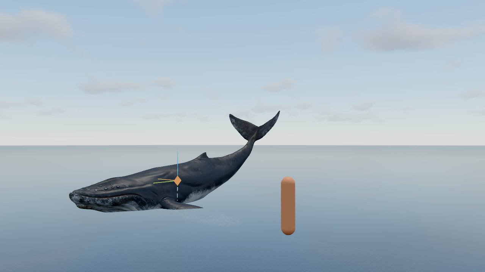
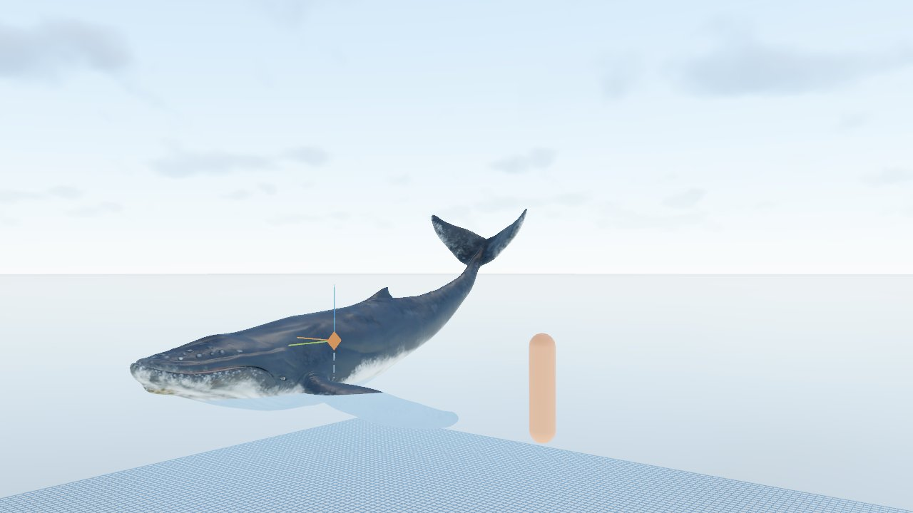
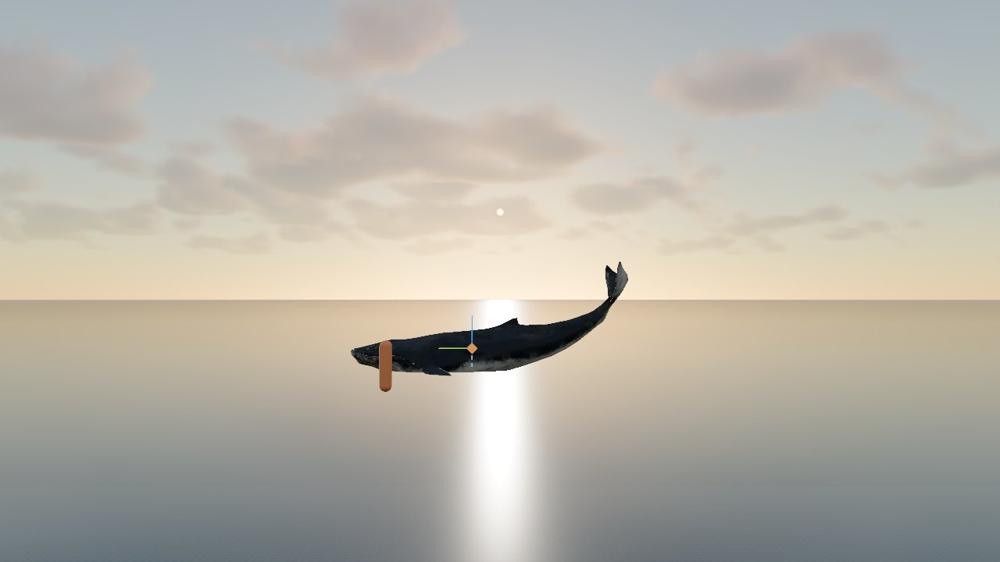
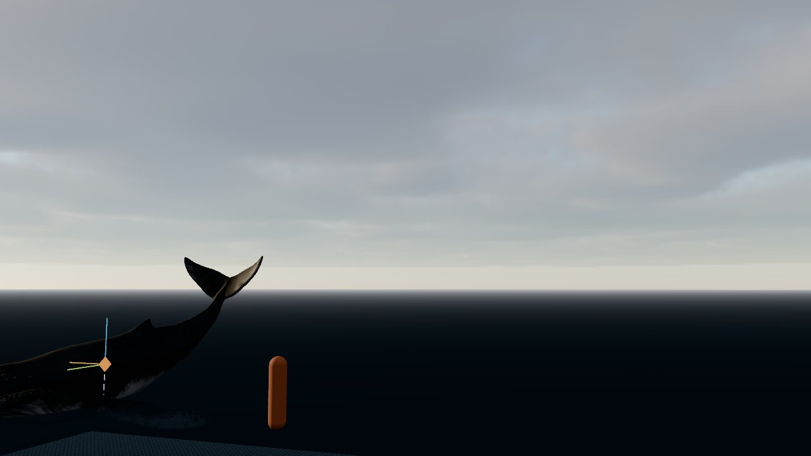
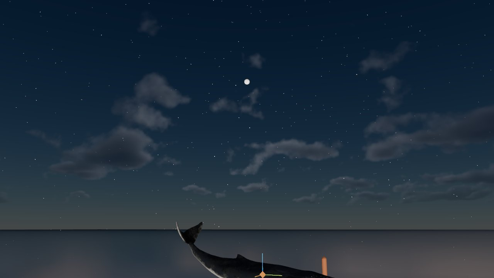
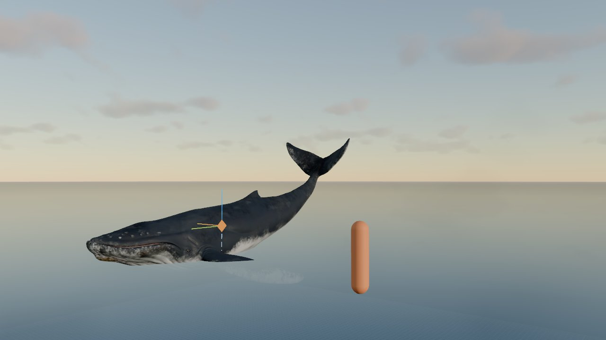
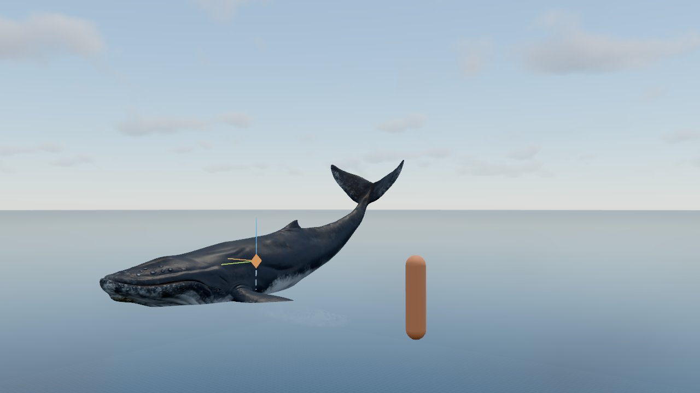
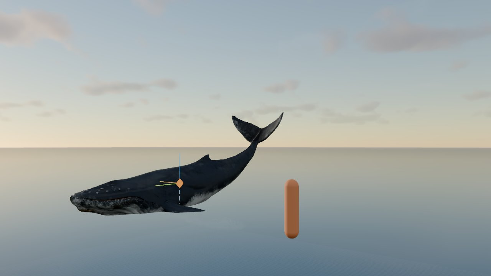
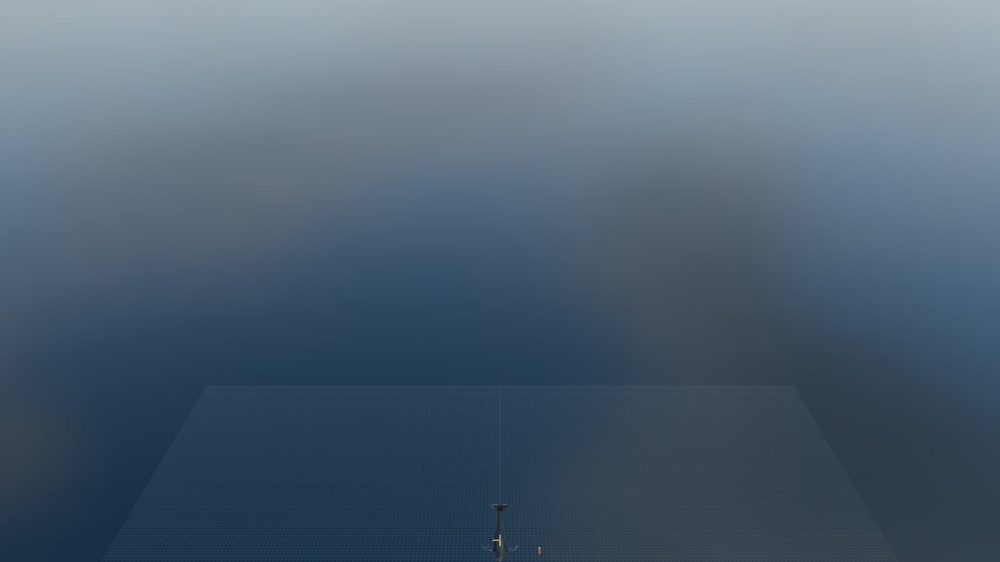

# Fase 3 · Cielo fotorrealista

28/09/2026 · Three.js r186 (`WebGPURenderer` + TSL) · solo WebGPU (el fallback WebGL2 queda para la Fase 8.5)

## Resumen

- **"Hecho cuando" cumplido:** al mover la hora cambian de forma coherente el cielo, las nubes, la luz del sol y de la luna, la niebla y los reflejos (entorno PMREM regenerado).
- **Novedades:**
  - Sol y luna calculados por fecha, hora, zona horaria, latitud y longitud (NOAA/Meeus), con 6 lugares predefinidos y animación del tiempo.
  - **Dos modelos de cielo** a elegir en la GUI: **físico** (Hillaire simplificado, LUT *sky-view* calculada en la GPU, por defecto) y **Preetham** (`SkyMesh` de Three.js, el prototipo).
  - Noche: estrellas en coordenadas ecuatoriales que giran con el tiempo sidéreo, luna con su fase y luz de luna.
  - **Nubes volumétricas** por *raymarching* (Perlin-Worley 3D + mapa de clima 2D), a ½ resolución con acumulación temporal y reproyección: **1,8 ms de GPU a 720p** (la primera versión costaba 113 ms).
  - Luz derivada del cielo: color del sol por transmitancia atmosférica, entorno PMREM que incluye cielo y nubes, sombras de nubes sobre el agua y perspectiva aérea con niebla.
  - 8 presets (2 nuevos de esta fase: "Noche de luna" y "Día acelerado").

| Mediodía (físico) | Mediodía (Preetham) |
|---|---|
|  |  |
| **Atardecer (físico)** | **Atardecer (Preetham)** |
|  |  |
| **Atardecer tormentoso** | **Noche de luna** |
|  |  |

Misma cámara a tres horas (cielo físico, cobertura 0,35):

| 07:00 | 12:30 | 17:54 |
|---|---|---|
|  |  |  |

Sombras de nubes sobre el plano de agua, vistas desde 120 m: 

> El agua sigue siendo el plano provisional de la Fase 2 (color plano, rugosidad 0,18, sin olas). El océano de verdad llega en la Fase 4, que usará el mismo entorno PMREM y la misma sombra de nubes.

## Estructura del código

| Archivo | Punto | Función |
|---|---|---|
| `src/sky/astro.js` | 3.1 | Sol (NOAA), luna (Meeus simplificado), iluminación y fase de la luna, tiempo sidéreo, orto y ocaso, conversión alt/az → dirección (norte = −Z, este = +X) |
| `src/sky/atmosphere.js` | 3.2 | **Atmósfera física**: LUT *sky-view* en la GPU, cúpula que la muestrea, disco solar y transmitancia en la CPU |
| `src/sky/sky.js` | 3.1–3.3, 3.5 | Módulo "cielo": estado y GUI, selección de modelo, estrellas, luna, luces, niebla y regeneración del entorno PMREM |
| `src/sky/clouds.js` | 3.4, 3.5 | Nubes volumétricas: *raymarch*, pase a resolución reducida, acumulación temporal con reproyección, composición, malla para el entorno y nodo de sombra |
| `tools/gen-cloud-noise.mjs` | 3.4 | Genera las texturas de ruido: `npm run gen:clouds` |
| `public/textures/cloud_noise_64.bin`, `cloud_weather_256.bin` | 3.4 | Ruido 3D 64³ (RG8) y mapa de clima 256² (RG8). Son generados, no derivan del modelo: se versionan |
| `vite.config.js` | — | Solo en desarrollo: `POST /__capture` guarda capturas del canvas en `.PLAN/docs/img/` |

## 3.1 Sol y luna

- **Sol:** algoritmo NOAA (ecuación del tiempo, declinación, ángulo horario), con refracción atmosférica cerca del horizonte.
- **Luna:** posición eclíptica con los términos principales de Meeus, pasada a ecuatoriales y luego a alt/az. La fase y la fracción iluminada salen de la elongación sol-luna.
- **Parámetros** (carpeta *Cielo · fecha, hora y lugar*): lugar (6 zonas de ballenas jorobadas: Tonga, Hawái, Hervey Bay, Samaná, Húsavík y Tenerife, o "Personalizado"), latitud, longitud, zona horaria, fecha, hora y animación del tiempo con velocidad (minutos de cielo por segundo real).
- **Validación** (valores calculados frente a los teóricos):

| Caso | Calculado | Esperado |
|---|---|---|
| Equinoccio 20/03/2026, mediodía solar, lat 0 | alt 89,68° | ≈ 90° |
| Madrid, solsticio de verano, mediodía solar | alt 73,02°, az 178,6° | 90 − 40,42 + 23,44 = 73,02° |
| Madrid, solsticio de invierno, mediodía solar | alt 26,14°, az 180,5° | 90 − 40,42 − 23,44 = 26,14° |
| Luna 26/09/2026 17:00 UTC | 99,9 % iluminada ("Luna llena") | Luna llena el 26/09/2026 |
| Luna 10/10/2026 12:00 UTC | 0,1 % ("Luna nueva") | Luna nueva el 10/10/2026 |

## 3.2 Atmósfera física

### Modelo

Hillaire (2020) simplificado: una LUT *sky-view* de 256 × 128 (HalfFloat) que se recalcula en la GPU con un `QuadMesh` solo cuando el sol se mueve más de 0,05° o cambia algún parámetro.

- **Planeta:** radio del suelo 6360 km y de la atmósfera 6460 km. El observador está a 50 m.
- **Rayleigh:** β = (5,802, 13,558, 33,1) · 10⁻³ km⁻¹, escala de altura 8 km.
- **Mie:** dispersión 3,996 · 10⁻³ y extinción 4,4 · 10⁻³ km⁻¹, escala de altura 1,2 km, fase Henyey-Greenstein con `g` = 0,8.
- **Ozono:** absorción (0,65, 1,881, 0,085) · 10⁻³ km⁻¹, perfil en tienda centrado en 25 km (±15 km). Es lo que da el azul del crepúsculo.
- **Integración:** 32 pasos por dirección de vista y 6 hacia el sol (con sombra del planeta), integración analítica de cada tramo (Hillaire) y un término aproximado de **dispersión múltiple** (isótropa, escalable desde la GUI).
- **Parametrización de la LUT:** u = azimut relativo al sol / π y v = signo(el) · √(|el| / (π/2)) · ½ + ½, que da más resolución cerca del horizonte.
- **Cúpula:** esfera `BackSide` de radio 990 que sigue a la cámara y muestrea la LUT. Añade el disco solar (0,53°) con oscurecimiento al borde y el color que llega a través de la atmósfera.
- **Transmitancia en la CPU** (`transmittance(alt)`, 64 pasos): da el color y la intensidad de la luz direccional del sol, y los mismos valores tiñen las nubes.

### Parámetros compartidos entre los dos modelos

| GUI | Físico | Preetham |
|---|---|---|
| Rayleigh | escala de β_R | `rayleigh` |
| Turbidez | escala de Mie = turbidez / 2,5 | `turbidity` |
| Direccionalidad Mie | `g` de la fase | `mieDirectionalG` |
| Ozono | escala de β_O | — |
| Dispersión múltiple | peso del término de dispersión múltiple | — |
| Brillo del cielo | ganancia de la cúpula | ganancia de la cúpula |

### Comparación y decisión

- **Preetham** se ve bien a mediodía, pero en el atardecer el cielo se vuelve gris o amarillo verdoso y no tiene crepúsculo: por debajo del horizonte se apaga.
- **El físico** da el azul del crepúsculo gracias al ozono, un horizonte más blanco y, al atardecer, degradados naranja → rosa → azul. Además continúa después de la puesta de sol (sombra del planeta). Por eso es el modelo por defecto.
- **Escala de radiancia:** el cielo físico da radiancias a escala real respecto del sol (≈ 0,4-0,5 en el cenit a mediodía, con el sol en 22). El de Preetham es unas 8 veces más brillante. Por eso el entorno se usa con `environmentIntensity = 1` en el modelo físico y con 0,2 + 0,45 · factor de día en Preetham.

### Coste de GPU (720p, medido con `trackTimestamp`)

| Situación | ms |
|---|---|
| Fotograma con cielo físico y nubes (LUT sin recalcular) | 1,70 |
| Fotograma con Preetham y nubes | 1,77 |
| Fotograma con cielo físico sin nubes | 0,13 |
| Fotograma con Preetham sin nubes | 0,20 |
| Fotograma en el que se recalculan la LUT **y** el entorno PMREM | 8,3 |

El recálculo solo ocurre cuando cambia el sol: con el tiempo animado a gran velocidad hay que contar con él en cada fotograma. Si molesta, se puede repartir entre fotogramas en la Fase 8.

### Error encontrado y corregido: el entorno salía negro con el cielo físico

`PMREMGenerator.fromScene()` (r186) asigna `near` y `far` a su cámara cúbica, pero **no llama a `updateProjectionMatrix()`**, así que la proyección se queda con el `far = 100` inicial. El `SkyMesh` de Preetham no se ve afectado, porque su *vertex shader* lleva la profundidad al plano lejano. En cambio, la cúpula física (radio 990) y la malla de nubes del entorno (900) quedaban recortadas: el agua reflejaba negro.

**Solución:** en la escena del entorno, la cúpula y la malla de nubes tienen radio 50. Solo se usa la dirección de vista, así que el radio no cambia el resultado. Diagnóstico: lectura de píxeles del *render target* del PMREM (solo contenía el color de borrado) y prueba con radios de 50 y 990.

## 3.3 Noche

- **Estrellas:** 6000 estrellas procedurales (semilla fija), con reparto de brillo muy sesgado a las débiles y tres tonos (rojizas, blancas y azuladas), colocadas en coordenadas ecuatoriales. No es un catálogo real. Se giran con el tiempo sidéreo local y la latitud, así que el cielo nocturno rota correctamente. Se funden con el brillo del cielo (aparecen en el crepúsculo náutico) y se atenúan cerca del horizonte.
- **Luna:** disco orientado hacia el sol con la fase calculada y luz direccional azulada cuya intensidad depende de la fracción iluminada y de la altura de la luna.
- **Cielo nocturno:** brillo mínimo azul oscuro, más la luz de la luna sobre las nubes.

## 3.4 Nubes volumétricas

### Técnica

- **Capa:** base 1500 m y grosor 1400 m (ajustables), intersección rayo-esfera con la curvatura de la Tierra y distancia máxima de 30 km.
- **Densidad:** mapa de clima (cobertura en R, tipo en G) × perfil vertical según el tipo (cúmulo ↔ estrato) × ruido Perlin-Worley 3D con erosión Worley. El umbral de cobertura se reparte con `mix(0.9, 0.45, cobertura)` para que 0 sea un cielo despejado y 1 uno cubierto.
- **Iluminación:** 40 pasos de vista y 4 hacia la luz, fase doble Henyey-Greenstein (g = 0,65 y −0,25), "*powder*" y **octavas de dispersión múltiple de Wrenninge** (3 octavas: extinción ×1, ×0,3, ×0,09 y pesos 1, ½, ¼, con la fase cada vez más isótropa). Esto evita nubes grises y planas. Ambiente con el color del cielo arriba y abajo.
- **Viento:** desplaza el mapa de clima y el ruido (velocidad y dirección).
- **Texturas precalculadas:** generadas por `tools/gen-cloud-noise.mjs` (determinista). Calcular el ruido en el *shader* era el 90 % del coste de la primera versión.

### Rendimiento

| Versión | GPU a 720p |
|---|---|
| Ruido calculado en el *shader*, resolución completa | 113 ms |
| + ½ resolución y acumulación temporal (≈ 8 fotogramas) | **1,84 ms** |

### Acumulación temporal y reproyección

- Las nubes se calculan en un RT de ½ resolución (HalfFloat) con un desfase de la muestra (*jitter*) por fotograma y se mezclan con el historial (*ping-pong*) antes de componerlas sobre la escena con una cúpula que lee el RT por `screenUV`.
- **Reproyección:** las nubes están a kilómetros, así que basta la rotación de la cámara. Para cada píxel se reconstruye la dirección de vista actual y se proyecta con la vista y la proyección del fotograma anterior para leer el historial en el sitio correcto. Si cae fuera de la pantalla, se usa solo la muestra nueva.
- **Mezcla:** cámara quieta, 1/8. Cámara girando, 1/4 (reproyectado). Salto de cámara de más de 50 m o cambio de la simulación (hora animada), 1 (sin historial).
- **Medido:** con la cámara girando, el error medio frente a una referencia sin acumulación es de **0,018** con reproyección y de 0,146 sin ella. El signo del eje vertical de las coordenadas de textura en WebGPU se midió así: `ySign = −1`.

### Parámetros (carpeta *Nubes volumétricas*)

Activar, cobertura, densidad, altitud de la base, grosor, tipo (cúmulo ↔ estrato), velocidad y dirección del viento, escala del ruido, pasos de vista y de luz, distancia máxima, resolución (¼ a 1), acumulación temporal e intensidad de las sombras.

## 3.5 Luz derivada del cielo

- **Sol:** su color es la transmitancia de la atmósfera (física o de Preetham, según el modelo) y su intensidad se apaga suavemente al cruzar el horizonte.
- **Luna:** su luz toma el relevo de noche.
- **Hemisférica:** tintada por el color del sol y escalada por el factor de día.
- **Entorno PMREM:** se regenera desde una escena propia (cúpula del cielo + nubes a resolución completa) cuando el sol se mueve más de 0,5°, cada 2 s si el tiempo está animado, o cuando cambian los parámetros de las nubes (`invalidateEnv`). Por eso el agua y la ballena reflejan el cielo y las nubes del momento.
- **Sombras de nubes:** `clouds.cloudShadowNode(posiciónMundo)` proyecta cada punto del agua hacia el sol hasta la capa de nubes y lee la densidad (mapa de clima + perfil). El plano de agua lo multiplica por su color. La Fase 4 lo usará igual en el océano.
- **Perspectiva aérea:** `FogExp2`, cuyo color sigue el horizonte según la hora (día, atardecer y noche) y cuya densidad crece con la turbidez.

## Presets

| Preset | Qué muestra |
|---|---|
| 01 Escena gris | Placeholder de la Fase 2: cielo y nubes apagados |
| 02 Mediodía despejado | Tonga a las 12:20, cobertura 0,25 |
| 03 Atardecer | 18:03, turbidez 3, cúmulos dispersos (0,4) |
| 04 Atardecer tormentoso | 17:36, turbidez 6, cobertura 0,85, nubes bajas (900 m) y densas, viento 25 m/s |
| 05 Salto a cámara lenta | Simulación al 35 %, cámara desde el barco, 9:00 |
| 06 Inspección del modelo | Escena gris sin cielo, nubes, agua ni niebla |
| 07 Noche de luna | 21:30, luna casi llena, estrellas y nubes iluminadas por la luna |
| 08 Día acelerado | Desde las 5:30, 15 min de cielo por segundo |

Todos usan el modelo físico, que es el de por defecto; con `#cielo.model=Preetham` en la URL se compara con Preetham.

## Herramientas de desarrollo

Solo con `npm run dev`:

- `window.whaleViewer.renderFrames(n)` dibuja n fotogramas a paso fijo aunque la pestaña esté oculta y devuelve los ms de GPU del último.
- `window.whaleViewer.capture('fase_3/nombre')` guarda una captura de 1280×720 en `.PLAN/docs/img/fase_3/nombre.jpg` mediante el *middleware* de `vite.config.js`. El nombre se valida y no admite `..`.

## Límites conocidos y trabajo futuro

- **Agua:** el plano de agua es provisional (Fase 4).
- **Transmitancia:** la LUT de transmitancia se integra dentro del *shader* (6 pasos hacia el sol) en lugar de tener LUT propia. El término de dispersión múltiple es aproximado, sin LUT de Hillaire.
- **Perspectiva aérea:** es niebla exponencial, no un volumen *froxel*. En la Fase 7 se puede sustituir por la LUT de perspectiva aérea.
- **Nubes:** no se ven desde dentro de la capa (la cámara no sube a 1500 m) y a gran distancia son 2D (sin *god rays* de nubes).
- **Coste del recálculo:** recalcular la LUT y el PMREM cuesta unos 6,5 ms por fotograma mientras el sol se mueve. Opción futura: repartir el trabajo entre fotogramas.
- **Fallback WebGL2** (Fase 8.5): las nubes y la LUT usan RTs HalfFloat y nodos TSL que deberían compilar también en WebGL2, pero no se ha probado.
