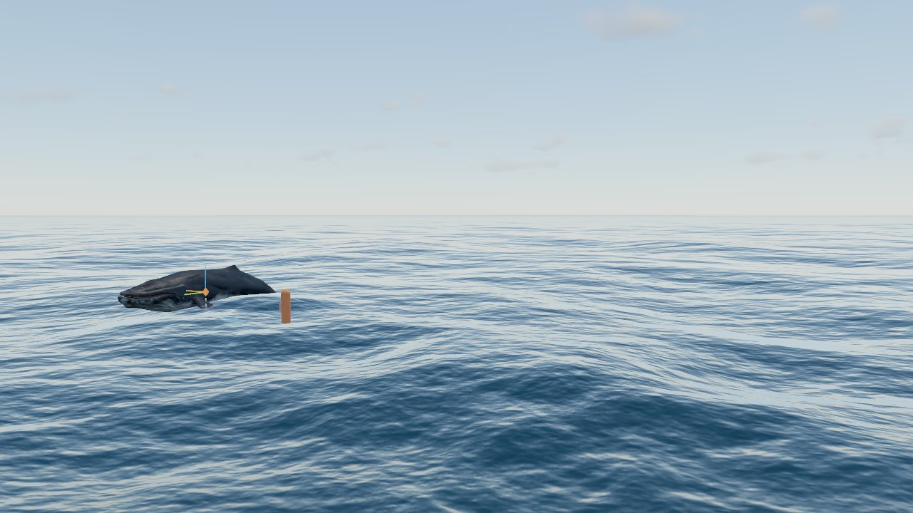
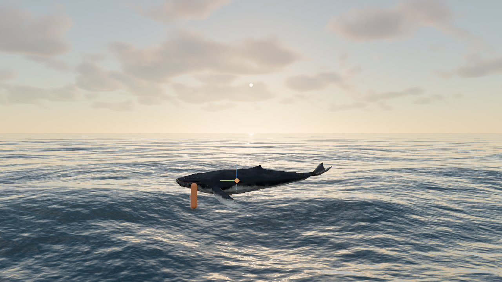
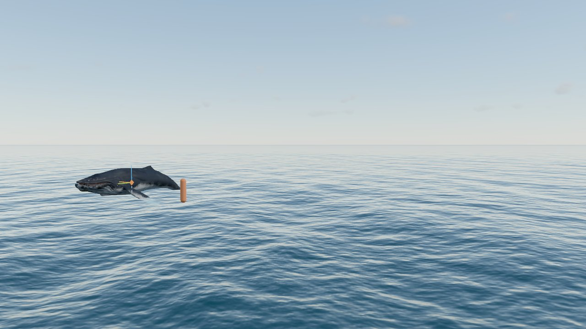
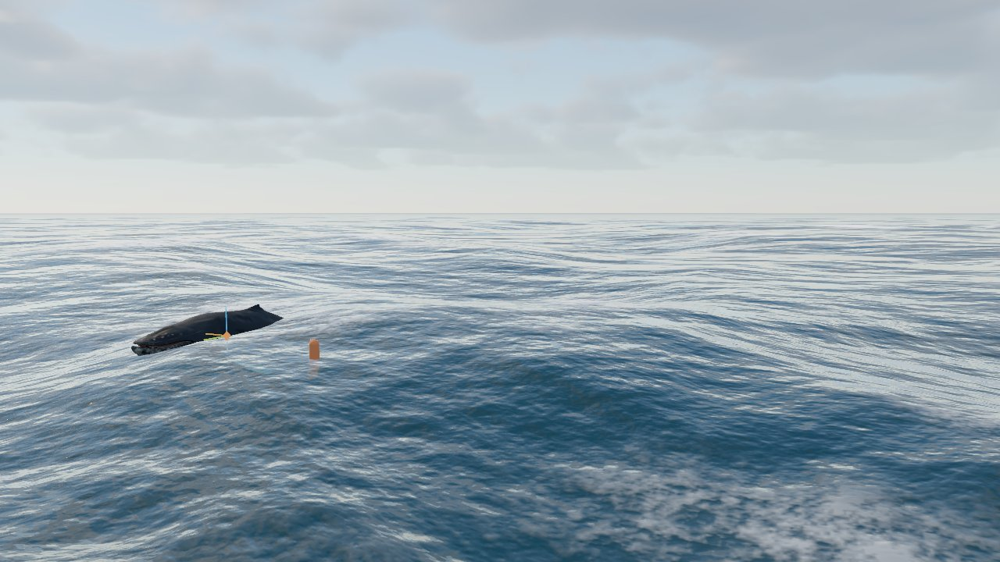
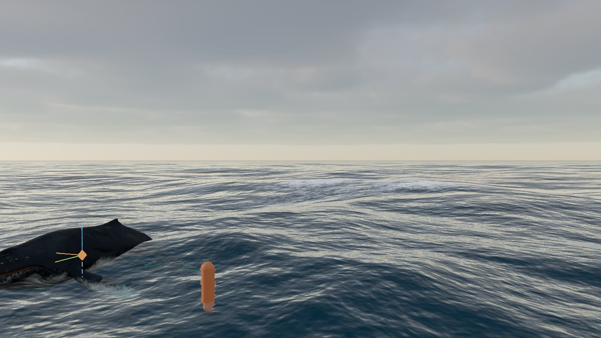
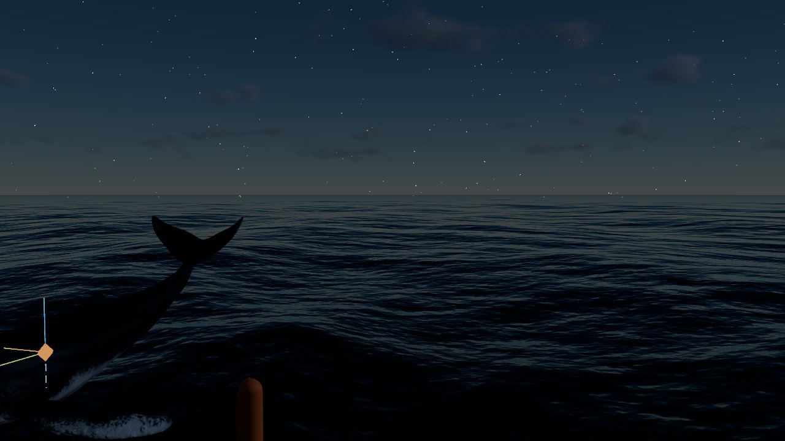
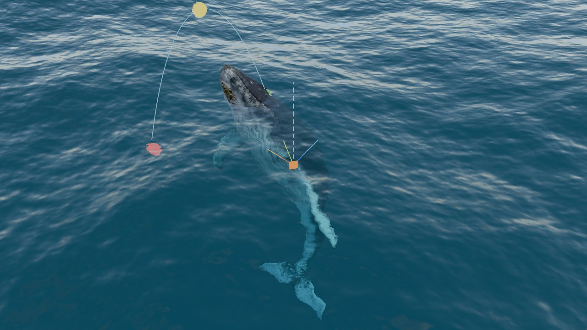
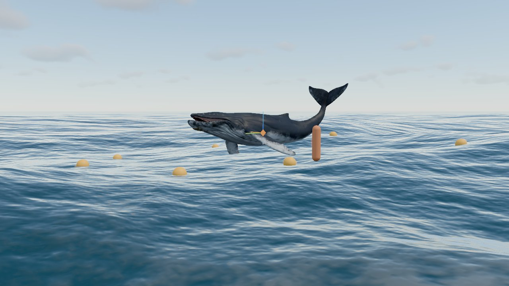
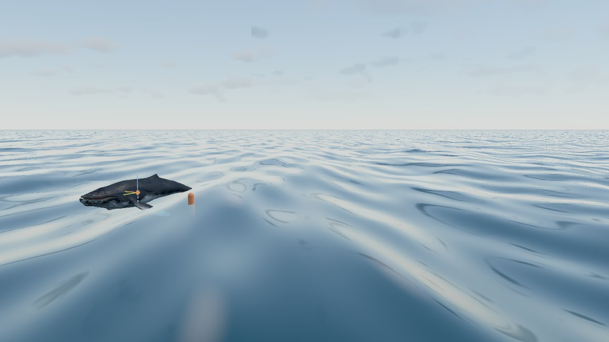

# Fase 4 · Océano (superficie)

28/09/2026 · Three.js r186 (`WebGPURenderer`, compute shaders TSL) · solo WebGPU

## Resumen

- **"Hecho cuando" cumplido:** el mar se ve creíble desde el nivel del agua, desde 5-7 m (barco) y desde el aire (60-300 m). Los parámetros de viento y de mar de fondo lo llevan de la calma casi de espejo al mar agitado con cabrillas.
- **Novedades:**
  - **Malla** continua hasta 25 km, anclada al mundo y curvada con la Tierra (4.1).
  - **Gerstner** con 8 ondas como prototipo (4.2).
  - **FFT** en la GPU: espectro JONSWAP de viento más mar de fondo, 3 cascadas de 256² y FFT en memoria compartida en 0,6 ms (4.3).
  - **Shading propio** (4.4):
    - Fresnel.
    - Reflejo del cielo y las nubes (PMREM) y del sol (GGX).
    - Refracción con absorción según el espesor de agua (la ballena se ve bajo la superficie).
    - Luz a través de las crestas.
    - Espuma por el jacobiano calibrada con la ley de Monahan.
    - Rugosidad creciente con la distancia y perspectiva aérea.
  - **Consulta de altura en CPU** sin latencia (4.5), con boyas de prueba.
- **Validación:**
  - Pruebas automáticas (`npm run test:ocean`): la FFT, la Hs, la velocidad de fase, el afilado de las crestas y la inversión del desplazamiento.
  - La FFT de la GPU coincide con la de la CPU (error < 2·10⁻⁶ m).
  - La cobertura de espuma coincide con Monahan entre 9 y 20 m/s.
- **Coste (720p, fotograma completo):** 0,9 ms sin océano → **2,9 ms con el océano FFT** (3,7 ms con nubes). Con Gerstner, 2,0 ms.

| Mediodía (preset 02) | Atardecer |
|---|---|
|  |  |
| **Mar en calma (preset 09)** | **Mar agitado (preset 10)** |
|  |  |
| **Atardecer tormentoso (preset 04)** | **Noche** |
|  |  |
| **Refracción: ballena subiendo hacia la superficie** | **Boyas de prueba (consulta de altura)** |
|  |  |

Prototipo de Gerstner: 

## Estructura del código

| Archivo | Punto | Función |
|---|---|---|
| `src/ocean/spectrum.js` | 4.3, 4.5 | Espectro (JONSWAP + Mitsuyasu + swell), amplitudes h0, FFT de referencia (misma mariposa que la GPU) y campo de CPU para la consulta de altura. Sin Three.js: se prueba con Node |
| `src/ocean/fft.js` | 4.3 | Compute shaders: espectro en el tiempo t, IFFT en memoria compartida, texturas de desplazamiento y derivadas, y espuma persistente |
| `src/ocean/gerstner.js` | 4.2 | Generación de las 8 ondas y desplazamiento en CPU |
| `src/ocean/ocean.js` | 4.1, 4.4, 4.5 | Módulo "océano": estado y GUI, malla, material (vértices y fragmento), boyas y `heightAt(x, z)` |
| `tools/test-ocean.mjs` | — | Pruebas: `npm run test:ocean` |

Cambios fuera de `src/ocean/`:

- **`core/viewer.js`:** el plano lejano de la cámara pasa de 2 km a 60 km.
- **`core/helpers.js`:** el plano de agua provisional y la rejilla del fondo quedan apagados por defecto (la rejilla se veía a través del agua).
- **`sky/sky.js`:** el entorno se regenera en `renderEnv()`, después de actualizar las nubes (ver [Errores corregidos](#errores-corregidos)).
- **`sky/clouds.js`:** el historial temporal se descarta cuando cambia la luz.

## 4.1 Malla

Es una sola rejilla de 257 × 257 vértices (66 049 vértices y 131 072 triángulos) con este espaciado:

- **Hasta 14 m:** paso constante de 0,35 m.
- **Más allá:** el paso crece de forma geométrica, con razón 1,1055: a 93 m la celda mide 7,8 m, a 620 m mide 58 m, y el último anillo, a 25 km, mide 2,4 km.

Cada vértice guarda el tamaño de su celda (atributo `cell`).

- **Anclaje sin "nadar":**
  - Cada vértice se coloca en `floor(cámara / celda) · celda + posición local`. Así solo salta entre nodos de una retícula del mundo con el paso de su propia celda: las olas no se deslizan por la malla al mover la cámara.
  - Como el salto de cada vértice es menor que su celda, dos vértices vecinos nunca se cruzan: sin grietas ni pliegues, y sin necesidad de *morphing* entre niveles.
- **Sin aliasing a distancia:** el *vertex shader* lee el desplazamiento de cada cascada en el nivel de mip `log2(celda / texel)`. Las celdas grandes solo ven las olas que pueden representar.
- **Curvatura de la Tierra:** la superficie cae `d² / 2R` respecto a la cámara, así que el horizonte queda donde debe: a unos 6 km con la cámara a 3 m.

## 4.2 Gerstner (prototipo)

- **Parámetros:** 8 ondas a partir de amplitud, longitud de onda, dirección, dispersión y afilado.
  - Longitudes: λᵢ = λ·0,72ⁱ. Direcciones repartidas con el ángulo áureo.
  - Afilado: Qᵢ = afilado / (kᵢ·Aᵢ·8). Con ΣQ·A·k ≤ 1 las crestas nunca se pliegan.
- **Normales y espuma:** mismas funciones en el *vertex* y el *fragment shader*, con las pendientes analíticas y el jacobiano aproximado.
- **Consulta de altura:** `gerstnerDisplacement` hace el mismo cálculo en CPU, así que en este modo es exacta.
- Se usó para validar el shading antes de la FFT y queda como modo barato: 2,0 ms por fotograma frente a 2,9 ms.

## 4.3 Oleaje FFT

### Espectro (`spectrum.js`)

- **Mar de viento:** espectro JONSWAP limitado por el *fetch*.
  - ωp = 22·(g²/UF)^⅓ y α = 0,076·(U²/Fg)^0,22, sin pasar del mar totalmente desarrollado (ωp ≥ 0,855·g/U, α ≥ 0,0081).
  - γ pasa de 3,3 a 1 al acercarse al mar desarrollado, que así tiende a Pierson-Moskowitz.
- **Dispersión direccional:** Mitsuyasu, cos^2s(Δθ/2) con s = 11,5·(U·ωp/g)^−2,5·(ω/ωp)^(5 o −2,5), multiplicada por "Alineación con el viento".
- **Mar de fondo:** forma JONSWAP (γ = 5) con el periodo pedido, escalada numéricamente para dar exactamente la Hs pedida, y cos^2s estrecho (s = 24).
- **Amplitudes:** h0 = (ξr + iξi)/√2·√(E·Δk²/2). La evolución es h = h0·e^(−iωt) + conj(h0(−k))·e^(iωt), con dispersión en aguas profundas (ω² = g·k).
- **Cascadas:**

  | Cascada | Tamaño | Banda de \|k\| (longitud de onda) |
  |---|---|---|
  | 0 | 500 m | 500 → 16 m |
  | 1 | 97 m | 16 → 3,2 m |
  | 2 | 19 m | 3,2 → 0,15 m |

  - Cada cascada solo contiene su banda (corte en 6 ciclos por tile de la siguiente), así que ninguna frecuencia se suma dos veces.
  - Los tamaños no son múltiplos entre sí, lo que disimula la repetición.
- **Coste en CPU:** calcular h0 cuesta ~110 ms y solo se repite al soltar un control del espectro.

### GPU (`fft.js`)

1. **`spectrum`** (1 despacho, 3·256² hilos):
   - Calcula h(k,t) y 8 campos empaquetados en 4 señales complejas (dos vec4): Dx + iDz, Dy + i∂Dx/∂z, ∂Dy/∂x + i∂Dy/∂z y ∂Dx/∂x + i∂Dz/∂z.
   - El desplazamiento horizontal es Dx = i(kx/k)·h. Con esa convención las crestas se afilan (J < 1 en la cresta, comprobado).
2. **IFFT** (2 despachos, filas y columnas):
   - Cada workgroup de 256 hilos carga una línea en `workgroupArray` y hace allí las 8 etapas de mariposa, con `workgroupBarrier` entre etapas.
   - Primero procesa un vec4 y luego el otro, y escribe el resultado en el mismo buffer.
3. **`post`** (3 despachos, uno por cascada): escribe dos `StorageTexture` RGBA16F con repetición y mipmaps automáticos.
   - disp = (λDx, Dy, λDz).
   - deriv = (∂Dy/∂x, ∂Dy/∂z, J, espuma).
   - La espuma persiste en un buffer: f = max(f·e^(−decay·dt), (J_umbral − J)·8).

**Optimización:** la primera versión hacía 16 despachos de mariposa leyendo y escribiendo en memoria global (≈ 300 MB de tráfico por fotograma) y costaba **2,7 ms**. Con memoria compartida cuesta **0,6 ms** con los mismos resultados (errores de 1,8·10⁻⁶, 5,9·10⁻⁷ y 3,1·10⁻⁷ m en las 3 cascadas).

## 4.4 Shading

Material `MeshBasicNodeMaterial` con iluminación propia en TSL:

- **Normal:** suma de las pendientes de las 3 cascadas, leídas por píxel en la posición sin desplazar, con filtrado anisótropo y mipmaps. Las cascadas pequeñas se apagan con la distancia (la 2 entre 120 y 450 m y la 1 entre 1,5 y 5 km).
- **Rugosidad:** base de 0,04 más hasta 0,16 entre 30 m y 4 km. Es el detalle que ya no se resuelve y da el brillo difuso lejano.
- **Fresnel de Schlick** (F0 = 0,02).
  - **Cielo:** el reflejo sale de `pmremTexture` del entorno del cielo, con cielo y nubes; el rayo reflejado nunca apunta bajo el horizonte.
  - **Sol:** GGX + Smith, con el color y la intensidad del sol de la Fase 3 y la sombra de las nubes.
- **Agua:**
  - Color de dispersión × (sol + ambiente).
  - Luz a través de las crestas: más intensa mirando hacia el sol y en las crestas altas.
- **Refracción** con `viewportSharedTexture` (lo ya dibujado, desplazado por la normal) y `viewportDepthTexture`:
  - El espesor de agua hasta lo que hay detrás atenúa la luz con absorción de agua de mar (rojo ≫ verde > azul), escalada por la "Claridad".
  - La ballena bajo la superficie se ve teñida de turquesa según la profundidad.
  - El océano se dibuja después de la ballena (`renderOrder = 1`).
- **Espuma:**
  - La genera y la conserva la cascada 0, que es la que rompe según el viento; las cascadas pequeñas solo la texturizan.
  - Es blanca y difusa, con la luz del sol y el ambiente.
  - **Calibración** con la ley de Monahan (W = 3,84·10⁻⁶·U^3,41), tras 8 s de simulación:

  | Viento | Espuma (f > 0,2) | Monahan |
  |---|---|---|
  | 6 m/s | 0 % | 0,17 % |
  | 9 m/s | 0,60 % | 0,69 % |
  | 12 m/s | 2,6 % | 1,8 % |
  | 16 m/s | 5,5 % | 4,9 % |
  | 20 m/s | 7,9 % | 10,5 % |

  - **Por qué solo la cascada 0:** los percentiles del jacobiano de las cascadas 1 y 2 casi no cambian con el viento (esas escalas están saturadas), mientras que la cascada 0 sí depende del viento. Sumarlas llenaba el mar de espuma con cualquier viento.
- **Perspectiva aérea:** mezcla hacia el color del cielo en el horizonte (el PMREM en dirección horizontal) según la "Visibilidad horizontal" (18 km).

## 4.5 Consulta de altura

- **API:** `ocean.heightAt(x, z)` devuelve la altura del agua (y del mundo) en el instante actual de la simulación.
  - FFT: IFFT en CPU de las frecuencias bajas del **mismo espectro** que la GPU (64² de la cascada 0 y 32² de la cascada 1), con interpolación Catmull-Rom y 4 iteraciones para deshacer el desplazamiento horizontal.
  - Gerstner: fórmula exacta.
- **Coste:** el campo se recalcula solo cuando alguien consulta y ha cambiado el tiempo (≈ 1,5-2,3 ms).
- **Precisión frente al campo completo** (el mismo que dibuja la GPU; rms de las olas 0,54 m):

  | Muestras por cascada | Error rms | Error máx. | Coste |
  |---|---|---|---|
  | 64, 64, 64 | 4,8 cm | 22 cm | 3,6 ms |
  | 64, 64, — | 5,4 cm | 24 cm | 2,9 ms |
  | **64, 32, — (por defecto)** | **7,0 cm** | **28 cm** | **1,3 ms** |
  | 32, 32, — | 21,7 cm | 58 cm | 0,5 ms |
  | 128, 64, — | 2,7 cm | 7,6 cm | 6,6 ms |

  - Con interpolación bilineal, el error de la opción por defecto era de 9,7 cm: la cascada grande tiene solo unas 2 muestras por onda.
  - En el navegador, con Hs 2,8 m: 7 cm rms frente al campo completo.
- **Boyas de prueba:** en la GUI, "Boyas de prueba" muestra 7 esferas que se colocan con `heightAt`. Quedan medio sumergidas sobre las olas.

## Parámetros (carpeta *Océano*)

- **General:** activar, olas (FFT o Gerstner), estado del mar (Hs, periodo y longitud de onda de pico), nivel y crestas afiladas (*choppiness*).
- **FFT · mar de viento:** velocidad, dirección, fetch, alineación, corte de ondas cortas y semilla.
- **FFT · mar de fondo:** altura significativa, periodo, dirección y concentración.
- **Gerstner:** amplitud, longitud de onda, dirección, dispersión y afilado.
- **Aspecto:** color del agua, claridad, luz a través de las crestas, rugosidad, reflejo, espuma, umbral de espuma (J), disipación de la espuma, visibilidad horizontal y refracción.
- **Boyas de prueba.**

Todo va en presets y en la URL (módulo `oceano`).

**Presets:**

- **Nuevos:**
  - 09 "Mar en calma": 4 m/s y swell de 0,8 m / 13 s.
  - 10 "Mar agitado": 17 m/s, fetch de 400 km y swell de 2 m, Hs ≈ 6 m.
- **Cambiados:**
  - 04 "Atardecer tormentoso" tiene ahora un mar de 14 m/s.
  - 01 y 06 apagan el océano (escena gris y revisión del modelo).

## Rendimiento

Tiempo de pared con sincronización de la GPU, 720p, cámara a 5 m:

| Configuración | ms por fotograma |
|---|---|
| Sin océano ni nubes | 0,94 |
| Océano FFT | 2,93 |
| Océano FFT sin refracción | 2,98 (la diferencia se pierde en el ruido de la medida) |
| Océano Gerstner | 1,98 |
| Océano FFT + nubes | 3,69 |
| Solo la FFT (compute) | 0,58 |

## Errores corregidos

- **Mapa de entorno con las nubes de la hora anterior:** `sky.update()` regeneraba el PMREM antes de que `clouds.update()` recibiera la luz nueva. Al saltar de día a noche, el entorno se quedaba con nubes blancas y el mar nocturno se llenaba de destellos. Ahora el entorno se regenera en `sky.renderEnv()`, que se llama después de las nubes.
- **Bordes rectangulares en las nubes al cambiar la hora:** el historial temporal, reproyectado, mezclaba nubes de día con nubes de noche. Ahora se descarta cuando cambia la luz (más de 0,3° o más de un 2 % de intensidad) o cualquier parámetro de las nubes.
- **Herramienta de capturas:** con la pestaña oculta no corre `requestAnimationFrame`, y en r186 es ese bucle el que avanza el `frameId` de los nodos. Sin él, la piel de la ballena no se actualizaba y aparecía congelada en una pose antigua. `renderFrames` lo avanza ahora a mano (solo en desarrollo).

## Límites conocidos y trabajo futuro

- **Repetición del oleaje:** el tile de 500 m se repite y se nota desde mucha altura (a partir de ~500 m). Si hiciera falta: una cuarta cascada o ruido de modulación a gran escala.
- **Espuma:** aparece como manchas suaves (2 m por texel en la cascada 0), sin la textura de burbujas de las cabrillas reales. La Fase 5.5 añadirá la espuma persistente en el mundo (impacto y estela) con una textura de detalle.
- **Luna:** la luz de la luna no se refleja en el mar (no hay reflejo especular de la luna ni está en el mapa de entorno).
- **Bajo el agua:** el océano solo se ve desde arriba (`FrontSide`). La Fase 6 añadirá la superficie vista desde abajo.
- **Consulta de altura:** para muchos puntos por fotograma (Fase 5) se puede añadir una consulta en la GPU con lectura asíncrona (un fotograma de latencia).
- **Refracción:** usa el color ya dibujado (sin segunda pasada), así que lo que está por encima del agua pero delante del punto refractado puede "sangrar" en la refracción en los bordes.
