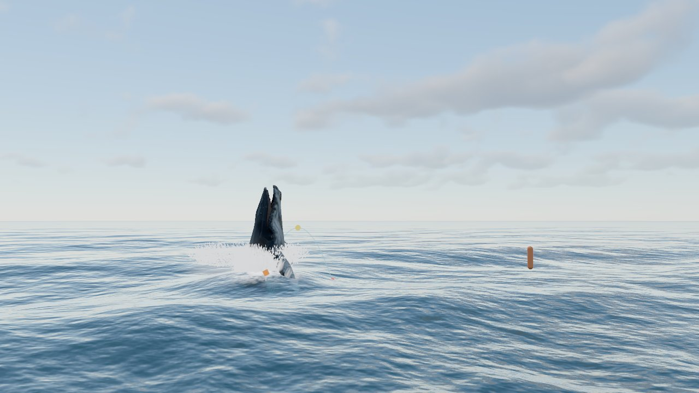
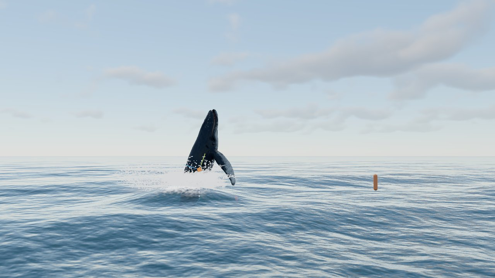
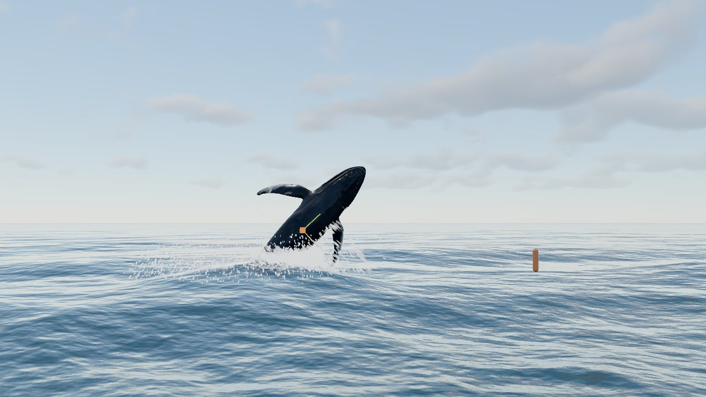
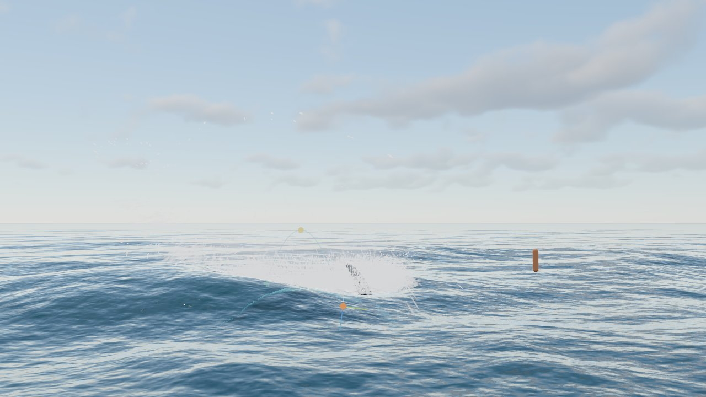
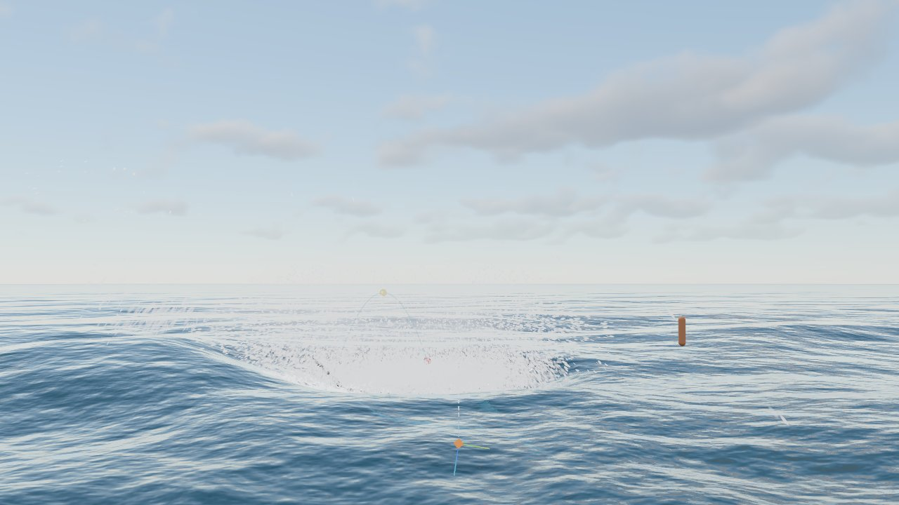
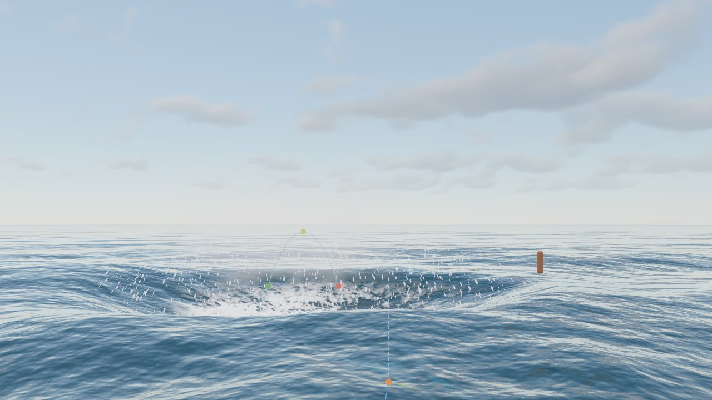
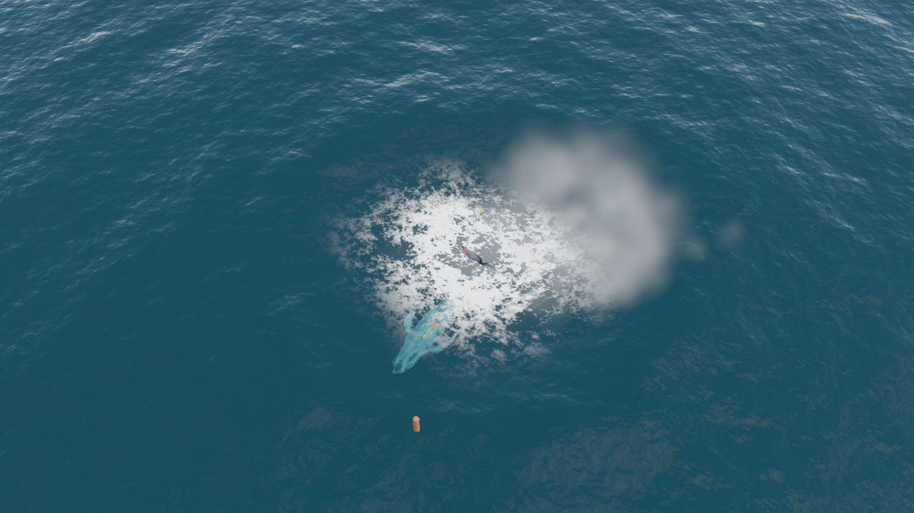
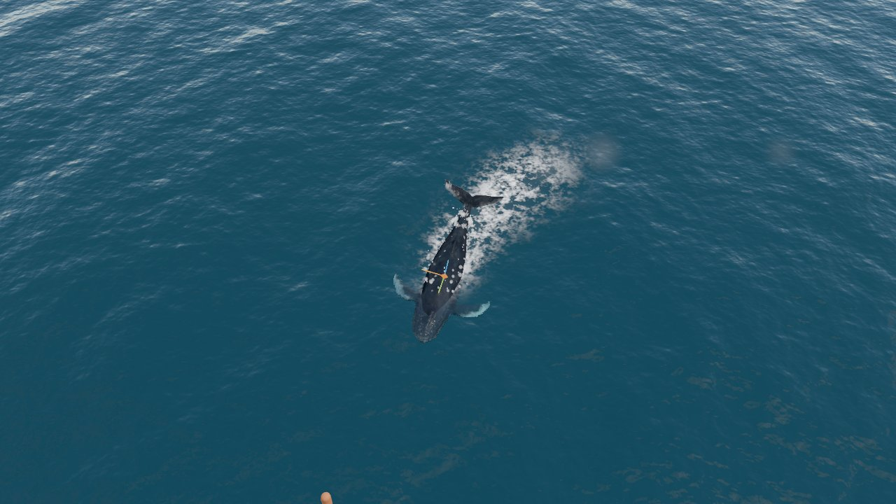
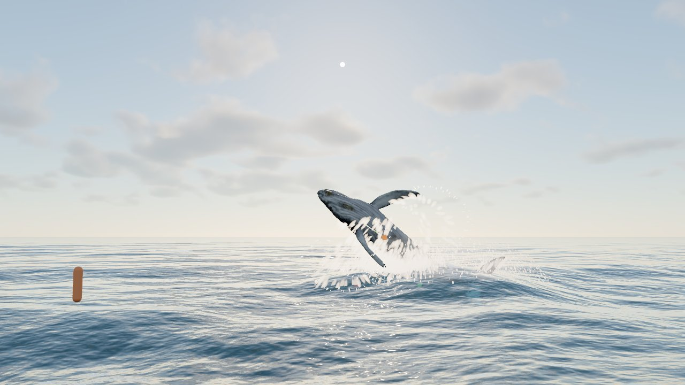
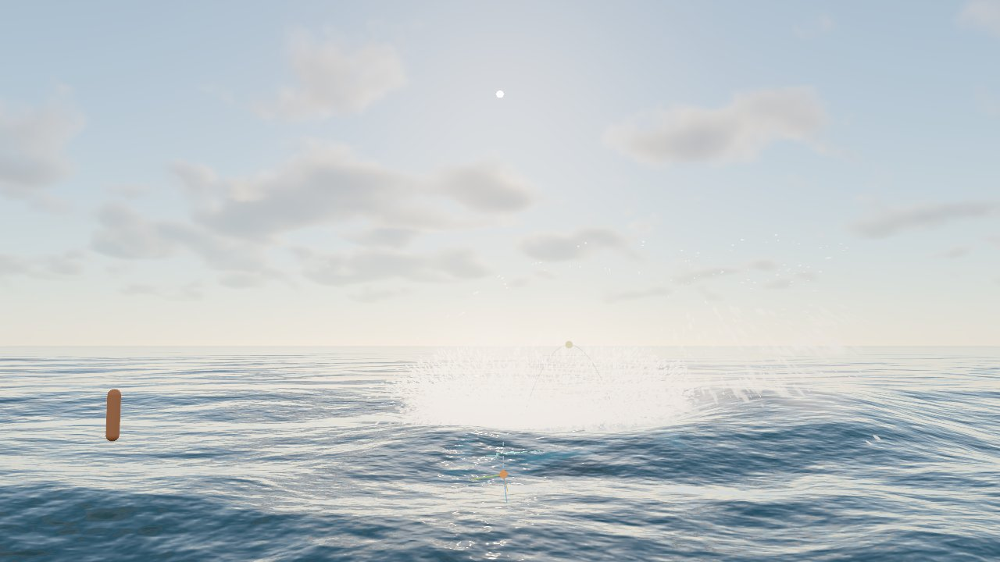

# Fase 5 · Interacción ballena ↔ agua

28/09/2026 · Three.js r186 (`WebGPURenderer`, compute shaders TSL)

## Resumen

- **"Hecho cuando" cumplido:** el salto tiene salida con agua que sube con el cuerpo, cortinas que caen del lomo y las aletas, un gran impacto con corona de gotas, spray y bruma, cráter, anillos de ondas y una mancha de espuma que dura y se disipa.
- **Tres piezas nuevas** en `src/water/`:
  - `interaction.js`: 22 sondas en los huesos (5.1), emisores, estela, piel mojada y eventos del salto.
  - `ripples.js`: ondas y espuma persistente en una rejilla de 128 m × 128 m que sigue a la ballena (5.2, 5.5 y 5.6).
  - `splash.js`: 131 072 partículas en la GPU de 4 tipos (5.3 y 5.4).
- **Coste:**
  - GPU: 0,4 ms las partículas y 0,55 ms las ondas.
  - CPU: 0,7 ms.
  - Justo después del impacto, con decenas de miles de partículas en el aire, el fotograma sube unos 2 ms.

| Salida | Subida (columna) |
|---|---|
|  |  |
| **Apex** | **Impacto (+0,13 s)** |
|  |  |
| **Corona (+0,6 s)** | **Cráter y gotas cayendo (+1,6 s)** |
|  |  |
| **Espuma y bruma desde el aire (+2,6 s)** | **Estela nadando en superficie** |
|  |  |
| **Contraluz: cortinas cayendo del cuerpo** | **Contraluz: impacto** |
|  |  |

## 5.1 Detección de cruce (sondas)

- **Sondas:** 22 esferas sobre huesos del esqueleto, cada una con el radio del cuerpo en ese punto y un papel:
  - Cabeza: `UpperJaw` 0,9 m y `Head` 1,35 m.
  - Cuerpo: de `Spine005` a `Spine002`, con 1,7 m en el centro.
  - Cola: `Spine008` y `Spine007`.
  - Aletas pectorales: `FinL/R002` y `004`, y las puntas `005`.
  - Aleta dorsal: `UpperFin001`.
  - Aleta caudal: `TailL/R002` y `004`.
- **Cada fotograma**, por sonda:
  - Posición del hueso y velocidad por diferencias con el `dt` de simulación, así que respeta la cámara lenta y la pausa.
  - Profundidad respecto a la superficie con `ocean.heightAt`; si está a más de 8 m bajo el nivel, ni se consulta.
  - La sonda corta la superficie si |profundidad| < 1,1·r. El radio de la sección, √(r² − d²), da el área de contacto.
  - Se guarda el instante en que dejó el agua y la velocidad con la que salió.
- **GUI:** "Ver sondas" las muestra en alambre: azul bajo el agua, amarillo cortando la superficie y rojo en el aire.

## 5.2 Ondas dinámicas y 5.6 Estela (`ripples.js`)

- **Rejilla:** 256² celdas de 0,5 m (128 m de lado), centrada en la ballena.
  - Cuando la ballena se mueve, el dominio se desplaza en celdas enteras: el paso lee el estado desplazado; lo que sale se pierde y lo que entra es agua en calma.
  - Bordes de esponja (12 % exterior) para que las ondas no reboten.
- **Ecuación de onda** con Euler semi-implícito:
  - v += (c²∇²h − amortiguación·v)·dt; h += v·dt.
  - c = 4,5 m/s por defecto (onda de gravedad de unos 13 m) y amortiguación 0,08/s.
  - Subpasos para que c·dt/dx < 0,6: con 30 fps, 2 subpasos.
  - La altura se limita a ±3 m.
- **Fuentes:** hasta 48 por paso, gaussianas de radio r.
  - Cada fuente impone la velocidad vertical del agua bajo su huella (mezcla del 35 % por subpaso): el cuerpo empuja el agua.
  - Sondas que cortan la superficie: 0,3·vy − 0,12·v_horizontal·estela. Al subir levanta un poco el agua; al avanzar la hunde, lo que produce la estela en V.
  - **Impacto:** pulso de −5 m/s, radio 4 m, durante 0,3 s → cráter y anillo que se propaga.
  - **Salida:** pulso de +2,5 m/s durante 0,2 s.
- **Salida:** textura RGBA16F (h, ∂h/∂x, ∂h/∂z, espuma) con mipmaps.
  - El océano suma h al desplazamiento de los vértices (con un mip según la celda) y el gradiente a las pendientes del fragmento.
  - Fuera del dominio el efecto se desvanece suavemente.
- **Validación con un pulso de −3 m/s, radio 4 m, en mar en calma:**
  - El frente llega a 8 m a los 0,7 s y a 16 m a los 2,7 s (c·t ≈ 11-12 m desde el borde del pulso).
  - En `salto_6_despues.jpg` se ven el cráter y el anillo.

## 5.3 Salpicaduras y 5.4 Cortinas (`splash.js`)

### Partículas

- **Búfer circular** de N = 131 072 partículas en tres `instancedArray` vec4: posición + edad, velocidad + vida y tipo + tamaño.
- **Emisores:** la CPU reúne hasta 64 por fotograma. Cada uno recibe un tramo contiguo del anillo y el compute inicializa las partículas de ese tramo con números aleatorios por índice y fotograma, sin atómicos. Las más viejas se reciclan.
- **Salida de las partículas:** en esfera (con sesgo hacia arriba) o radial desde un anillo (coronas).
- **Tipos:**

  | Tipo | Física | Aspecto |
  |---|---|---|
  | Gota | Balística, rozamiento 0,08/s; muere al tocar el agua | 4-14 cm, estirada según la velocidad (obturación 1/45 s) |
  | Spray | Rozamiento 0,9/s | 8-25 cm, 30 % de opacidad |
  | Bruma | Flota (+0,15 m/s²), rozamiento 1,2/s hacia el viento (0,6·U), crece un 12 %/s | Sprites de 1,5-5 m muy tenues (3,5 %), con fundido de entrada y salida |
  | Lámina | Como la gota, rozamiento 0,25/s | 15-35 cm, estiramiento ×4: chorros y cortinas |

- **Choque con el agua:** en el compute se usa `ocean.surfaceHeightNode(xz)`, que suma el oleaje FFT (o Gerstner) y las ondas de la ballena.
- **Luz:** ambiente del cielo ×1,3 + sol × (0,12 + 0,35·fase). La fase es una doble Henyey-Greenstein (g = 0,75 / −0,2), así que a contraluz el agua brilla, como en las fotos.

### Emisión según las sondas

Tasas por segundo, multiplicadas por "Cantidad de agua". `a` es el radio de la sección.

- **Sale (vy > 0,8 m/s):**
  - 260·a·vy láminas en anillo que suben con el 80 % de la velocidad del cuerpo: la columna de agua.
  - 160·a·vy gotas.
- **Entra (vy < −0,8 m/s):**
  - 420·a·|vy| gotas en corona radial (velocidad 0,7·|vy|).
  - 260·a·|vy| gotas de spray.
  - 3·a·|vy| sprites de bruma.
- **Roza la superficie nadando:** spray fino, 18·a·v_horizontal.
- **Cortinas (5.4):** durante 2,2 s después de salir, cada sonda del cuerpo suelta láminas por su parte baja, con el 85 % de su velocidad y −1,5 m/s.
  - La tasa depende de la velocidad con la que salió (0 si asomó despacio, máxima a partir de 6,5 m/s), así que nadando en superficie no aparecen.
  - Las puntas de las aletas y la cola gotean durante 6 s.
- **Piel mojada (5.4):** la uniforme `wetness` del material de la ballena, que ya existía, pasa a ser automática. Vale 1 al salir del agua, se seca con τ = 60 s y no baja de 0,35. Se puede desactivar ("Piel mojada automática").

## 5.5 Espuma persistente

- **Dónde vive:** en el cuarto canal de la simulación de ondas, anclada al mundo con el dominio.
- **Fuentes:**
  - Las sondas que cortan la superficie: 0,08·|vy| + 0,04·v_horizontal por segundo.
  - Los pulsos del impacto (6/s) y de la salida (3/s).
  - Donde la superficie de las ondas se rompe (|∇h| > 0,35).
- **Evolución:**
  - Se advecta con la deriva superficial (3 % del viento, semi-lagrangiana bilineal).
  - Se difumina un 8 % por paso hacia la media de sus vecinas.
  - Se disipa con τ = 25 s ("Duración de la espuma").
- **Aspecto:** el océano la modula con el jacobiano de las cascadas pequeñas, así que se ve rota en manchas y no como un disco uniforme (`salto_7_aereo.jpg`).

## 5.7 Sincronización con los eventos

`fsm.on` recibe `surface_exit`, `apex` e `impact`; los eventos se procesan después de actualizar las sondas del fotograma.

- **`surface_exit`:**
  - 3500 gotas en anillo con la mitad de la velocidad de la cabeza.
  - 80 sprites de bruma.
  - Pulso de ondas hacia arriba.
- **`impact`:** en el centro de las sondas del cuerpo que tocan el agua:
  - 7000 gotas en corona (hasta 11 m/s, sesgo hacia arriba 0,55).
  - 5000 gotas de spray.
  - 220 sprites de bruma.
  - Pulso de −5 m/s durante 0,3 s y espuma.
- **`apex`:** se recibe, pero no dispara nada. A partir del apex solo continúan las cortinas, que dependen del tiempo desde la salida.

La emisión continua de las sondas cubre todo lo demás: la subida, el choque de cada parte del cuerpo y el golpe de la cola.

## Parámetros (carpeta *Ballena ↔ agua*)

Interacción, estado (sondas en la superficie y partículas emitidas), salpicaduras, cantidad de agua, tamaño y brillo de las gotas, cortinas, fuerza y velocidad de las ondas, estela, duración de la espuma, piel mojada automática y ver sondas.

Todo va en presets y en la URL (módulo `agua`).

## Cambios en otros módulos

- **`ocean/ocean.js`:**
  - Acepta `ripples` y suma su altura, gradiente y espuma.
  - Exporta `surfaceHeightNode(xz)` para los compute shaders.
- **`main.js`:** crea `ripples` antes del océano y la interacción después de la máquina de estados. `water.update` va después de `ocean.update`.

## Límites conocidos y trabajo futuro

- **Ondas sin dispersión:** la ecuación de onda tiene una sola velocidad, así que el impacto da un único anillo ancho en lugar de un tren de anillos cada vez más cortos. Una simulación dispersiva (iWave o una FFT local) lo mejoraría.
- **Partículas:** no se ordenan por profundidad (casi todas son blancas y tenues, apenas se nota), no proyectan sombra ni reciben la de la ballena, y al caer al agua no generan espuma ni ondas.
- **Cortinas:** son partículas estiradas, no láminas continuas. Desde cerca se distinguen los trazos.
- **Consulta de altura de las sondas:** es la de CPU (oleaje sin las ondas de la ballena), así que el cráter del impacto no cambia la profundidad que ven las sondas.
- **Herramientas de capturas:** `capture(nombre, 0)` devuelve negro: el canvas de WebGPU solo se puede leer justo después de dibujar, así que hay que pedir al menos 1 fotograma.
