# Fase 6 · Cámara bajo el agua

28/09/2026 · Three.js r186 (`WebGPURenderer`, `RenderPipeline` + TSL)

## Resumen

- **"Hecho cuando" cumplido:** con la cámara bajo el agua se ve a la ballena subir hacia la luz entre haces de sol, romper la superficie (desde abajo se ve a través de la ventana de Snell) y volver a caer con una nube de burbujas.
- **Nuevo** en `src/underwater/`:
  - `underwater.js`: posprocesado bajo el agua con línea de flotación, absorción, god rays, distorsión, aberración cromática, desenfoque, viñeta y gotas en la lente.
  - `snow.js`: nieve marina y plancton.
- **Ampliado:**
  - `ocean.js`: cara inferior con ventana de Snell y reflexión total interna, cáusticas, luz bajo el agua y tipos de agua.
  - `splash.js`: burbujas.
  - `interaction.js`: emisión de burbujas.
- **Coste (720p):**
  - Bajo el agua, 16 pasos de god rays: 6,2 ms (8 pasos: 5,5 ms; 32: 8,2 ms). Sin efectos, en el mismo sitio: 4,0 ms.
  - Sobre el agua y lejos de ella no se usa el posprocesado: el `RenderPipeline` cuesta ~1,5 ms y solo se usa con la cámara a menos de 2,5 m del agua o con gotas en la lente.

| La ballena sube hacia la luz | Rompe la superficie |
|---|---|
| 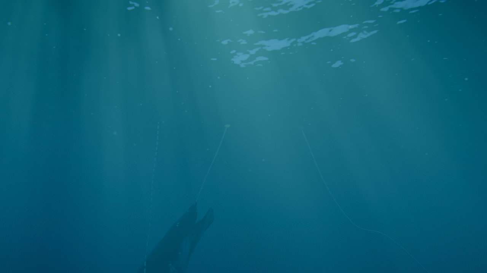 | 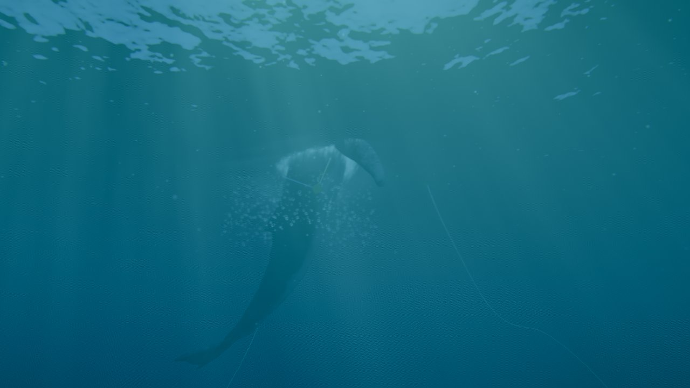 |
| **Apex, a través de la ventana de Snell** | **Impacto: nube de burbujas** |
| 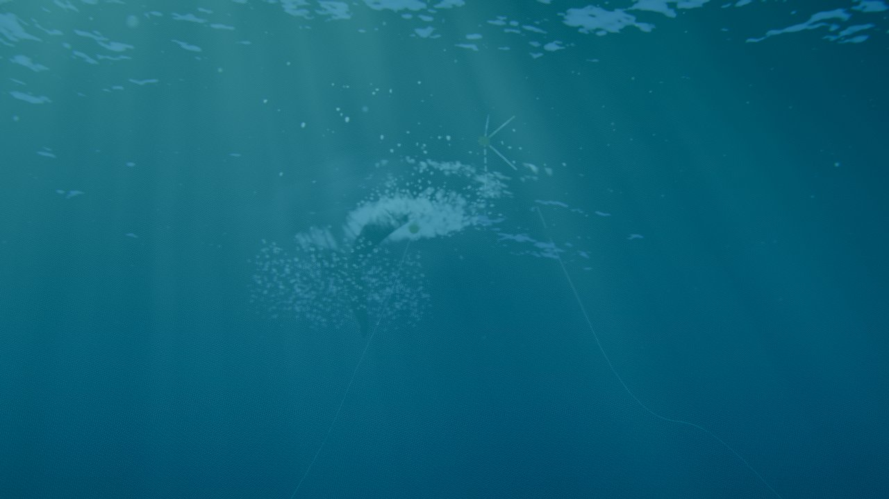 | 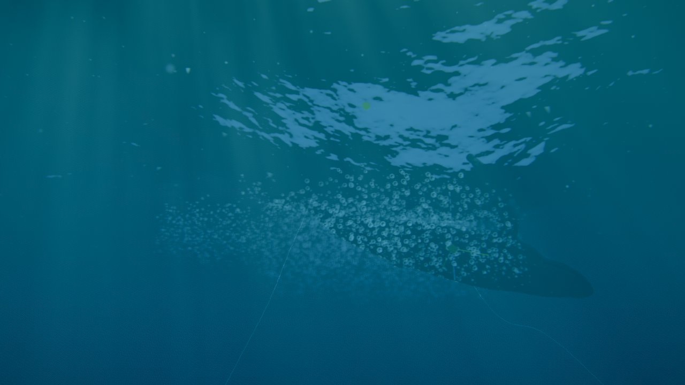 |
| **Vuelve a bajar, con burbujas** | **God rays mirando hacia el sol** |
| 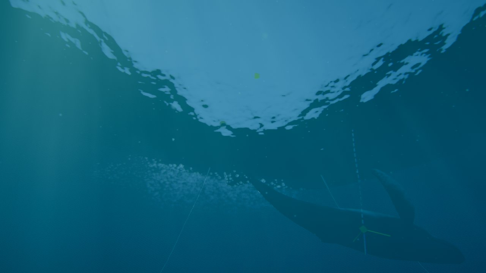 | 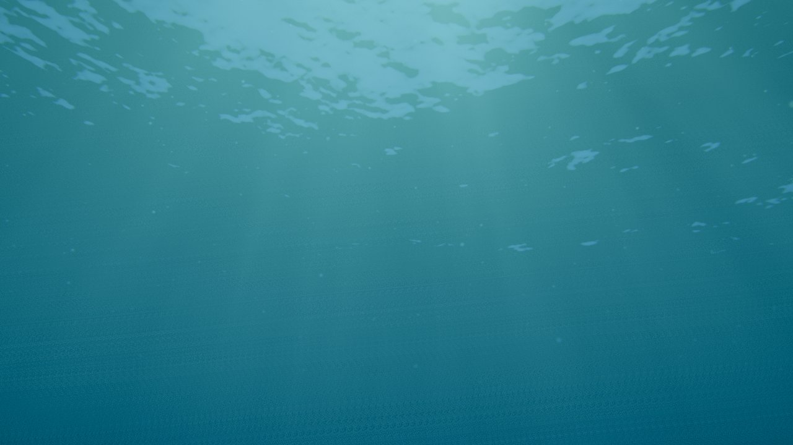 |
| **Ballena a 5 m, luz atenuada y cáusticas** | **Ballena en superficie vista desde abajo** |
| 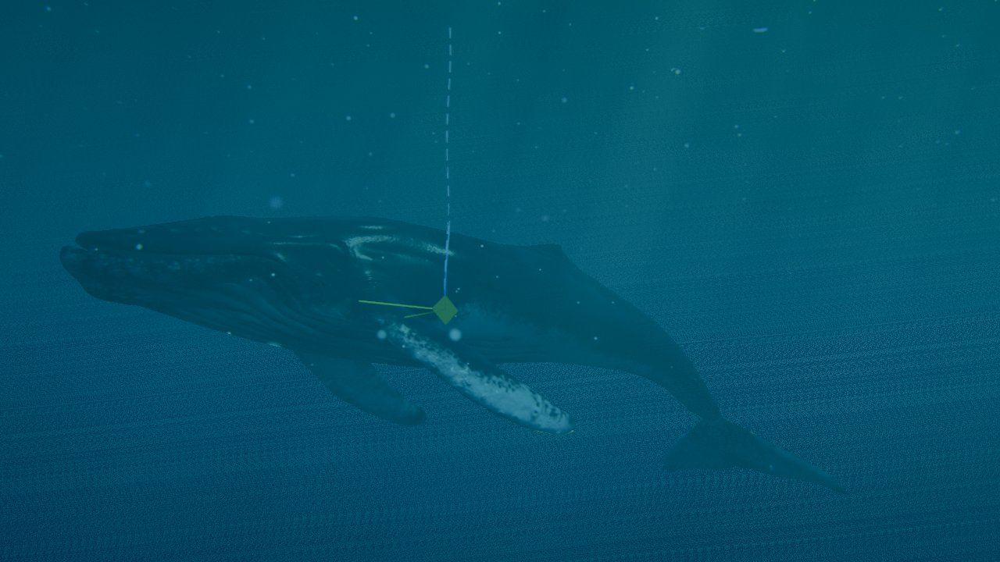 | 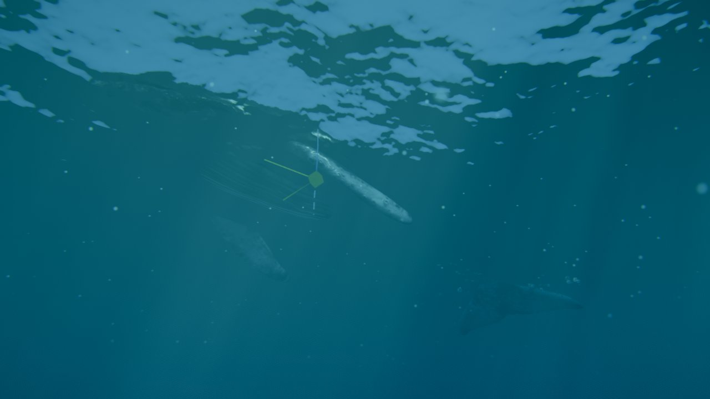 |
| **Línea de flotación (cámara a medias)** | **Gotas en la lente al salir** |
| 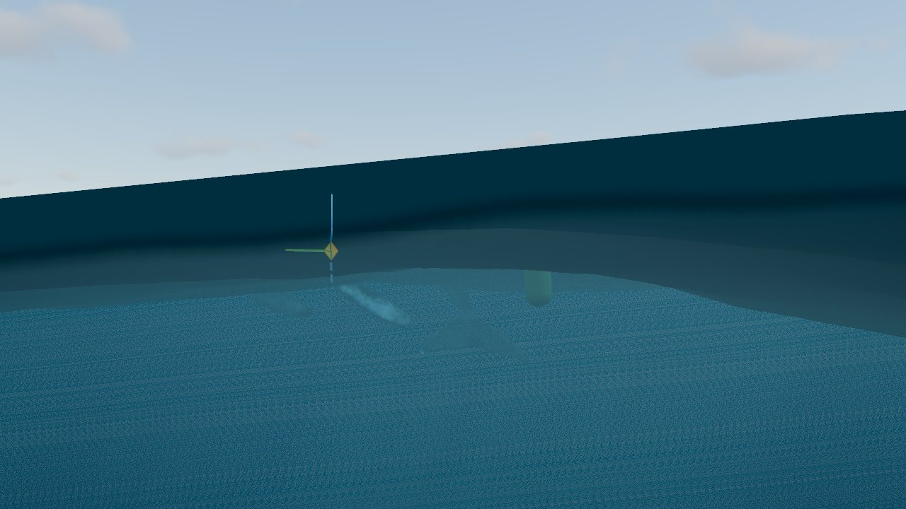 | 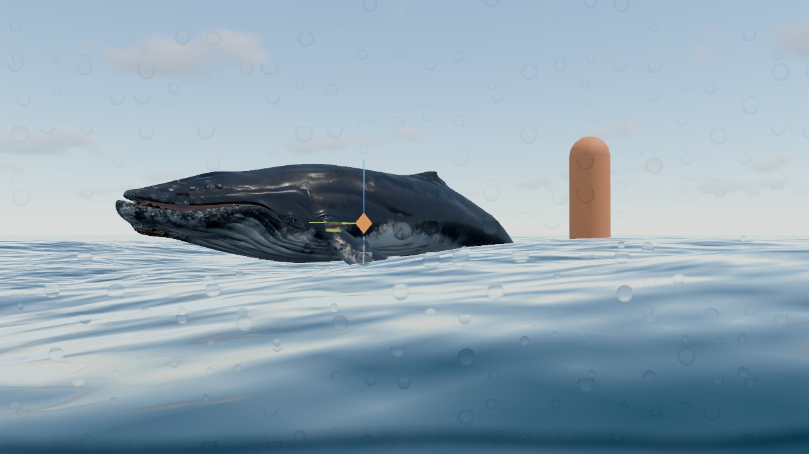 |

De espaldas al sol y mirando hacia abajo, el azul se oscurece: 

## Estructura

| Archivo | Punto | Función |
|---|---|---|
| `src/underwater/underwater.js` | 6.1, 6.3, 6.4, 6.8 | `RenderPipeline` con una pasada de la escena (color + profundidad) y un compositor TSL |
| `src/underwater/snow.js` | 6.7 | Nieve marina y plancton en el vertex shader (sin compute) |
| `src/ocean/ocean.js` | 6.2, 6.3, 6.5 | `DoubleSide`, cara inferior (Snell/TIR), `causticNode`, `underLightNode`, tipos de agua |
| `src/water/splash.js`, `interaction.js` | 6.6 | Tipo de partícula burbuja y sus emisores |
| `src/main.js` | — | `under.render()` sustituye a `renderer.render()`; la luz bajo el agua se aplica a los materiales de la ballena |

## 6.1 Transición y línea de flotación

- **Detección:** con `ocean.heightAt` en la CPU se sabe si la cámara está bajo el agua o a menos de 2,5 m. Solo entonces se calcula el posprocesado.
- **Máscara por píxel:** el compositor mira si el punto del rayo a 0,5 m de la cámara (la "cúpula" de una carcasa submarina) está bajo la superficie. Usa la misma altura que dibuja la GPU: `surfaceHeightNode`, oleaje más ondas de la ballena.
  - Así la imagen se parte por la línea de flotación, que sigue a las olas.
  - Con el plano cercano real (0,1 m) la franja partida solo mediría unos 4 cm; con 0,5 m se ve como en las fotos de carcasa.
- **Menisco:** franja oscura y algo verdosa donde |altura − lente| < 1,4 cm.
- **Gotas en la lente:**
  - Al pasar de estar bajo el agua a estar fuera, aparecen gotas procedurales, una por celda de una rejilla de 26 × 14 (el 55 % de las celdas).
  - Cada gota invierte y amplía lo que hay detrás, tiene el borde más oscuro y resbala despacio.
  - Se secan en 4 s.

## 6.2 Superficie vista desde abajo

El océano pasa a `DoubleSide`. En la cara de atrás (`frontFacing` falso):

- **Refracción** agua → aire con `refract(I, −N, 1,333)`:
  - Dentro del cono de ~48,6° (ventana de Snell) se ve lo que hay encima (la escena ya dibujada, desplazada por la normal: cielo, nubes, sol y la ballena en el aire), multiplicado por 1 − F.
  - Fuera, `refract` devuelve cero: reflexión total interna (F = 1), que refleja el propio mar (color de dispersión × luz, más oscuro).
- **Fresnel** de Schlick con F0 = 0,02 sobre el ángulo transmitido.
- **Ondas:** la ventana sigue a las olas de las tres cascadas y a las ondas de la ballena. En `ballena_desde_abajo.jpg` se ve la mancha clara irregular típica.

## 6.3 Niebla y absorción

- **Absorción:** la de agua de mar, con distinta proporción por tipo de agua y escalada por la "Claridad" (la misma que ya usaba la refracción vista desde arriba). El rojo desaparece en pocos metros y el azul es lo último.

  | Tipo de agua | Absorción R, G, B (1/m, claridad de referencia 14 m) | Color | Claridad |
  |---|---|---|---|
  | Océano abierto | 0,45 / 0,07 / 0,045 | #06303c | 14 m |
  | Tropical clara | 0,42 / 0,05 / 0,03 | #0a4a5a | 28 m |
  | Costera verde | 0,50 / 0,12 / 0,30 | #163d27 | 6 m |

- **Dispersión:** σs = 0,03 × turbidez × 14 / claridad.
- **Transmitancia:** T = exp(−σt·d), con σt = absorción + σs y d = la distancia hasta lo que se ve (400 m para el fondo vacío).
- **Luz dispersada** (6.4), integrada a lo largo del rayo:
  - En cada punto p, a una profundidad D, llega el sol atenuado por exp(−σa·D/cos θ_refr) y multiplicado por las cáusticas, más el ambiente atenuado por exp(−σa·D).
  - Por eso la imagen se oscurece hacia abajo y hacia lo lejos, y aclara hacia la superficie.
- **Más allá de 70 m:** se añade la solución analítica con la luz del último punto.

## 6.4 God rays

- **Recorrido del rayo:** 16 pasos por defecto (configurable de 2 a 48), hasta 70 m, con ruido de gradiente entrelazado como desfase. El ruido blanco dejaba un grano en diagonal.
- **En cada punto:** proyecta hacia arriba por la dirección del sol refractada (Snell) hasta la superficie y lee allí las cáusticas.
  - Los puntos alineados con el sol comparten el mismo punto de la superficie, lo que produce haces de luz que se mueven con las olas.
- **Luz:** se ilumina con fase de Henyey-Greenstein (g = 0,7) respecto a la dirección del sol dentro del agua.
- **Parámetro "God rays":** mezcla entre luz uniforme (0) y haces (2 por defecto).
- **Versión de bajo coste:** menos pasos en la GUI (8 pasos: −0,7 ms).

## 6.5 Cáusticas

> Revisión del 29/09/2026, a petición de Roberto: la primera versión (jacobiano del desplazamiento) daba manchas suaves. Ahora las cáusticas se calculan con la curvatura real de la superficie y forman la red de líneas brillantes de las fotos (y de las piscinas). También hay destellos y cáusticas en la cara inferior de la superficie, y los god rays llegan hasta 8.

| Ballena a 4 m con cáusticas | Superficie desde abajo: sol, destellos y haces |
|---|---|
| 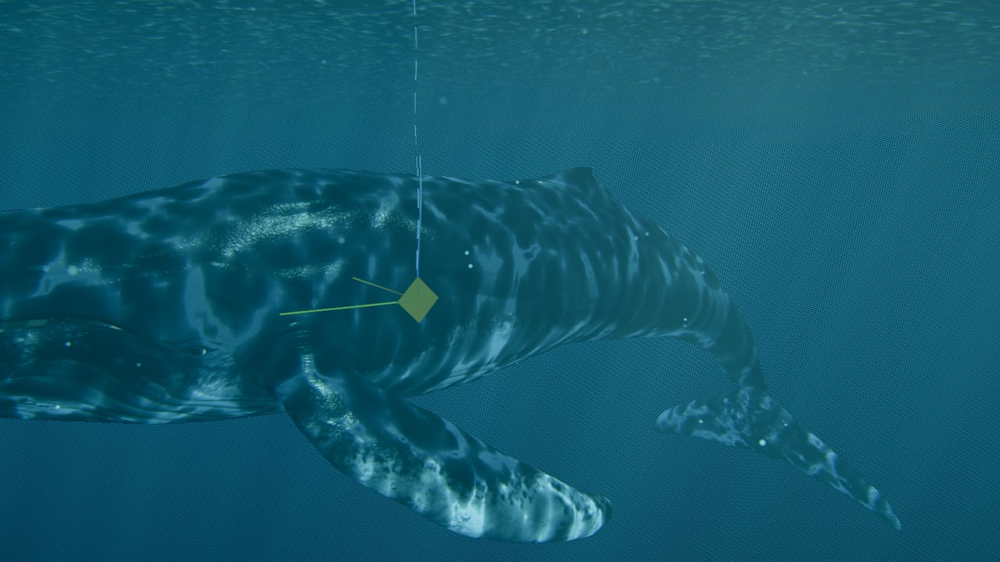 | 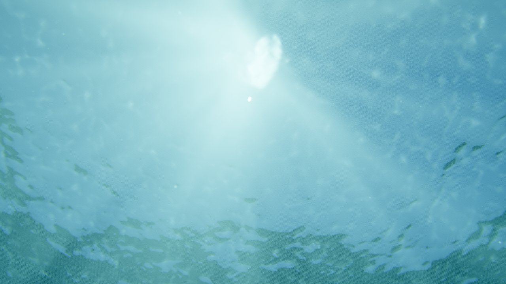 |

- **Curvatura:** el pase `post` de la FFT escribe una tercera textura por cascada con el hessiano de la altura (∂²h/∂x², ∂²h/∂z², ∂²h/∂x∂z), por diferencias centrales de las pendientes.
- **`causticAt(xzS, D)`:** cada ola actúa de lente. El haz que entra por un trozo de superficie se desplaza D·κ·H a una profundidad D (κ = 1 − 1/n ≈ 0,25, con D alargado por la inclinación del sol refractado).
  - La intensidad es el cociente de áreas **I = 1 / |det(I + D·κ·H)|**.
  - Donde el determinante pasa por 0 (los pliegues) aparecen las líneas brillantes.
  - Se limita con un ε (la "nitidez") y a un máximo de 8.
- **Cascadas que intervienen:**
  - La de 97 m enfoca a decenas de metros.
  - La de 19 m enfoca a pocos metros y se apaga hacia los 15 m.
  - Más allá de 12-35 m el patrón se deshace y la luz vuelve a ser uniforme, como en el mar abierto real.
- **`causticNode(p)`:** busca el punto de la superficie por donde entra el sol que llega a p y lo multiplica por la sombra de las nubes.
  - Con `soft` (god rays) usa un mip más grueso y un ε 3 veces mayor: haces sin centelleo.
- **`underLightNode(p)`:** absorción desde la superficie × (1 + fracción de sol × (cáusticas − 1)), con una fracción de sol de 0,75 × el factor de altura del sol.
  - Se aplica a la ballena (`outputNode`), a las salpicaduras, las burbujas y la nieve marina.
  - Solo hay cáusticas cuando las condiciones de luz lo permiten: el efecto se multiplica por la altura del sol y la sombra de las nubes. De noche, o bajo una nube, desaparece.
- **Cara inferior de la superficie:**
  - Destellos del sol visto a través de las olas (dirección refractada alineada con el sol, fuera de la reflexión total).
  - Red de cáusticas que se forma justo bajo la superficie (a 1,2 m).
  - Ambos con la misma condición de luz.
- **Parámetros** (carpeta *Bajo el agua*): "God rays" 0-8 (5 por defecto), "Cáusticas (ballena y partículas)" 0-3 (1,5), "Nitidez de las cáusticas" 0-1 (0,75) y "Brillo de la superficie (desde abajo)" 0-3 (1).
- **Coste:** una muestra de textura por cascada y evaluación. Con la ballena cubriendo la pantalla bajo el agua, el fotograma sube a unos 10 ms a 720p (16 pasos de god rays).

### Ajustes del 29/09/2026 (preset de Roberto)

- **Valores por defecto** del preset que envió: god rays 3,2, cáusticas 0,3 y brillo de la superficie desde abajo 0,5.
- **Los god rays solo se veían a veces.** Tenía dos causas:
  1. **Dependían del control de cáusticas:** se calculaban con `causticNode`, que se mezcla con «Cáusticas». Con 0,3 los haces quedaban al 30 %. Ahora usan `ocean.shaftNode`, independiente de ese control.
  2. **Sombra de las nubes:** cuando una nube tapa el sol sobre esa zona, no hay haces. Las nubes se mueven con el viento, así que los haces aparecían y desaparecían aunque la cámara diera vueltas. Es lo físico, pero ahora el control «Las nubes apagan los haces» (0,5 por defecto; 1 = físico) deja que solo los atenúen.

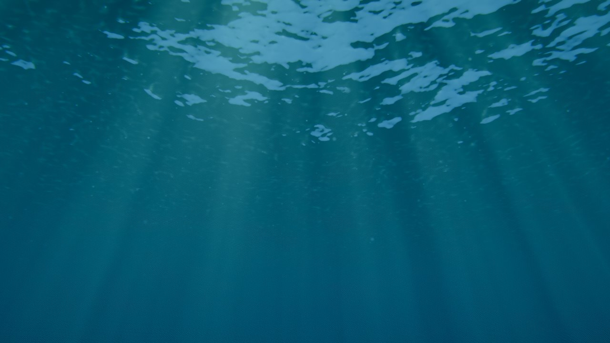

- **Burbujas más pequeñas y dispersas:**
  - Nube del impacto: 8000 burbujas de 0,6-5 cm en 7 m de radio.
  - Salida: 2000 burbujas de 0,6-4 cm.
  - Huella al entrar y estela: 0,5-3,5 cm, más repartidas. Antes medían hasta 18 cm y formaban una nube compacta.

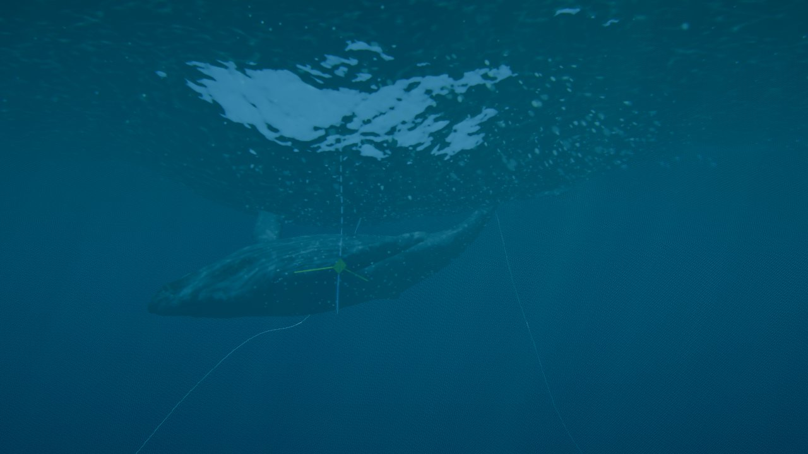

## 6.6 Burbujas

- **Física:** nuevo tipo de partícula (4).
  - Rozamiento fuerte y empuje proporcional al tamaño: velocidad terminal de ~0,3-1 m/s.
  - Bamboleo lateral y estallan al llegar a la superficie.
- **Aspecto:** anillo con reflejo, 1,6 veces más brillante que las gotas.
- **Emisores:**
  - `impact`: nube de 6000 burbujas en una esfera de 5 m, a 3 m bajo la superficie.
  - `surface_exit`: 1500 burbujas.
  - Sondas que entran en el agua a más de 0,8 m/s: burbujas bajo la huella.
  - Sondas bajo el agua durante los 4 s siguientes a haber estado fuera, moviéndose a más de 2 m/s: estela de burbujas (aire atrapado).

## 6.7 Partículas en suspensión

- **Cantidad:** 14 000 sprites (un 7 % de plancton, algo mayor y verdoso) en una caja de 36 m que acompaña a la cámara.
- **Posición:**
  - Cada partícula tiene una posición fija en el mundo que se repite cada 36 m, así que no viajan con la cámara.
  - Derivan con una corriente (0,12 / −0,02 / 0,05 m/s), oscilan y se desvanecen en el borde de la caja.
- **Luz:** la del agua a su profundidad con cáusticas; brillan en los haces.
- **Solo bajo el agua:** se ocultan con la cámara fuera.

## 6.8 Posprocesado

Solo en los píxeles bajo el agua:

- **Distorsión:** senos en pantalla de 0,0012 de amplitud que se mueven con el tiempo.
- **Aberración cromática:** radial, R y B desplazados ±0,4 % en los bordes.
- **Desenfoque:** 5 muestras en cruz, con un radio que crece con la distancia (hasta 60 m).
- **Viñeta:** 0,35.

## Errores encontrados

- **Nodos de cámara en el posprocesado:** en el quad del `RenderPipeline`, `cameraPosition`, `cameraNear` o `cameraProjectionMatrixInverse` son los de la cámara ortográfica del quad, no los de la escena. La niebla no se aplicaba. Se pasan como uniformes propias actualizadas en cada fotograma.
- **Capturas con recarga en caliente:** los cambios de código recargan la página y cortan las capturas en marcha; hay que repetirlas con la página ya cargada.

## Límites conocidos y trabajo futuro

- **Ventana de Snell aproximada:** usa la imagen ya dibujada desplazada, no una refracción geométrica real, así que el cielo no se comprime en el cono de 97°. Además, el sol no aparece como un disco brillante propio (solo el de la cúpula).
- **Cáusticas:** la intensidad se evalúa en el punto de la superficie por donde entra la luz, sin el desplazamiento lateral del haz (pequeño a pocos metros). No hay cáusticas en un fondo marino porque no hay fondo.
- **Profundidad de campo:** el desenfoque es por distancia en pantalla, sin bokeh.
- **Ruido de los god rays:** hay un grano fino con pocos pasos. Con acumulación temporal (Fase 7.3, TAA) desaparecería.
- **Luz de la ballena:** la luz bajo el agua usa el nivel medio del mar, no la altura de la ola encima de cada punto.
