# Fase 7 · Secuencia y composición final

29/09/2026 · Three.js r186 (`RenderPipeline` + nodos TSL de `three/addons/tsl/display`)

## Resumen

- **Secuencia completa** (7.1): nado profundo → ascenso → salto → impacto → ondas y espuma → vuelta a empezar.
  - Carpeta *Secuencia* de la GUI (o tecla **P**): repetible, con disparo manual ("Saltar ahora") y duraciones y profundidades ajustables.
- **Cámaras cinemáticas** (7.2): dos raíles nuevos, «Hacia la luz (desde abajo)» y el travelling «Cruce de superficie», más un director por fase con cortes secos.
  - El paso sobre/bajo el agua se da en el cruce de superficie y en el corte del ascenso al barco (con gotas en la lente).
  - Las cámaras sobre el agua siguen la altura real de las olas.
- **Posprocesado global** (7.3), cada efecto se puede apagar:
  - TAA o FXAA;
  - profundidad de campo con enfoque automático en la ballena;
  - motion blur (con la velocidad del océano corregida);
  - bloom;
  - exposición, contraste, saturación, temperatura y viñeta;
  - grano.
- **Audio procedural** (7.4, opcional): oleaje, impacto y chapoteo con retraso por distancia, sonido apagado bajo el agua y canto de ballena. Todo sintetizado con WebAudio, sin archivos.

### La secuencia, plano a plano (director automático)

| Nado profundo («Bajo el agua») | Ascenso («Hacia la luz») |
|---|---|
| 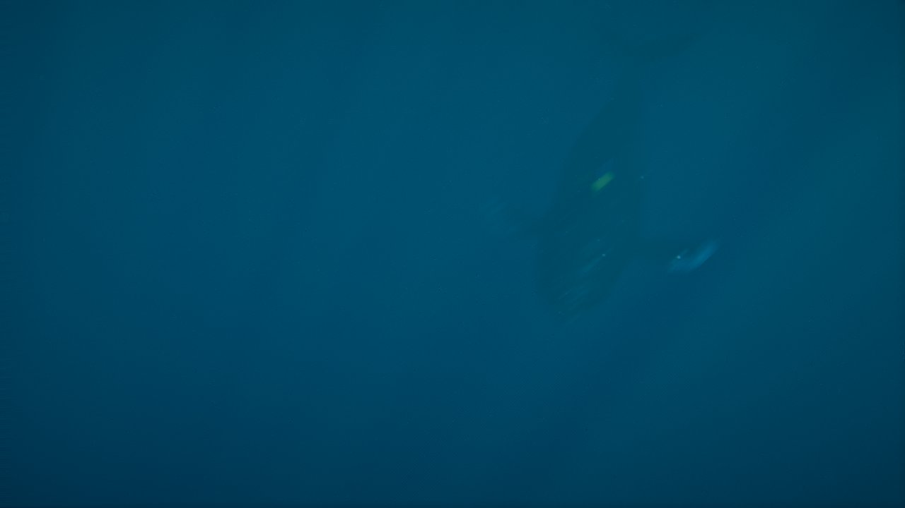 | 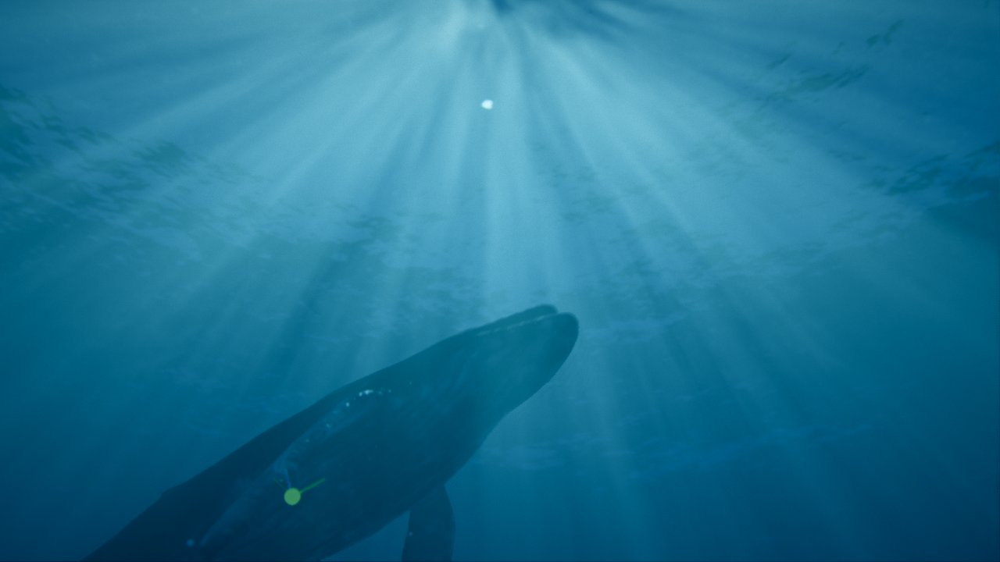 |
| **Salto («Barco», corte seco tras subir del agua)** | **Caída («Barco»)** |
| 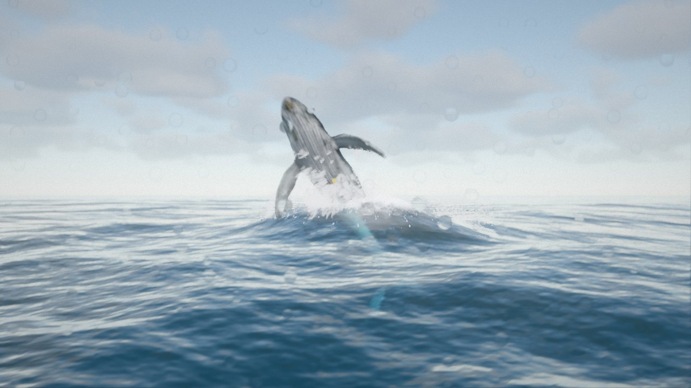 | 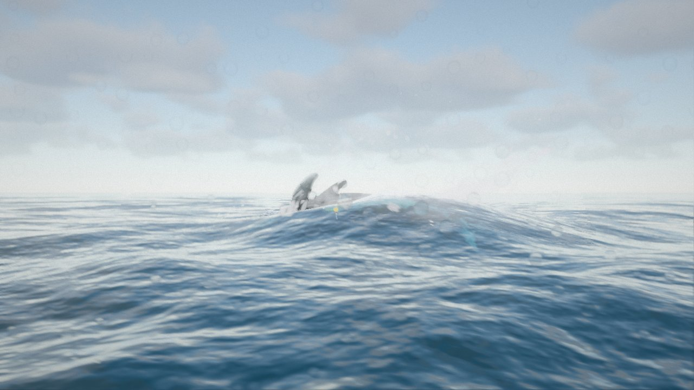 |
| **Impacto («Ras de agua», siempre sobre las olas)** | **Recuperación («Cruce de superficie»: empieza encima…)** |
| 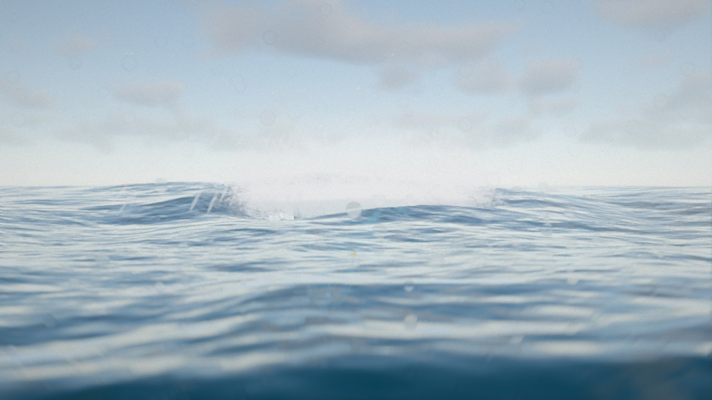 | 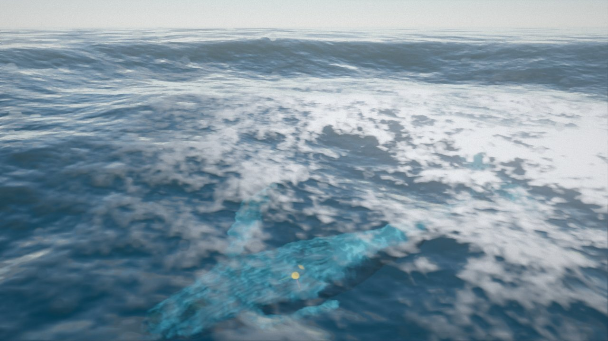 |
| **…pasa por la línea de flotación y baja** | **Ondas y espuma («Aérea»)** |
| 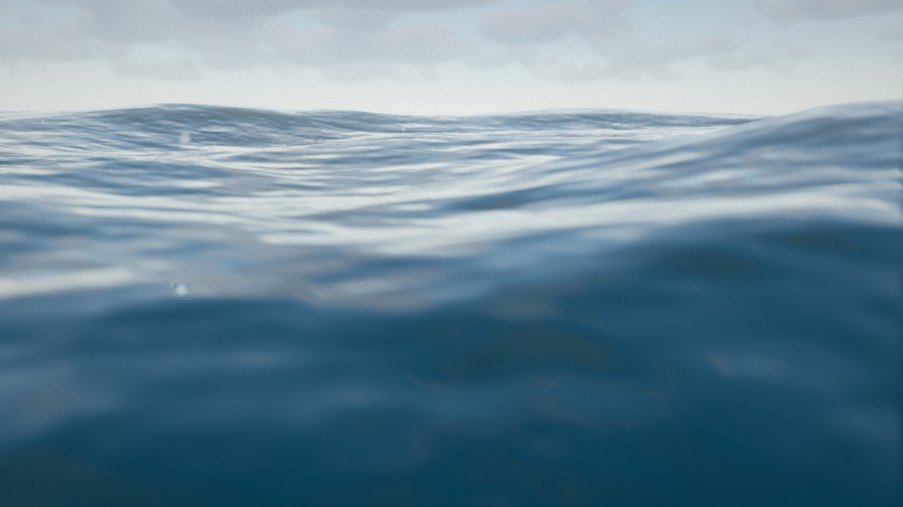 | 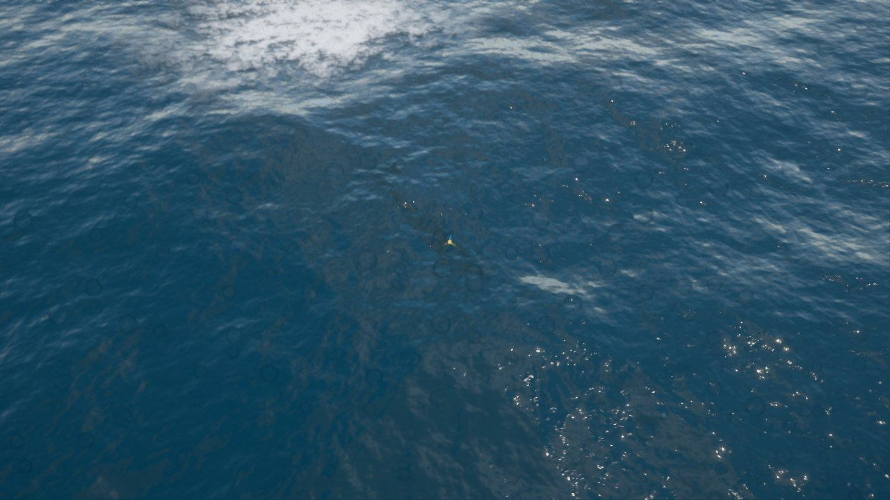 |

## 7.1 Secuencia (`core/sequence.js`)

- **Fases** y lo que hace cada una:
  - **Nado profundo:** la ballena nada a `deepDepth` (16 m) durante `deepTime` (8 s).
  - **Ascenso y salto:** `fsm.jump()`; la máquina de estados planifica el salto desde donde esté y pasa por preparar → saltar → caer → recuperar.
  - **Ondas y espuma:** cuando la máquina de estados vuelve a "nadar", la ballena nada a `surfaceDepth` (3 m) durante `surfaceTime` (7 s).
  - Luego vuelve al nado profundo si "Repetir" está activo; si no, para.
- **Mientras se reproduce:**
  - Quita los saltos automáticos.
  - Oculta las ayudas de depuración (trayectoria, punto de anclaje, ejes y persona de referencia).
  - Con "Cámaras automáticas" pasa a cámara cinemática con cortes secos.
  - Al parar, restaura todo como estaba.
- **Controles:** «▶ Reproducir / ■ Parar» (tecla P), «Saltar ahora», la fase y el progreso en pantalla, y las duraciones y profundidades (van en presets y en la URL, módulo `secuencia`).
- **Comprobado** en el navegador con la secuencia completa: nado profundo (fotograma 0) → ascenso (119) → barco (253) → ras de agua (300) → cruce (374) → aérea (522) → fin (673), a 30 fps.

## 7.2 Cámaras cinemáticas (`core/cameras.js`)

- **Raíles nuevos:**
  - **«Hacia la luz (desde abajo)»:** por debajo y delante de la ballena, mirando hacia la superficie. La ballena sube hacia los haces de luz.
  - **«Cruce de superficie»** (travelling): junto al impacto. Pasado 1 s, la cámara baja de 1,4 m sobre el agua a 3,2 m por debajo en 5 s: se ve la línea de flotación partiendo la imagen y termina bajo el agua.
- **Tiempo propio de cada plano** (`shotStart`) para los travellings.
- **`setDirector(fn)`:** la secuencia sustituye al director.

  | Momento | Plano |
  |---|---|
  | Nado profundo | Bajo el agua |
  | Preparar | Hacia la luz |
  | Saltar | Barco |
  | Caer | Ras de agua |
  | Recuperar | Cruce de superficie |
  | Ondas y espuma | Aérea |

- **Cámaras sobre el agua:** consultan la altura real del mar (`ocean.heightAt`).
  - El barco sube y baja con las olas (+2,5 m).
  - «Ras de agua» se mantiene 0,9 m por encima de la ola. A 1,2 m fijos, con olas de Hs ≈ 2 m, quedaba a menudo sumergida.
- **`consumeCut()`:** marca el fotograma de un corte seco para que el motion blur no mezcle las dos posiciones de la cámara.

## 7.3 Posprocesado global (`core/post.js`)

- **Cadena:** escena (color + profundidad + velocidad, sin MSAA) → composición bajo el agua (Fase 6) → **TAA** (TRAA de three) → **profundidad de campo** → **motion blur** → **bloom** → exposición y tone mapping (`renderOutput`) → corrección de color en el espacio de la pantalla (temperatura, contraste, saturación, viñeta) → **FXAA** (si se elige en vez de TAA) → **grano**.
- **Grafo:**
  - Se reconstruye al activar o desactivar efectos, así que lo apagado no cuesta.
  - Si todo está apagado y la cámara lejos del agua, se dibuja sin la pasada extra.
- **Valores por defecto:** TAA; bloom 0,12 (umbral 1,4, radio 0,25); motion blur 0,35 del fotograma, limitado al 3 % de la pantalla; contraste 1,05; saturación 1,05; viñeta 0,15; grano 0,04. Profundidad de campo desactivada, con enfoque automático en la ballena.
- **El TAA también limpia el grano de los god rays** (su ruido cambia cada fotograma).
- **Coste (720p, medidas con bastante ruido):** 4,4 ms sin posprocesado → ~6,3 ms con todo; con FXAA en vez de TAA, ~3,8 ms.

| Sin posprocesado | Con posprocesado |
|---|---|
| 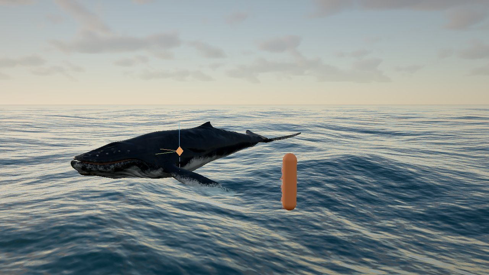 | 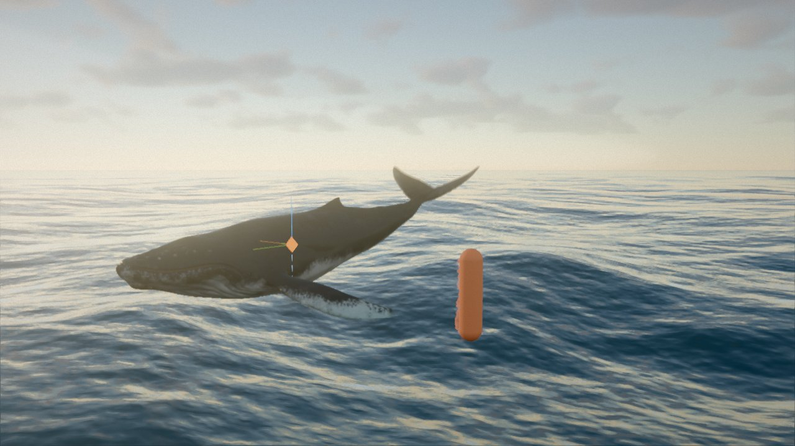 |

### Error encontrado: velocidad del océano

`VelocityNode` compara la posición actual con la anterior del **atributo**. El mar genera sus vértices en el vertex shader (anclados a la cámara y con el oleaje), así que su "velocidad" era enorme en toda la superficie. El motion blur lo convertía en estelas y fantasmas, y un simple cambio de plano en remolinos.

- **Mar:** ahora escribe su propia velocidad en el MRT (`material.mrtNode`), reproyectando su punto del mundo con la matriz vista-proyección actual y la del fotograma anterior.
- **Partículas y nieve marina:** su posición también sale del shader; escriben velocidad 0.

Diagnóstico: la textura de velocidad vista como color (antes el mar salía saturado, ahora solo se mueve la ballena).

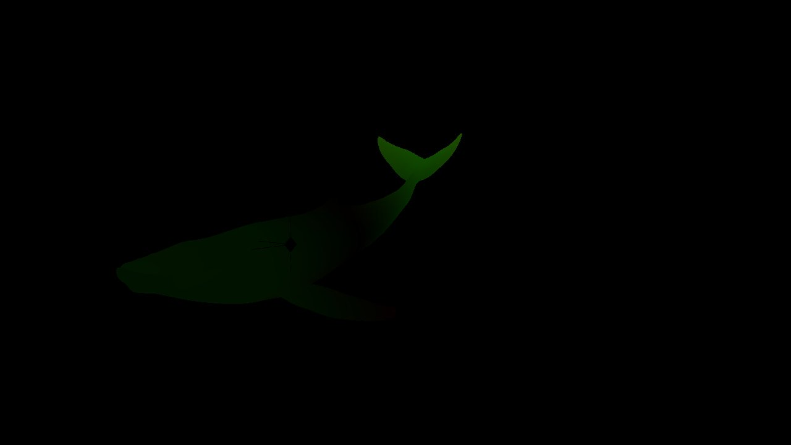

## 7.4 Audio (`audio/audio.js`, opcional)

Todo es WebAudio procedural, sin archivos de sonido (sin problemas de licencia). Se activa con un clic en la carpeta *Audio*: el navegador no deja sonar sin un gesto del usuario, por eso `enabled` no se guarda en presets ni en la URL.

- **Oleaje:** ruido rosa con paso bajo a 700 Hz y "respiración" lenta (dos senos de 0,9 y 0,37 rad/s), más un siseo de crestas (paso alto a 2,5 kHz). El nivel crece con el viento y el mar de fondo.
- **Impacto:** golpe grave (70 → 35 Hz) y estallido de ruido cuyo filtro se cierra de 5 kHz a 200 Hz en 1,8 s.
- **Salida:** chapoteo de 0,9 s.
- **Retraso y volumen por distancia:** los sonidos se retrasan según la distancia a la cámara, a 343 m/s en el aire o 1500 m/s bajo el agua, y se atenúan con 1/(1 + d/25).
- **Bajo el agua:** todo pasa por un paso bajo a 380 Hz y aparece un rumor grave. Cada 7-17 s suena un canto de ballena: glissandos de 120-240 Hz con vibrato, un armónico y eco de 0,45 s.
- **Controles:** volumen, oleaje, salto e impacto, y canto de ballena.
- **Comprobado:** el grafo se construye y los eventos del salto suenan sin errores. No he podido escuchar el resultado: el panel del navegador de pruebas no tiene salida de audio.

## Límites conocidos y trabajo futuro

- **TAA:** puede dejar algo de estela en las partículas (no escriben velocidad). Si se nota, se puede usar FXAA.
- **Velocidad del mar:** no incluye el movimiento de las olas, solo el de la cámara. El motion blur del oleaje en sí no existe; no se echa en falta.
- **Transiciones del director:** con cortes secos, el primer fotograma tras salir del agua lleva gotas en la lente (paso bajo → sobre agua). Es intencionado; se desactiva con «Gotas en la lente al salir».
- **Audio:** es sintético y sencillo (sin reverberación de convolución ni muestras reales). Mejorable con grabaciones con licencia libre en la Fase 8.
