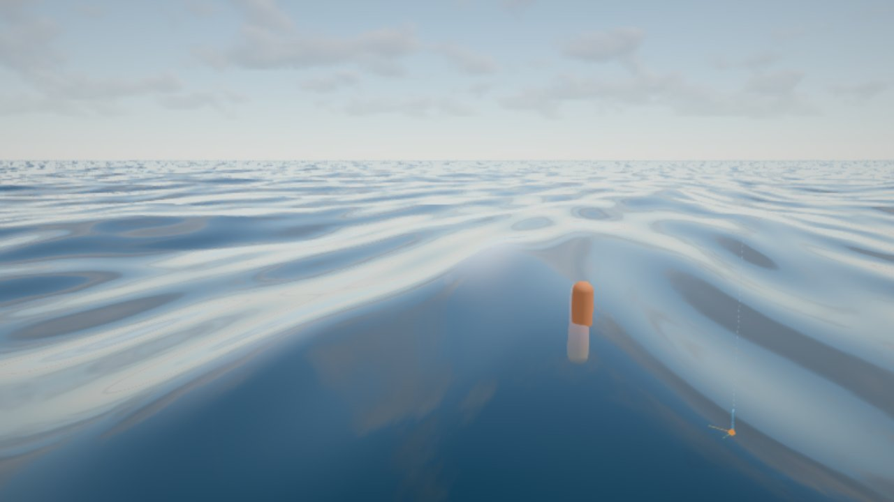

# Fase 8 · Rendimiento y entrega

29/09/2026

## Resumen

| Punto | Estado |
|---|---|
| **8.1** Perfiles de calidad | Hecho: Bajo, Medio, Alto, Ultra y Automático (`core/quality.js`, carpeta *Calidad*) |
| **8.2** Perfilado | Hecho: tiempos por perfil y desglose por módulo a 1080p; Ultra bajo el agua reajustado |
| **8.3** Build, despliegue y documentación | Build de producción listo y probado (`base: './'`), `README.md` y [`parametros.md`](parametros.md) generado desde la GUI. **Despliegue público pendiente de decidir** (licencia del modelo) |
| **8.4** Vídeo (opcional) | Hecho: grabación a WebM (VP9) desde la GUI, con un fotograma de vídeo por fotograma dibujado |
| **8.5** Fallback WebGL2 | Hecho: sin WebGPU (o con `?webgl`) arranca con el backend WebGL2 y desactiva lo que necesita compute |

## 8.1 Perfiles de calidad

| Perfil | Escala de render | Nubes (resolución · pasos · luz) | God rays (pasos) | Posprocesado | Partículas |
|---|---|---|---|---|---|
| Bajo | 0,6 | 0,35 · 24 · 2 | 6 (sin desenfoque) | FXAA, sin bloom, motion blur ni grano | ×0,5 |
| Medio | 0,8 | 0,5 · 32 · 3 | 10 | TAA, bloom, sin motion blur | ×0,8 |
| Alto (por defecto) | 1 | 0,5 · 40 · 4 | 16 | TAA, bloom, motion blur, grano | ×1 |
| Ultra | 1,25 | 0,75 · 64 · 6 | 20 | Como Alto | ×1,3 |

- **Automático:** empieza en Alto. Con la media del tiempo de fotograma, baja un nivel si pasa de 19 ms y sube si baja de 11 ms (sin pasar de Alto). Espera 3-5 s entre cambios para no oscilar.
- **Al elegir un perfil** se actualizan los controles de la GUI. Después se puede retocar cualquier parámetro a mano.

## 8.2 Rendimiento

Herramienta: `window.whaleViewer.benchmark(n, [ancho, alto])` (solo en desarrollo). Dibuja n fotogramas completos a paso fijo y mide el tiempo con la GPU sincronizada. Sobre el agua: cámara a 4 m, mediodía, nubes al 45 %.

### Por perfil (1920×1080)

| Perfil | Sobre el agua | Bajo el agua | Buffer |
|---|---|---|---|
| Bajo | 6,2 ms | 5,5 ms | 1152×648 |
| Medio | 7,7 ms | 8,9 ms | 1536×864 |
| Alto | 10,9 ms | 15,1 ms | 1920×1080 |
| Ultra | 15,9 ms | 34 ms* | 2400×1350 |

\* Medido con 28 pasos de god rays. Por eso Ultra pasó a 20 pasos; con 20 no se ha vuelto a medir.

**Objetivo (60 fps = 16,7 ms): se cumple en Alto**, sobre y bajo el agua, en el equipo de desarrollo.

### Desglose (Alto, 1080p, quitando cada módulo)

| Módulo | Coste aprox. |
|---|---|
| Océano (malla + shading + FFT) | ~4,0 ms (la FFT frente a Gerstner: ~1,8 ms) |
| Posprocesado global | ~2,9 ms |
| Nubes volumétricas | ~2,0 ms |
| Cielo físico | ~0,8 ms |
| Interacción (en reposo) | ~0 ms (0,4 + 0,55 ms de GPU durante un salto, Fase 5) |
| Bajo el agua | +4,9 ms, de ellos ~2,2 ms los god rays con 16 pasos frente a 8 |

Las medidas tienen algo de ruido (±0,5 ms). Lo más caro es el océano y el posprocesado; si hiciera falta más, lo siguiente sería reducir la malla del océano en los perfiles bajos.

## 8.3 Build y documentación

- **`vite.config.js`:**
  - `base: './'`: rutas relativas, así el build funciona en GitHub Pages u otra subruta.
  - `build.target: 'es2022'`: por el `await` de nivel superior.
- **`npm run build`:** 1,28 MB de JS (371 KB con gzip) + el transcodificador Basis. Con el modelo, `dist/` ocupa unos 15 MB.
- **Probado con `vite preview`:** carga el modelo y la GUI, sin errores, y sin las herramientas de desarrollo.
- **[`README.md`](../../README.md):** requisitos, modelo, scripts, uso, rendimiento, despliegue y estructura.
- **[`parametros.md`](parametros.md):** los 254 controles de la GUI con tipo, valor por defecto, rango y clave, más la tabla de claves de URL y presets (17 módulos). Se genera en desarrollo con el endpoint `POST /__save` de `vite.config.js`.
- **Despliegue: sin hacer.** El build incluye el modelo de CGTrader (*Royalty Free*); publicarlo en una web pública lo haría descargable. Queda pendiente decidir el destino (GitHub Pages, Netlify o Vercel) y confirmar que la licencia lo permite. Al no estar el modelo en el repo, una acción automática de GitHub no podría construir la web completa: habría que subir `dist/` desde local o alojar el modelo aparte.

## 8.4 Vídeo

- **Qué hace:** `core/recorder.js` graba con `MediaRecorder` (WebM VP9, o VP8/MP4 según el navegador), de 5 a 120 Mbit/s, y descarga el archivo al parar.
- **Captura fotograma a fotograma:** usa `captureStream(0)` y `requestFrame()` justo después de cada render. Cada fotograma dibujado es un fotograma del vídeo, aunque la pestaña no se esté pintando.
  - Con `captureStream(fps)` y el panel oculto solo salía la cabecera (110 bytes).
  - Probado: 60 fotogramas → WebM de 1,6 MB.
- **Cámara lenta:** con la velocidad del tiempo (carpeta *Tiempo*). Se graba en tiempo real, así que si el equipo no llega a 60 fps el vídeo sale a trompicones. Para una captura perfecta haría falta un modo offline (render a paso fijo y codificación con WebCodecs), que queda como mejora.

## 8.5 Fallback WebGL2

- **Detección:** `viewer.js` usa `forceWebGL` cuando no hay `navigator.gpu` o la URL lleva `?webgl`. `viewer.compute` indica si hay compute shaders.
- **Sin compute:**
  - **Océano:** sin FFT, en modo Gerstner (texturas FFT sustituidas por texturas vacías de 1×1; sin cáusticas del oleaje FFT).
  - **Salpicaduras y ondas de la ballena:** no se crean. La interacción sigue con las sondas y la piel mojada.
  - Perfil **Bajo** y aviso en pantalla durante 9 s.
- **Funciona igual en WebGL2:** cielo físico, nubes volumétricas, niebla bajo el agua, god rays (sin cáusticas), nieve marina, posprocesado y audio.
- **Probado** con `?webgl` en Chromium: sin errores (solo un aviso de three sobre un atributo de posición) y bien sobre y bajo el agua.
- **Límites:**
  - No se ha probado en un navegador sin WebGPU de verdad (Firefox antiguo, Safari < 26).
  - El benchmark no mide en WebGL: no hay cola de GPU con la que sincronizar.

| WebGL2: sobre el agua | WebGL2: bajo el agua |
|---|---|
|  |  |
