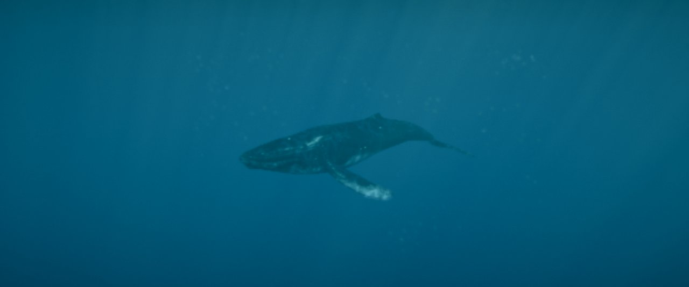
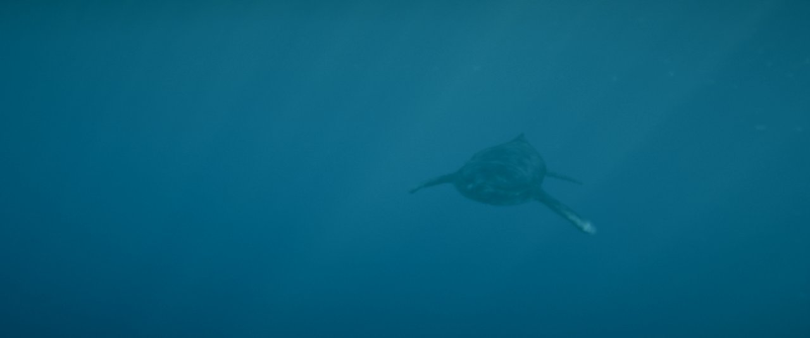
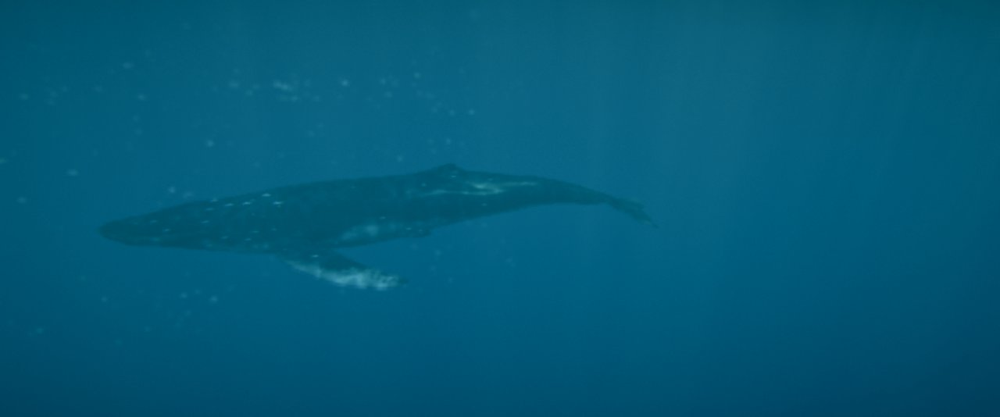
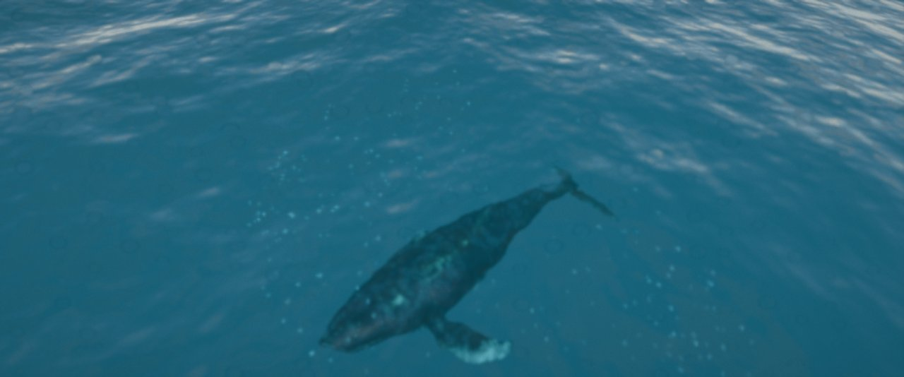

# Ampliación · Efecto 3D de ventana (paralaje con la cámara frontal)

29/09/2026 · Rama `parallax` · Petición de Roberto: si el dispositivo tiene cámara frontal, leer la posición de la cara y mover el punto de vista con ella, de modo que la escena parezca tener profundidad y salir de la pantalla.

Decisiones acordadas:
- **Fuente:** cara leída con la cámara frontal (también en el móvil), con el giroscopio como alternativa.
- **Activación:** desactivado por defecto, con un botón.
- **Intensidad:** realista, con un control para ajustarla.
- **MediaPipe:** desde su CDN.

| Sin efecto | Cabeza (ratón) a la izquierda |
|---|---|
|  |  |
| **Cabeza a la derecha** | **Cabeza arriba** |
|  |  |

(Capturas con la fuente *Ratón* en los extremos y la escena en pausa. Con la cabeza de verdad los desplazamientos suelen ser menores.)

## Cómo funciona (`src/core/parallax.js`)

- **Seguimiento de la cara:** MediaPipe Face Detector (BlazeFace, modelo de corto alcance), en el navegador y por GPU; el vídeo no sale del equipo.
  - **Posición:** punto medio entre los ojos.
  - **Distancia:** sale de la separación entre los ojos (6,3 cm de media) y del ángulo de la cámara.
  - **Unidades:** todo en cm respecto al centro de la pantalla, teniendo en cuenta que la cámara está en el borde superior.
  - **Suavizado:** exponencial, *Suavizado* (0,12 s).
- **Efecto de ventana:** la pantalla es una ventana física a una distancia virtual D = *Plano de la pantalla* × distancia al objetivo de la cámara (1,25 por defecto).
  - **Salida de la pantalla:** con D más allá de la ballena, ella queda por delante del cristal y parece salir de la pantalla.
  - **Escala realista:** los cm de la cabeza se pasan a la escena con la proporción entre el ancho físico de la pantalla y el ancho de la ventana virtual. *Intensidad* = 1 es realista.
  - **Proyección descentrada:** el ojo se desplaza con la cabeza y el frustum se inclina para que los bordes de la ventana queden fijos.
  - **Dentro de la cámara:** la proyección va dentro de `updateProjectionMatrix`. El antialiasing temporal recalcula la proyección en cada fotograma (jitter con `setViewOffset`) y borraba una matriz puesta a mano.
  - **Sin alterar la cámara del fotograma:** se aplica justo después de colocar la cámara y se deshace tras dibujar. Funciona sobre cualquier modo (seguimiento, cinemática, secuencia, órbita) sin cambiar su lógica. Entra y sale con un fundido de ~0,3 s.
- **Otras fuentes:**
  - **Ratón:** recorre el 60 % del ancho de la pantalla.
  - **Giroscopio (móvil):** inclinar el móvil equivale a mover la cabeza; en iOS pide permiso.
  - **Sin cámara:** si no hay cámara o se deniega el permiso, pasa solo a *Ratón* y lo indica.
- **Activación:**
  - **Botón:** «Activar efecto 3D (cámara)» en el pie, a la derecha. El navegador exige un clic para pedir la cámara.
  - **GUI:** carpeta *Efecto 3D (paralaje)*.
  - **Sin coste:** MediaPipe (≈0,8 s y ~3 MB: WASM desde jsDelivr y el modelo desde Google) solo se descarga al activarlo.
- **Controles (carpeta *Efecto 3D (paralaje)*):**
  - activado;
  - fuente;
  - estado (posición y distancia de la cara);
  - intensidad;
  - plano de la pantalla;
  - suavizado;
  - ancho de la pantalla (cm; se estima con `screen.width`, conviene ajustarlo);
  - distancia habitual (60 cm; 32 cm en el móvil);
  - ángulo de la cámara (60°; 70° en el móvil);
  - cámara en el borde superior;
  - ver la imagen de la cámara (esquina, en espejo).
- **Sin guardar:** estos ajustes no se guardan en la URL ni en los presets. Pedir la cámara al cargar la página no es buena idea.

## Comprobado

- **Paralaje:** con el ratón, el punto de vista cambia y la ventana se mantiene; la ballena, por delante del plano, «sale» de la pantalla. Al desactivarlo, la imagen vuelve a la normal.
- **MediaPipe:** se descarga y se crea en 0,76 s, y el detector funciona (en una imagen sin cara, 0 detecciones).
- **Sin probar:** la cámara de verdad. En el panel de pruebas activarla habría pedido permiso para la webcam del equipo; queda para probarla Roberto.

## Requisitos y límites

- **https:** la cámara solo funciona con https (o en localhost).
- **Un solo espectador:** el efecto de ventana solo es correcto para un ojo, o para el punto medio entre los dos ojos de una persona. Otras personas mirando la pantalla verán el punto de vista moverse.
- **Calibración aproximada:** la distancia sale de la separación media entre los ojos y de un ángulo de cámara típico. Si el efecto se nota exagerado o escaso, se corrige con *Ángulo de la cámara* y *Ancho de la pantalla*.
