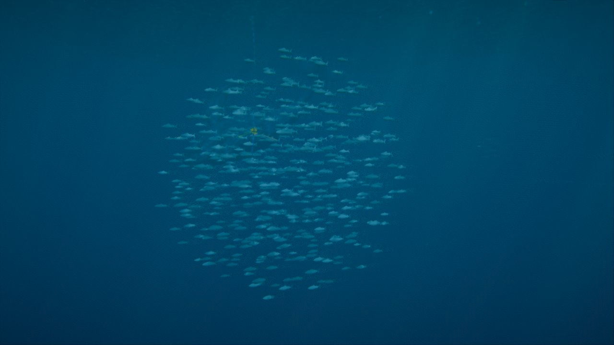
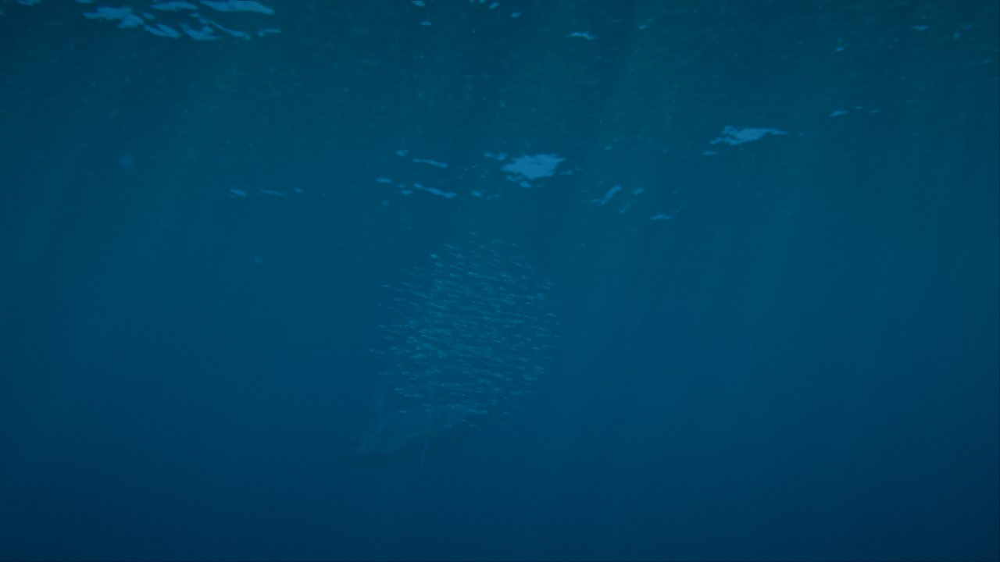
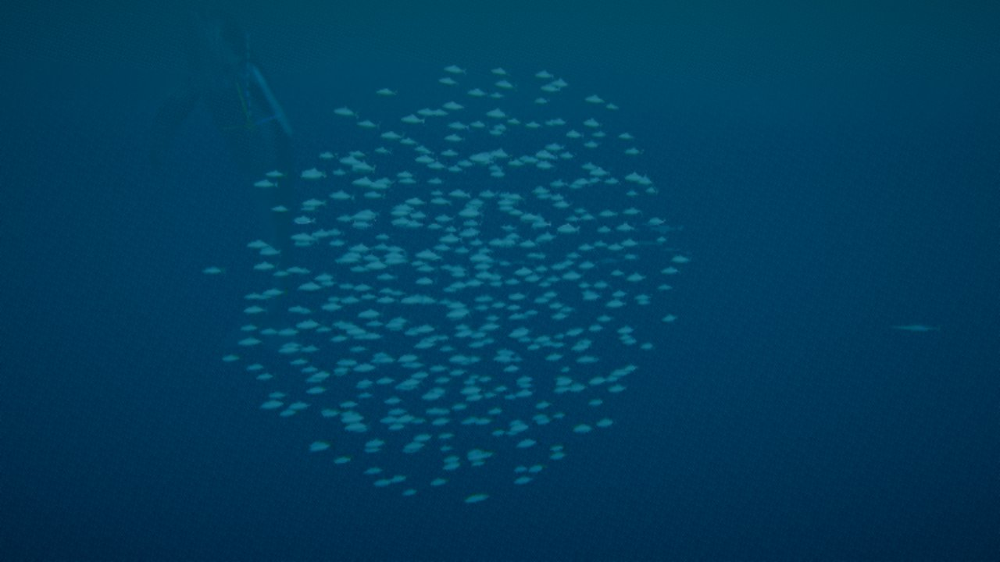

# Ampliación · Peces (cardumen y peces sueltos) y selector de renderizador

29/09/2026 · Petición de Roberto: un selector en la GUI para ver la versión WebGL, algún pez suelto y un cardumen de peces pequeños que nade como un cardumen de verdad.

| Cardumen de cerca (WebGPU) | Cardumen bajo la superficie |
|---|---|
|  |  |
| **El mismo cardumen en WebGL2 (a la derecha, un pez suelto)** | |
|  | |

## Selector de renderizador

- **Dónde:** carpeta *Calidad* → «Renderizador (recarga)»: **WebGPU / WebGL2**.
- **Qué hace:** recarga la página con o sin `?webgl` y conserva todos los ajustes (la URL lleva el estado).
- **Sin WebGPU** en el navegador, solo ofrece WebGL2.

## Peces (`src/life/fish.js`)

- **Modelo propio, sin archivos:** así no hay problemas de licencia.
  - Cuerpo fusiforme (esfera deformada, más gruesa delante y afilada hacia el pedúnculo), aleta caudal en V y aleta dorsal.
  - Lomo oscuro, vientre claro y franja plateada (contrasombreado de los peces pelágicos).
- **Coletazo en el vertex shader:** una onda recorre el cuerpo de la cabeza a la cola (amplitud ∝ distancia a la cabeza²), con una frecuencia que crece con la velocidad de cada pez.
- **Luz:** la que llega a su profundidad, con cáusticas (`ocean.underLightNode`), como la ballena. No escriben velocidad (sin estelas de motion blur).

### Cardumen (boids en CPU, funciona también en WebGL2)

- **Reglas clásicas de Reynolds:**
  - separación con los vecinos a menos de 2,2 longitudes de cuerpo;
  - alineación de velocidades y cohesión dentro de 1,4 m;
  - vecinos por rejilla espacial (celdas de 1,2 m).
- **Vecinos limitados (interacción topológica):** cada pez atiende solo a sus **10 primeros vecinos**, como los peces reales, que se guían por unos 7. Sin este límite, con el cardumen apretado el coste era O(n²): 7,5 ms con 500 peces.
- **Fuerzas añadidas:**
  - atracción a un centro que da una vuelta lenta de 25 m de radio alrededor de la zona de la ballena;
  - franja de profundidad: al menos 1,2 m bajo la superficie y no más de 25 m;
  - huida de la ballena (sondas del cuerpo de la Fase 5, radio del cuerpo + 6 m) y, un poco, de la cámara.
- **Velocidad** entre 0,5 y 1,8 veces la de crucero; nadan sobre todo en horizontal.
- **Comprobado** en el navegador:
  - arranca desordenado (polarización 0,12) y en unos 10 s se organiza: polarización **0,96–0,99** (1 = todos en la misma dirección) y radio medio 1,3 m con 500 peces;
  - igual en WebGL2 (0,97).
- **Coste:** **0,54 ms** de CPU con 500 peces (2 ms con 1000), tras quitar `Math.hypot` (lento en V8) y reutilizar las listas de la rejilla.

### Peces sueltos

- **Cantidad y tamaño:** de 0 a 10 (4 por defecto), de 0,7 m.
- **Comportamiento:** deambulan hacia destinos aleatorios alrededor del cardumen y a otras profundidades (cambian cada 6-16 s o al llegar), nadan más despacio, con coletazos más lentos, y también se apartan de la ballena.

### Parámetros (carpeta *Peces*, módulo `peces` en presets y URL)

Peces, peces en el cardumen (0-1200, 500), tamaño (0,18 m), velocidad (1,4 m/s), profundidad (7 m), separación, alineación, cohesión, huida de la ballena, peces sueltos y su tamaño.

## Límites

- **Cardumen:** es uno solo, siempre alrededor de la zona de la ballena. No hay depredación ni formación de «bait ball» ante un ataque.
- **Geometría:** es sencilla, pensada para verse a distancia. De cerca se nota que es un pez genérico.
