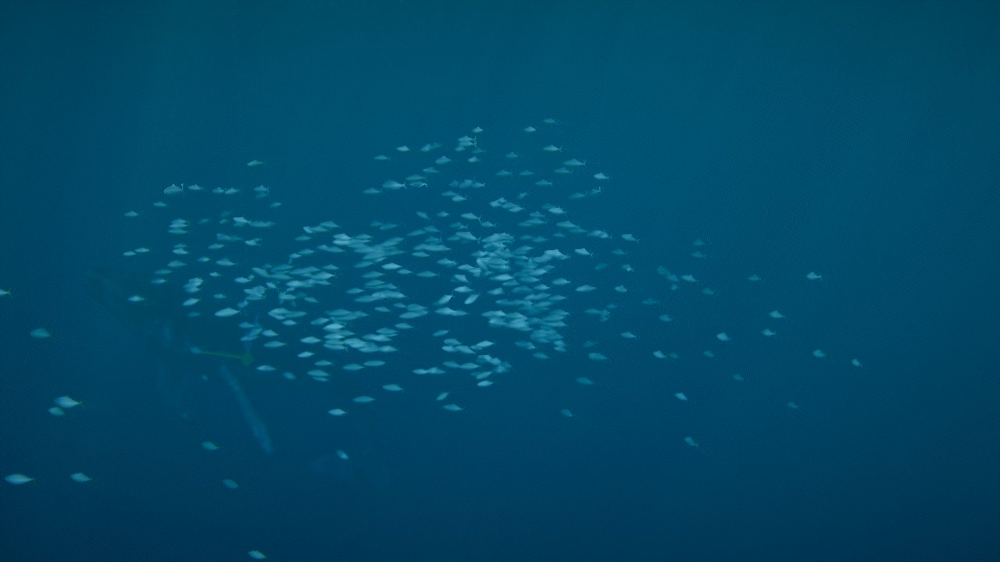
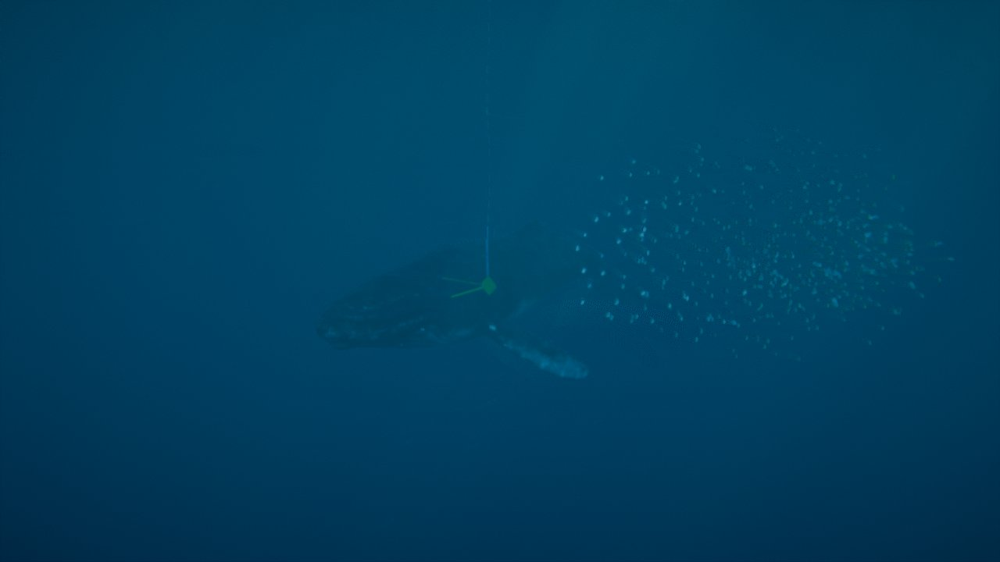

# Ampliación · Peces (cardumen y peces sueltos) y selector de renderizador

29/09/2026 · Petición de Roberto: un selector en la GUI para ver la versión WebGL, algún pez suelto y un cardumen de peces pequeños que nade como un cardumen de verdad.

| Cardumen de cerca | Cardumen a media distancia |
|---|---|
|  |  |

## Revisión del 29/09/2026 (petición de Roberto: «salen como rayas caóticas»)

- **Causa real: la geometría se deformaba.** En three r186 la matriz de cada instancia se aplica **antes** del `positionNode` del material. El coletazo usaba `positionLocal.z`, que ya estaba en coordenadas del mundo (z de −10 a 0 m), y desplazaba los vértices metros enteros. Cada pez se convertía en una aguja de varios metros, más larga cuanto más lejos del origen.
  - **Corrección:** la coordenada a lo largo del cuerpo sale del atributo original (`attribute('position')`). El desplazamiento lateral se aplica en el eje del costado del pez, que se calcula en CPU con su orientación y su escala (atributo por instancia).
  - La primera respuesta (que era el TAA) fue un diagnóstico equivocado. Lo que me hizo verlo fue acercarme a 1,5 m: las agujas seguían ahí con FXAA y sin motion blur.
- **Mejora que se mantiene del primer intento:** peces, salpicaduras, burbujas y nieve marina escriben su velocidad real en pantalla: movimiento de la cámara (`ocean.cameraVelocityNode`) más, en los peces, su propio desplazamiento en el fotograma. Antes escribían 0, y eso sí producía estelas del TAA al mover la cámara, aunque mucho más cortas.
- **Peces sueltos:** desactivados (el código se conserva, fuera de la GUI y de los presets).
- **Selector WebGPU / WebGL2:** retirado de la GUI. El fallback automático sin WebGPU (y `?webgl` en la URL) se mantiene.

## Valores por defecto (29/09/2026, de Roberto)

500 peces de 0,14 m a 0,8 m/s, profundidad mínima 4 m, a 15 m de la cámara; separación 3,05, alineación 3,35 y cohesión 3,4.

## Visibilidad (29/09/2026, petición de Roberto: «apenas veo el cardumen»)

- **Problema:** el cardumen daba vueltas alrededor de la zona de la ballena. La cámara de seguimiento va a ~24 m de la ballena y bajo el agua se ve a unos 15 m, así que casi siempre quedaba fuera del cuadro o perdido en la niebla. Además, la ballena y la cámara van a 3-5 m/s, más deprisa que los peces, y el cardumen se quedaba atrás.
- **Ahora:**
  - **Centro del cardumen delante de la cámara:** sobre el eje de visión, a *Distancia a la cámara* (10 m por defecto), algo desplazado a un lado y oscilando despacio. Se limita por arriba con *Profundidad mínima* (4 m) y por abajo a 25 m.
  - **Corriente de arrastre:** el cardumen se mueve con su centro y los peces nadan con los boids dentro de ese marco. Se orientan y dan coletazos según su velocidad real en el mundo (la propia más el arrastre), y el motion blur recibe ese mismo desplazamiento.
  - Cuando se alejan del centro, nadan hasta 3 veces más deprisa. Tras un corte de plano, si el cardumen queda a más de 18 m, reaparece delante de la cámara.
  - Tamaño por defecto: 0,22 m.
- **Comprobado con la cámara de seguimiento durante la secuencia:** a 10-13 m de la cámara, dentro del cuadro de nado a preparación, con polarización 0,9-0,99 y radio de 1-1,5 m. En el salto la cámara sube y el cardumen se queda debajo (límite de profundidad).

## Selector de renderizador (retirado)

- **Dónde:** carpeta *Calidad* → «Renderizador (recarga)»: **WebGPU / WebGL2**.
- **Qué hace:** recarga la página con o sin `?webgl` y conserva todos los ajustes (la URL lleva el estado).
- **Sin WebGPU** en el navegador, solo ofrece WebGL2.

## Peces (`src/life/fish.js`)

- **Modelo propio, sin archivos:** así no hay problemas de licencia.
  - Cuerpo fusiforme (esfera deformada, más gruesa delante y afilada hacia el pedúnculo), aleta caudal en V y aleta dorsal.
  - Lomo oscuro, vientre claro y franja plateada (contrasombreado de los peces pelágicos).
- **Coletazo en el vertex shader:** una onda recorre el cuerpo de la cabeza a la cola (amplitud ∝ distancia a la cabeza²), con una frecuencia que crece con la velocidad de cada pez.
- **Luz:** la que llega a su profundidad, con cáusticas (`ocean.underLightNode`), como la ballena. No escriben velocidad (sin estelas de motion blur).

### Cardumen (boids en CPU, funciona también en WebGL2)

- **Reglas clásicas de Reynolds:**
  - separación con los vecinos a menos de 2,2 longitudes de cuerpo;
  - alineación de velocidades y cohesión dentro de 1,4 m;
  - vecinos por rejilla espacial (celdas de 1,2 m).
- **Vecinos limitados (interacción topológica):** cada pez atiende solo a sus **10 primeros vecinos**, como los peces reales, que se guían por unos 7. Sin este límite, con el cardumen apretado el coste era O(n²): 7,5 ms con 500 peces.
- **Fuerzas añadidas:**
  - atracción al centro del cardumen (desde el 29/09, delante de la cámara: ver *Visibilidad*);
  - franja de profundidad: al menos 1,2 m bajo la superficie y no más de 25 m;
  - huida de la ballena (sondas del cuerpo de la Fase 5, radio del cuerpo + 6 m) y, un poco, de la cámara.
- **Velocidad** entre 0,5 y 1,8 veces la de crucero; nadan sobre todo en horizontal.
- **Comprobado** en el navegador:
  - arranca desordenado (polarización 0,12) y en unos 10 s se organiza: polarización **0,96–0,99** (1 = todos en la misma dirección) y radio medio 1,3 m con 500 peces;
  - igual en WebGL2 (0,97).
- **Coste:** **0,54 ms** de CPU con 500 peces (2 ms con 1000), tras quitar `Math.hypot` (lento en V8) y reutilizar las listas de la rejilla.

### Peces sueltos

- **Cantidad y tamaño:** de 0 a 10 (4 por defecto), de 0,7 m.
- **Comportamiento:** deambulan hacia destinos aleatorios alrededor del cardumen y a otras profundidades (cambian cada 6-16 s o al llegar), nadan más despacio, con coletazos más lentos, y también se apartan de la ballena.

### Parámetros (carpeta *Peces*, módulo `peces` en presets y URL)

Peces, peces en el cardumen (0-1200, 500), tamaño (0,22 m), velocidad (1,4 m/s), profundidad mínima (4 m), distancia a la cámara (10 m), separación, alineación, cohesión y huida de la ballena.

## Límites

- **Cardumen:** es uno solo y acompaña a la cámara (es un recurso de encuadre, no un banco que se quede en un sitio). No hay depredación ni formación de «bait ball» ante un ataque.
- **Geometría:** es sencilla, pensada para verse a distancia. De cerca se nota que es un pez genérico.
