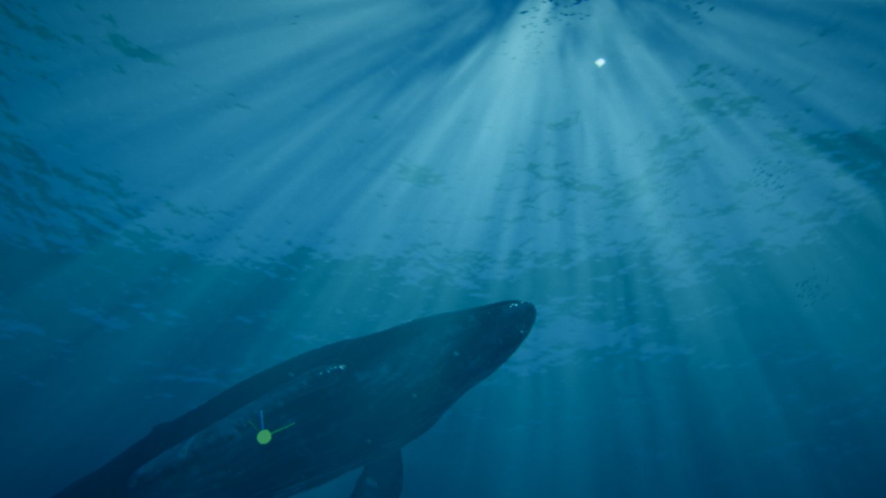
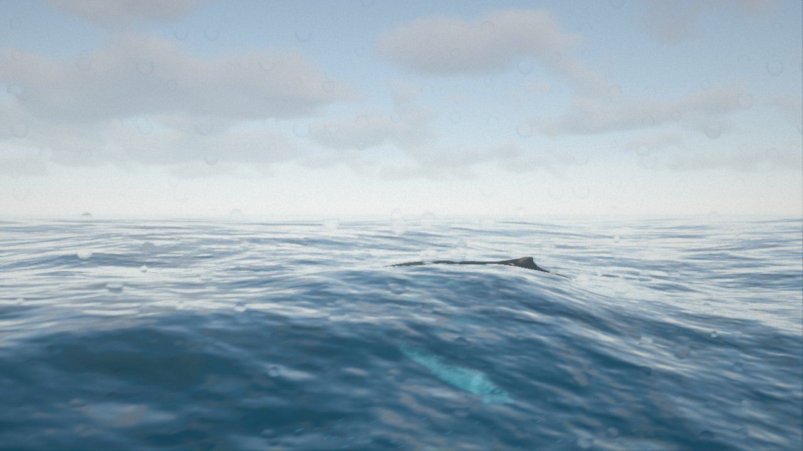
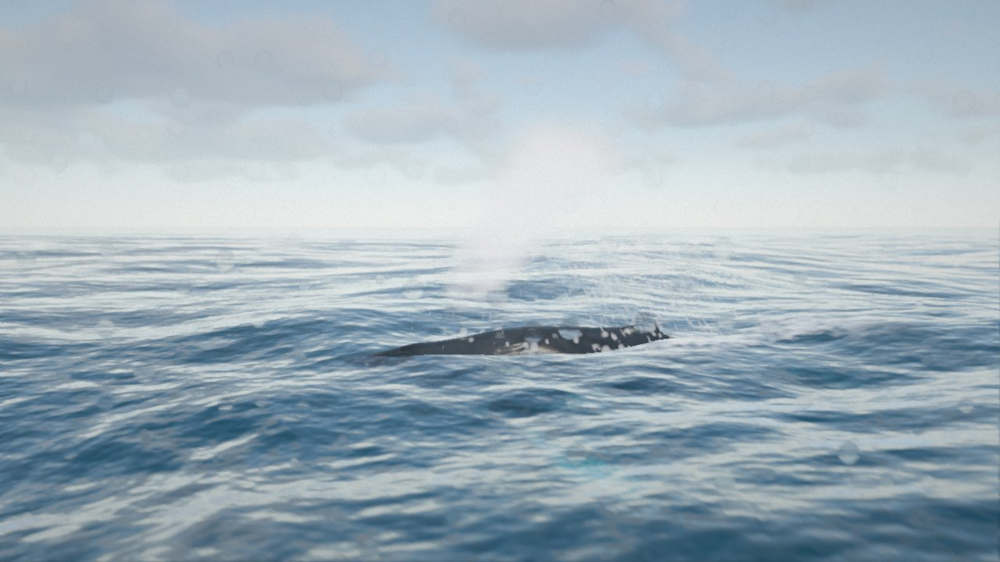
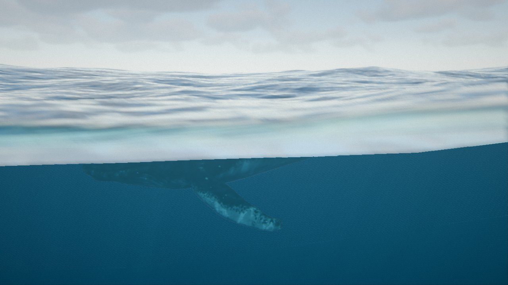
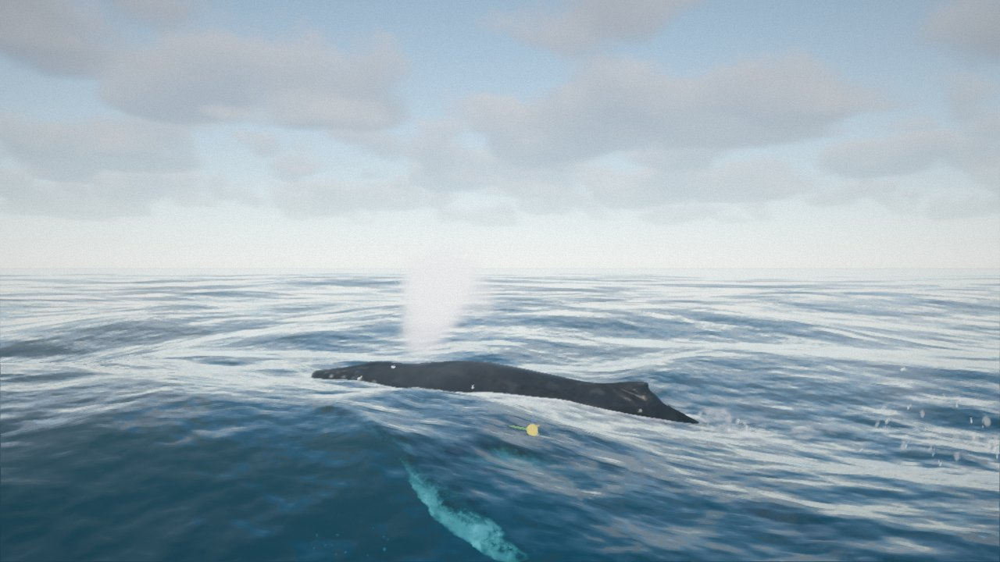

# Ampliación · Respiración, secuencia nueva y transiciones sin saltos

29/09/2026 · Petición de Roberto:
- aplicar por defecto sus valores del cardumen;
- añadir una fase en la que la ballena sube a respirar y expulsa vapor y gotas;
- que la secuencia sea «nada, respira, nada, salta, nada, respira, nada, respira»;
- que no haya saltos al cambiar de actitud.

| Sube a respirar | Soplido (plano *Soplido (cerca)*) |
|---|---|
|  |  |
| **El penacho a 1,5 s, arrastrado por el viento** | **Se sumerge (plano *Cruce de superficie*)** |
|  |  |

## Valores por defecto del cardumen

Los valores de su captura de la GUI: tamaño 0,14 m, velocidad 0,8 m/s, profundidad mínima 4 m, distancia a la cámara 15 m, separación 3,05, alineación 3,35 y cohesión 3,4 (`src/life/fish.js`).

## Saltos entre actitudes: causa y corrección

- **Medida:** 45-120 s de simulación a 60 fps. Para la cabeza, la punta de una aleta y la cola se mide la aceleración de un fotograma a otro; para el hueso Root, la variación de la velocidad angular.
- **Causa:**
  - Al pasar de *nadar* a *preparar* la orientación cambiaba de golpe. Al nadar, la ballena se inclina al girar (alabeo = −1,5 × la velocidad de giro, hasta ~45° cuando vuelve hacia el centro), pero el plan del salto empezaba con alabeo 0.
  - Picos de 700-7400 m/s² en un fotograma (cabeza, aleta y cola) y de 31 rad/s² en el Root.
- **Corrección (`whaleStates.js`, `place()`):** al empezar o acabar cualquier plan (salto o respiración) se guarda la diferencia de posición y de orientación con la pose del fotograma anterior. Esa diferencia se reparte en *Transición entre planes* (1 s por defecto, con smoothstep).
- **Nado con cambios de profundidad:**
  - Antes subía o bajaba de forma exponencial y sin cabecear: 6,5 m/s en vertical al pasar de 16 a 3 m, con el cuerpo horizontal.
  - Ahora la velocidad vertical está limitada (45 % de la de nado), suavizada, y el cuerpo cabecea hacia donde va.
- **Resultado:**
  - Ningún pico de velocidad angular del Root en 150 s de ciclo automático.
  - Los picos de aceleración que quedan son de ~150-220 m/s² en la punta de la aleta, lo mismo que produce la propia animación de nado.
- **Cámara:** en la secuencia, al acabar cada acción aparecía un fotograma con el plano por defecto (*Aérea*) antes del plano del paso siguiente, un parpadeo con los cortes secos. Ahora se usa directamente el plano del paso siguiente.

## Respiración (`src/whale/breathPlanner.js`)

Nuevos estados de la máquina: **subir → respirar → bajar**. Como en el salto, un plan determinista con curvas de Hermite que empiezan y acaban con la velocidad de nado:

| Fase | Qué hace | Duración (desde 12 m) |
|---|---|---|
| **Subir** | Curva en S hasta quedar horizontal justo bajo la superficie, algo más deprisa que nadando (×1,35). Inclinación máxima 28° | ~11 s |
| **Respirar** | Avanza despacio por la superficie con el lomo fuera. La cabeza se levanta 5° y vuelve a nivel. **Soplido** a los 0,15 s (evento `blow`) | 4,5 s |
| **Bajar** | Inmersión hasta la profundidad de partida (inclinación máxima 25°) | ~13 s |

- **Altura:**
  - El centro de masas queda 0,7 m bajo la superficie.
  - El espiráculo está ~0,75 m por encima del centro de masas, así que asoma justo, con el lomo y la aleta dorsal.
  - Medido en la malla: el espiráculo está sobre la línea media, 2,8 m por detrás de la punta del hocico (offset en el espacio del hueso Head: 0; 0,7; −0,98).
- **Cola bajo el agua:**
  - El clip `swim_idle` mueve la punta de la cola ±3 m (6,35 m de recorrido). Junto a la superficie, la aleta caudal salía hasta 3 m del agua en cada brazada.
  - **Brazada más corta cerca de la superficie:** el peso de los clips de nado baja a 0,25 junto a la superficie y vuelve a 1 hacia los 9 m de profundidad, con un cambio suave. Con peso menor que 1, el mezclador combina el clip con la pose de reposo. En el salto se mantiene el peso completo.
  - **Cabeceo limitado al bajar:** con el cuerpo rígido, bajar el morro levanta la cola, que está a 6-7 m del centro. El cabeceo hacia abajo se limita según la profundidad que tiene la cola. La ballena real arquea el pedúnculo.
  - **Resultado:** la cola no pasa de 0,5 m sobre el agua respirando ni al sumergirse (antes, 2-3 m).
- **Soplido (`interaction.js` + `splash.js`):** dura 1,4 s, con ataque rápido y caída lenta. Sale del espiráculo, que se sigue fotograma a fotograma.
  - **Vapor:** un tipo nuevo de partícula (`vapor`). Es como la bruma, pero más opaco, crece un 30 %/s y el viento lo arrastra al 30 %; con el 100 % desaparecía del plano en menos de 1 s. Forma un penacho de ~4 m que sube, se frena, se abre y deriva.
  - **Gotas:** balísticas; marcan la altura del soplido y caen.
  - **Spray:** fino.
  - **Parámetros:** *Altura del soplido* (4 m; jorobada: 3-5 m) y *Cantidad*.
- **Audio:** soplido áspero de ~1,6 s y, a los 1,9 s, una inspiración más suave. Bajo el agua suena atenuado.
- **Controles:**
  - Tecla **B** o «● Respirar ahora».
  - Carpeta *Ballena · comportamiento › Respiración (próxima)*: inclinaciones, tiempo en superficie, hundimiento, soplido y aleteo junto a la superficie.

## Modo automático y secuencia

- **Modo automático** (sin la secuencia):
  - la ballena alterna las acciones del ciclo **respirar, saltar, respirar, respirar** (`AUTO_CYCLE`), con *Nadar entre acciones* (6 s) nadando entre una y otra;
  - «Salto automático» y «Respiración automática» se pueden desactivar por separado.
- **Secuencia** (`sequence.js`, tecla **P**): 8 pasos en bucle.

| Paso | Plano (cámaras automáticas) |
|---|---|
| 1 · nado profundo (8 s, 14 m) | Bajo el agua |
| 2 · respira | Hacia la luz → *Soplido (cerca)* → Cruce de superficie |
| 3 · nado (6 s, 6 m) | Bajo el agua |
| 4 · salto | Hacia la luz → Barco → Ras de agua → Cruce de superficie |
| 5 · ondas y espuma (7 s, 3 m) | Aérea |
| 6 · respira | igual que el paso 2 |
| 7 · nado (6 s, 6 m) | Bajo el agua |
| 8 · respira | igual que el paso 2 |

- **Plano nuevo *Soplido (cerca)*:** de lado, a 17 m y a 2 m sobre el agua, avanzando con la ballena; encuadra el lomo y el penacho. El *Barco* (30 m) dejaba el soplido demasiado pequeño.
- **Controles nuevos en la carpeta *Secuencia*:** «Respirar ahora», *Nado entre respiraciones* (s) y su profundidad.
- **Durante la secuencia** también se oculta el marcador del hueso seleccionado (ayuda de la Fase 1), que aparecía en los planos.
- **Ciclo completo:** ~2 min.

## Límites

- **Cuerpo rígido:** no se arquea al respirar (el *roll-through* real). Solo cabecea como un cuerpo rígido y la animación de nado pone la ondulación.
- **Sin inmersión profunda:** no hay *fluke-up dive* (la cola en alto antes de bajar hondo); se podría añadir como variante de la última respiración.
- **Soplido fijo:** siempre es igual, sin variaciones entre respiraciones (la primera tras una inmersión larga suele ser más potente).
