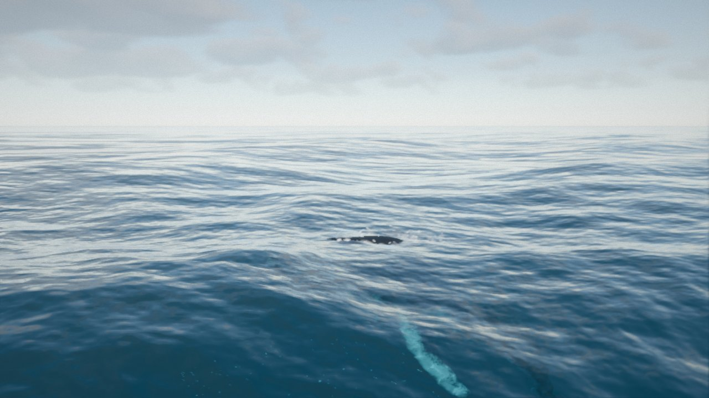
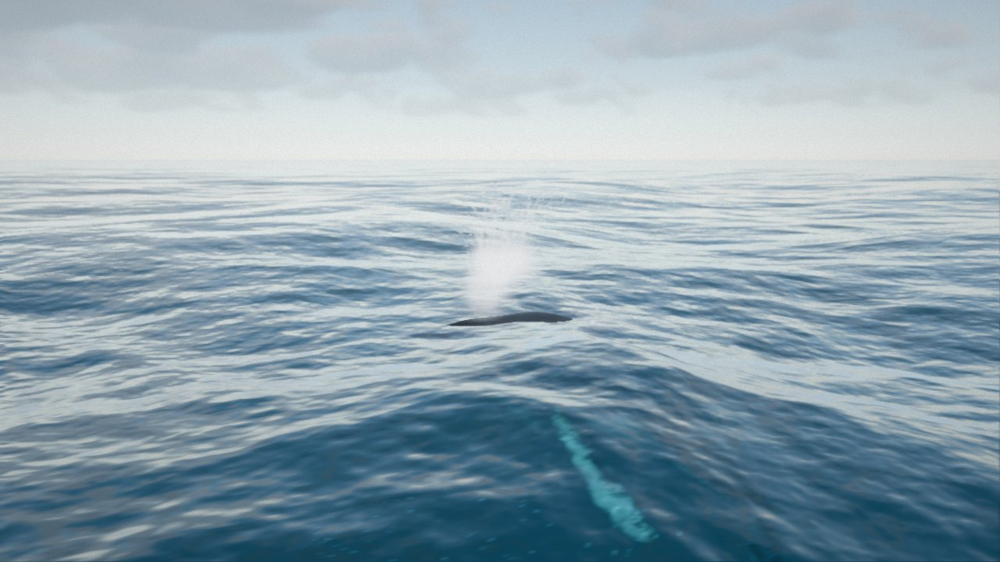
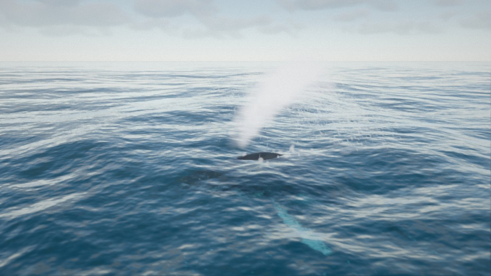
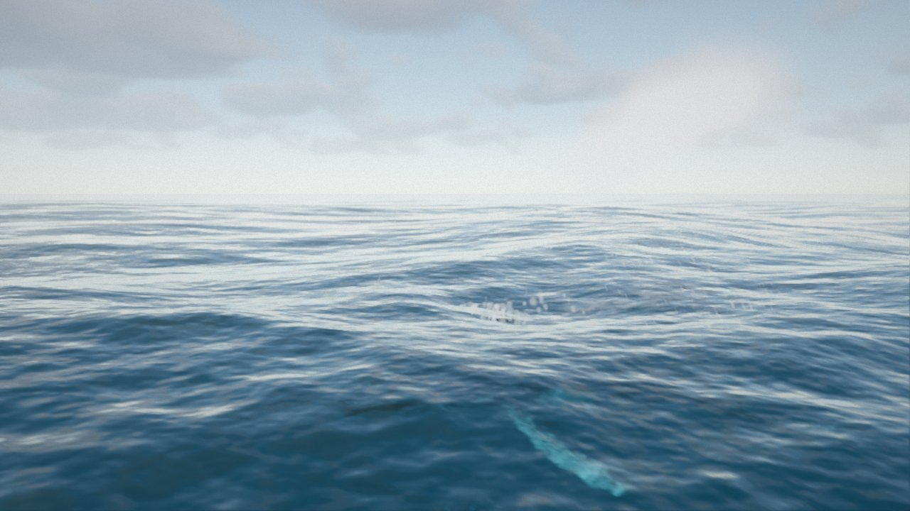
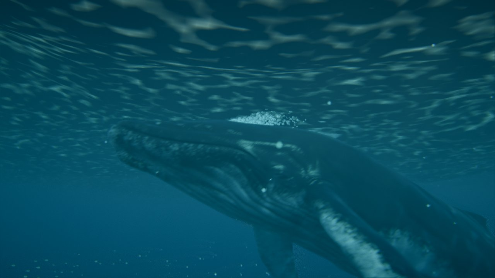
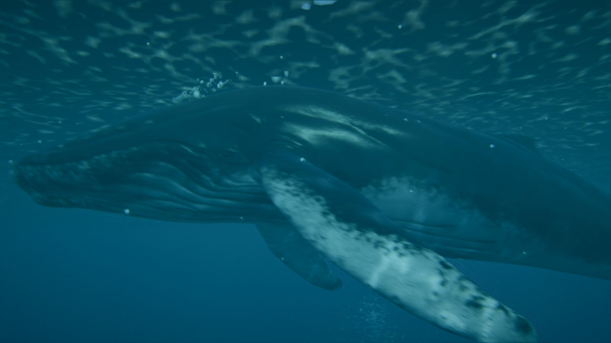

# Ampliación · Respiración, secuencia nueva y transiciones sin saltos

29/09/2026 · Petición de Roberto:
- aplicar por defecto sus valores del cardumen;
- añadir una fase en la que la ballena sube a respirar y expulsa vapor y gotas;
- que la secuencia sea «nada, respira, nada, salta, nada, respira, nada, respira»;
- que no haya saltos al cambiar de actitud.

## Respiración en arco (continua), el estilo por defecto (29/09/2026)

Petición de Roberto:
- el espiráculo está un poco más adelante;
- la respiración debe ser más orgánica, porque la ballena se paraba tras el soplido;
- que se arquee con la cola abajo, de forma que asome poco más que la nariz, y que sople y se sumerja en un movimiento continuo de avance y giro;
- conservar el movimiento anterior como otra opción.

| Asoma | Sopla |
|---|---|
|  |  |
| **Sigue avanzando y girando** | **Se sumerge (el penacho queda atrás)** |
|  |  |

- **Estilos:** carpeta *Respiración (próxima)* → **Estilo**. *Arco (continua)* es el de por defecto; *En superficie* es el primero, que se conserva tal cual (abajo).
- **Espiráculo adelantado 0,5 m:** ahora está sobre la línea media, ~2,3 m por detrás de la punta del hocico (offset en el hueso Head: 0; 1,25; −0,88).
- **Movimiento (`planBreathArc`):** velocidad constante de principio a fin, sin tramo en superficie.
  - **Trayectoria:** una curva en S sube hasta entrar en un **arco**, que pasa de subir (6°) a bajar (24°) en 4,5 s. Después, la inmersión hasta la profundidad de partida.
  - **Cabeceo:** es el de la trayectoria más un **adelanto** que crece en los 2,5 s antes del arco y desaparece al bajar. La cabeza va levantada al soplar (~30°) y el giro hacia delante es continuo (de +30° a −6° en 4 s, sin pararse).
  - **Arqueo del cuerpo:** se suma a la animación girando huesos de la columna sobre su eje lateral.
    - **Cabeza hacia abajo** (22°, hueso Head): el perfil superior de la cabeza de este modelo es casi recto, sin pico en el espiráculo. Sin la flexión asomaba entera (4,3 m); con el quiebro en el hueso Head, a 1,3 m del espiráculo, asoma solo la zona alrededor.
    - **Cola hacia abajo** (14°, repartidos entre Spine y Spine.007).
    - Entra en 3 s antes del arco y se deshace en 3 s al bajar. Se deshace cada fotograma antes del mezclador, así no se acumula.
  - **Altura calculada para el soplido:** con un modelo de la cabeza (pivote y espiráculo medidos en la pose real; error < 0,1 m), el plan busca la altura del arco para que el espiráculo, en su punto más alto, asome *Arco: asoma el espiráculo* (0,2 m).
  - **Soplido:** en ese punto, 0,25 s antes del máximo.
  - **Estados:** «respirar» empieza 1,5 s antes del soplido, para que el director ya esté en el plano de superficie.
  - **Con oleaje:** mientras dura el arqueo, la ballena sigue la altura local del agua delante de ella (suavizada). Sin esto, en un seno de ola el espiráculo asomaba 0,9 m y en una cresta no llegaba a salir.
- **Medido** (mar en calma, fotograma a fotograma):
  - asoma solo la cabeza, entre 1 y 4 m por delante del centro de masas, como mucho 0,33 m y durante ~2 s;
  - el lomo, la joroba y la cola quedan bajo el agua;
  - con oleaje normal, en tres respiraciones, el espiráculo asoma 0,2-0,34 m en el soplido;
  - sin picos de giro en 110 s de ciclo automático.
- **Exhala antes de asomar y burbujas al sumergirse** (29/09/2026, petición de Roberto: la ballena economiza el tiempo en superficie):
  - **Exhalación anticipada:** empieza *Arco: exhala antes de asomar* (0,5 s) antes de que el espiráculo salga del agua. Mientras sigue bajo el agua, la exhalación sale como un borbotón de burbujas (3200/s, de 3 a 15 cm). En cuanto asoma pasa a vapor, gotas y spray. Dura 1,8 s en total.
  - **Burbujas al sumergirse:** acabado el soplido, mientras el espiráculo está bajo el agua sale un reguero de burbujas más pequeñas (1,5-7 cm) que va disminuyendo (se reduce a la mitad cada ~1,1 s) durante 6 s.
  - **Medido** en tres respiraciones:
    - la exhalación empieza con el espiráculo 0,07-0,41 m bajo el agua y asoma 0,3-0,85 s después;
    - burbujas del reguero: ~900 → 300 → 80 cada 2 s;
    - la cola, en el gesto arqueado, queda siempre entre 0,7 y 1,8 m bajo el agua.

| Exhala todavía bajo el agua | Reguero de burbujas al sumergirse |
|---|---|
|  |  |

- **Plano *Soplido (cerca)*:** ahora a 15 m y a 3,5 m sobre el agua. Asoma tan poco que desde 2 m las olas lo tapaban.
- **Controles nuevos (carpeta *Respiración (próxima)*):**
  - estilo;
  - duración del arco;
  - cabeza levantada;
  - ángulo de salida;
  - flexión de la cabeza;
  - cola abajo;
  - lo que asoma el espiráculo.

## Primera versión: respiración en superficie (se conserva como estilo *En superficie*)

| Sube a respirar | Soplido (plano *Soplido (cerca)*) |
|---|---|
|  |  |
| **El penacho a 1,5 s, arrastrado por el viento** | **Se sumerge (plano *Cruce de superficie*)** |
|  |  |

## Valores por defecto del cardumen

Los valores de su captura de la GUI: tamaño 0,14 m, velocidad 0,8 m/s, profundidad mínima 4 m, distancia a la cámara 15 m, separación 3,05, alineación 3,35 y cohesión 3,4 (`src/life/fish.js`).

## Saltos entre actitudes: causa y corrección

- **Medida:** 45-120 s de simulación a 60 fps. Para la cabeza, la punta de una aleta y la cola se mide la aceleración de un fotograma a otro; para el hueso Root, la variación de la velocidad angular.
- **Causa:**
  - Al pasar de *nadar* a *preparar* la orientación cambiaba de golpe. Al nadar, la ballena se inclina al girar (alabeo = −1,5 × la velocidad de giro, hasta ~45° cuando vuelve hacia el centro), pero el plan del salto empezaba con alabeo 0.
  - Picos de 700-7400 m/s² en un fotograma (cabeza, aleta y cola) y de 31 rad/s² en el Root.
- **Corrección (`whaleStates.js`, `place()`):** al empezar o acabar cualquier plan (salto o respiración) se guarda la diferencia de posición y de orientación con la pose del fotograma anterior. Esa diferencia se reparte en *Transición entre planes* (1 s por defecto, con smoothstep).
- **Nado con cambios de profundidad:**
  - Antes subía o bajaba de forma exponencial y sin cabecear: 6,5 m/s en vertical al pasar de 16 a 3 m, con el cuerpo horizontal.
  - Ahora la velocidad vertical está limitada (45 % de la de nado), suavizada, y el cuerpo cabecea hacia donde va.
- **Resultado:**
  - Ningún pico de velocidad angular del Root en 150 s de ciclo automático.
  - Los picos de aceleración que quedan son de ~150-220 m/s² en la punta de la aleta, lo mismo que produce la propia animación de nado.
- **Cámara:** en la secuencia, al acabar cada acción aparecía un fotograma con el plano por defecto (*Aérea*) antes del plano del paso siguiente, un parpadeo con los cortes secos. Ahora se usa directamente el plano del paso siguiente.

## Respiración (`src/whale/breathPlanner.js`)

Nuevos estados de la máquina: **subir → respirar → bajar**. Como en el salto, un plan determinista con curvas de Hermite que empiezan y acaban con la velocidad de nado:

| Fase | Qué hace | Duración (desde 12 m) |
|---|---|---|
| **Subir** | Curva en S hasta quedar horizontal justo bajo la superficie, algo más deprisa que nadando (×1,35). Inclinación máxima 28° | ~11 s |
| **Respirar** | Avanza despacio por la superficie con el lomo fuera. La cabeza se levanta 5° y vuelve a nivel. **Soplido** a los 0,15 s (evento `blow`) | 4,5 s |
| **Bajar** | Inmersión hasta la profundidad de partida (inclinación máxima 25°) | ~13 s |

- **Altura:**
  - El centro de masas queda 0,7 m bajo la superficie.
  - El espiráculo está ~0,75 m por encima del centro de masas, así que asoma justo, con el lomo y la aleta dorsal.
  - Medido en la malla: el espiráculo está sobre la línea media; en esta primera versión estaba 2,8 m por detrás de la punta del hocico (offset en el hueso Head: 0; 0,7; −0,98). Después se adelantó 0,5 m (ver el estilo en arco).
- **Cola bajo el agua:**
  - El clip `swim_idle` mueve la punta de la cola ±3 m (6,35 m de recorrido). Junto a la superficie, la aleta caudal salía hasta 3 m del agua en cada brazada.
  - **Brazada más corta cerca de la superficie:** el peso de los clips de nado baja a 0,25 junto a la superficie y vuelve a 1 hacia los 9 m de profundidad, con un cambio suave. Con peso menor que 1, el mezclador combina el clip con la pose de reposo. En el salto se mantiene el peso completo.
  - **Cabeceo limitado al bajar:** con el cuerpo rígido, bajar el morro levanta la cola, que está a 6-7 m del centro. El cabeceo hacia abajo se limita según la profundidad que tiene la cola. La ballena real arquea el pedúnculo.
  - **Resultado:** la cola no pasa de 0,5 m sobre el agua respirando ni al sumergirse (antes, 2-3 m).
- **Soplido (`interaction.js` + `splash.js`):** dura 1,4 s, con ataque rápido y caída lenta. Sale del espiráculo, que se sigue fotograma a fotograma.
  - **Vapor:** un tipo nuevo de partícula (`vapor`). Es como la bruma, pero más opaco, crece un 30 %/s y el viento lo arrastra al 30 %; con el 100 % desaparecía del plano en menos de 1 s. Forma un penacho de ~4 m que sube, se frena, se abre y deriva.
  - **Gotas:** balísticas; marcan la altura del soplido y caen.
  - **Spray:** fino.
  - **Parámetros:** *Altura del soplido* (4 m; jorobada: 3-5 m) y *Cantidad*.
- **Audio:** soplido áspero de ~1,6 s y, a los 1,9 s, una inspiración más suave. Bajo el agua suena atenuado.
- **Controles:**
  - Tecla **B** o «● Respirar ahora».
  - Carpeta *Ballena · comportamiento › Respiración (próxima)*: inclinaciones, tiempo en superficie, hundimiento, soplido y aleteo junto a la superficie.

## Modo automático y secuencia

- **Modo automático** (sin la secuencia):
  - la ballena alterna las acciones del ciclo **respirar, saltar, respirar, respirar** (`AUTO_CYCLE`), con *Nadar entre acciones* (6 s) nadando entre una y otra;
  - «Salto automático» y «Respiración automática» se pueden desactivar por separado.
- **Secuencia** (`sequence.js`, tecla **P**): 8 pasos en bucle.

| Paso | Plano (cámaras automáticas) |
|---|---|
| 1 · nado profundo (8 s, 14 m) | Bajo el agua |
| 2 · respira | Hacia la luz → *Soplido (cerca)* → Cruce de superficie |
| 3 · nado (6 s, 6 m) | Bajo el agua |
| 4 · salto | Hacia la luz → Barco → Ras de agua → Cruce de superficie |
| 5 · ondas y espuma (7 s, 3 m) | Aérea |
| 6 · respira | igual que el paso 2 |
| 7 · nado (6 s, 6 m) | Bajo el agua |
| 8 · respira | igual que el paso 2 |

- **Plano nuevo *Soplido (cerca)*:** de lado, a 17 m y a 2 m sobre el agua, avanzando con la ballena; encuadra el lomo y el penacho. El *Barco* (30 m) dejaba el soplido demasiado pequeño.
- **Controles nuevos en la carpeta *Secuencia*:** «Respirar ahora», *Nado entre respiraciones* (s) y su profundidad.
- **Durante la secuencia** también se oculta el marcador del hueso seleccionado (ayuda de la Fase 1), que aparecía en los planos.
- **Ciclo completo:** ~2 min.

## Límites

- **Arqueo solo en arco:** el estilo *En superficie* no arquea el cuerpo. El arco lo hace con giros de huesos sumados a la animación, no con una animación propia. Si se exagera (más de ~30°), la malla se deforma en los quiebros.
- **Sin inmersión profunda:** no hay *fluke-up dive* (la cola en alto antes de bajar hondo); se podría añadir como variante de la última respiración.
- **Soplido fijo:** siempre es igual, sin variaciones entre respiraciones (la primera tras una inmersión larga suele ser más potente).
